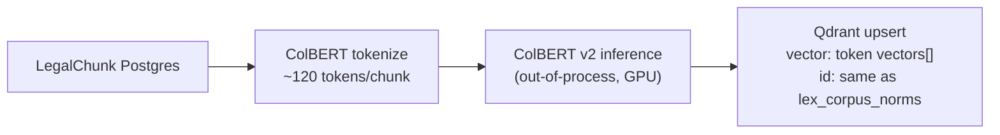
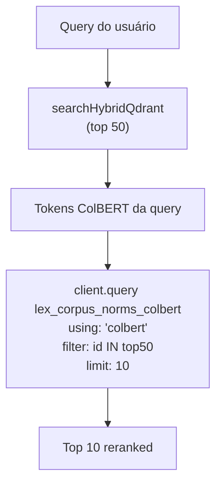

# ColBERT / Multivector Retrieval Jurídico — Design Doc (opcional)

**Status:** design only. **Não implementado.** **Não é o caminho padrão.**

Esta nota descreve a arquitetura prevista para um modo "pesquisa profunda"
que usa **ColBERT (multivector retrieval)** como reranker do top-N do
hybrid search. Ela documenta o design para que, quando ativarmos, não
haja decisões pendentes.

A flag `LEGAL_COLBERT_ENABLED` (env, default `false`) reserva o espaço de
configuração — code path correspondente ainda **não existe**.

---

## 1. Por que ColBERT como rerank, e não como retrieval primário?

| Aspecto | Hybrid (dense + sparse) | ColBERT |
| --- | --- | --- |
| Vetores por chunk | 1 dense + N sparse-keys | ~120 token vectors |
| Storage por 514 chunks | ~2 MB dense + ~5 MB sparse | ~250 MB |
| Latência (Qdrant ≥ 1.10) | 50-200 ms | 800-2 000 ms |
| Precisão recall@10 (CF) | ~93% (medido) | esperado +3-5% absoluto |
| Custo compute embedding | OpenAI-compat 1024 dim | ColBERT v2 ou similar |

ColBERT vence em precisão fina, mas:
- **23× mais storage** que hybrid.
- **5-10× mais latência** que hybrid Qdrant nativo.
- **Custo não proporcional**: ganho marginal pra UX comum (advogado
  buscando "Art. 5º, LIV") já satisfeito pelo hybrid + reranker BGE.

Decisão: ColBERT entra como **reranker opcional** sobre o top-50 do
hybrid, ativado por **flag de "pesquisa profunda"** (UI mostra "Buscar
com mais precisão (mais lenta)"). Latência aceitável quando UI dá
feedback explícito.

## 2. Schema da collection (proposto)

```ts
// scripts/qdrant-init-colbert.ts (a criar quando habilitarmos)
await client.createCollection("lex_corpus_norms_colbert", {
  vectors: {
    colbert: {
      size: 128,            // dim do token vector (ColBERT v2)
      distance: "Dot",      // sempre Dot pra max-sim
      multivector_config: { comparator: "max_sim" },
    },
  },
  hnsw_config: { m: 16, ef_construct: 100 },
  optimizers_config: {
    indexing_threshold: 0,
    memmap_threshold: 65_536,
  },
});
```

Sem `dense` nem `sparse` — essa collection serve **apenas rerank**.
Lookup pelos `point.id` que vêm do hybrid (mesmo id do `lex_corpus_norms`).

## 3. Pipeline de ingestão



Provider de embedding: **inference fora do Vercel** (ColBERT v2 é caro
demais pra serverless cold start). Opções:
- Modal/Replicate hospedando `colbert-ir/colbertv2.0`.
- DeepInfra (se exposto endpoint multivector).
- Self-host num pod GPU + queue Inngest.

Storage estimado para 514 chunks: ~250 MB. Para o full Brasil legal
corpus (~50k chunks): ~25 GB.

## 4. Fluxo de retrieval (modo pesquisa profunda)



Detalhes:
- Filtro `point.id IN top50` para limitar ao universo do hybrid (ColBERT
  só vai rerankar; não substituir a recall do hybrid).
- Comparador `max_sim` é o original do paper. Distance `Dot` exigido
  pelo Qdrant para multivector.
- Score retornado é a soma dos max-sim por token de query — pode ser
  combinado com o RRF do hybrid (RRF dos dois rankings).

## 5. Custo / latência projetados

| Operação | Latência | Custo |
| --- | --- | --- |
| Tokenize query (CPU) | 5-10 ms | grátis |
| Embed query (ColBERT v2 GPU) | 80-200 ms | $0.0001-0.0005/req |
| Qdrant multivector search | 200-800 ms | infra Qdrant |
| **Total adicional sobre hybrid** | **+1.0-1.5 s** | **+$0.0005/req** |

Aceitável para "pesquisa profunda" (advogado fazendo análise crítica),
inaceitável como default.

## 6. Trade-offs registrados

| Trade-off | Decisão |
| --- | --- |
| Reembedar 514 chunks com ColBERT | Sim, em pipeline separado quando flag ligar |
| Compartilhar `point.id` com `lex_corpus_norms` | **Sim** — facilita filtro no rerank |
| Reusar índices de payload | **Não** — cada collection tem seus próprios |
| Habilitar default | **Não** — flag explícita de UI |
| Usar SPLADE no lugar | **Não** — sparse hashing já cobre BM25-like |

## 7. Quando reavaliar

Reavaliar ColBERT como padrão **se**:
- Precision@1 do hybrid cair abaixo de 90% em QA expandido (≥ 30 queries).
- Servidor Qdrant ficar ≥ 1.12 com multivector_config otimizado.
- Custo de inference ColBERT cair 10× (cenário improvável a curto prazo).

Até lá, hybrid (dense + sparse + RRF) + cross-encoder BGE-v2-m3 é o
ponto ótimo custo/latência/precisão para retrieval jurídico nacional.

## 8. Tasks pendentes (quando ativar)

1. Provider de inference ColBERT v2 (Modal/Replicate/Self-host).
2. `scripts/qdrant-init-colbert.ts` para criar a collection.
3. `scripts/colbert-ingest.ts` para popular a partir de `LegalChunk`.
4. `src/lib/retrieval/legal/colbert.ts` com `rerankColbert(top50, query)`.
5. Integração opcional em `retrieveLegalContext` quando
   `opts.useColbertRerank=true`.
6. UI flag "Pesquisa profunda (mais lenta)".
7. Telemetria de latência ColBERT vs default.

Nenhuma dessas tarefas está aberta agora — espaço reservado.
