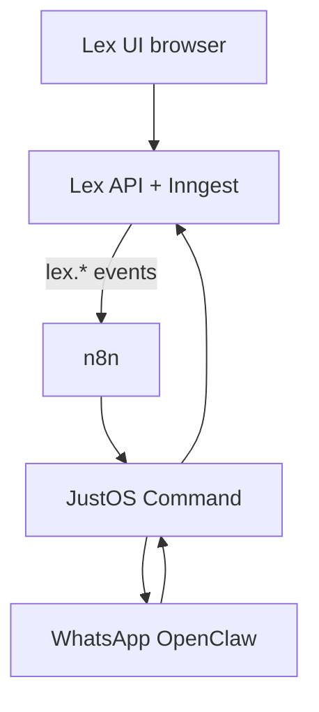

# JustOS — sistema operacional do escritório

**Nome oficial:** **JustOS** (renomeação do produto Lex; não “SOLD Lite”, não “Lex + IA”).

**Posicionamento:** plataforma única — **JustOS Core** (casos, peças, Case Brain) + **JustOS** (integração/automação) + **JustOS Pro** (CRM + WhatsApp do escritório, mediante assinatura). Mesmas credenciais Supabase/workspace para tudo.

**Plano CRM Pro (canônico):** [`JUSTOS_PRO_CRM_PLAN.md`](./JUSTOS_PRO_CRM_PLAN.md) — multi-tenant, OpenClaw por escritório, rename Lex→JustOS, fases 0→E.

**Monetização:**

| Plano | Inclui |
|-------|--------|
| **JustOS** (base) | Eventos, integração n8n, configuração, saúde dos serviços — sem secretária proativa |
| **JustOS Pro** | Secretária por automação: lembretes, confirmações, WhatsApp operacional, filas — **cobrança à parte** |

O motor jurídico (Case Brain, corpus, peças, revisão, LGPD) permanece no **JustOS Core** (código em transição de prefixo `lex` → `justos`).

---

## 1. Lex hoje (núcleo jurídico)

Fluxo caso-cêntrico em `/cases/[id]` — 8 fases no cockpit. Ver [`UX_FLOW_AUDIT.md`](./UX_FLOW_AUDIT.md) e [`CASE_BRAIN.md`](./CASE_BRAIN.md).

**JustOS não substitui** entrevista, documentos, pesquisa pinada, minuta ou protocolo manual.

---

## 2. O que é o JustOS

| Camada | Responsável |
|--------|-------------|
| Fatos, peças, corpus, review | **Lex** |
| WhatsApp, cron, CRM tribunal, e-mail | **JustOS** (n8n + sidecar) |
| Conversa em tempo real + confirmação envio | **JustOS Command** (porta 3301) |
| Secretária proativa | **JustOS Pro** apenas |



**Regra de ouro:** JustOS **nunca** gera minuta nem altera pedidos sem API Lex autenticada + audit trail.

---

## 3. Arquitetura sidecar

Mesmo padrão do ecossistema SOLD local (`local-ai-control`), adaptado por **workspace**:

- **OpenClaw** :3310 — transporte WhatsApp  
- **JustOS Command** :3301 — intent jurídico, allowlist, confirmações  
- **n8n** :5678 — workflows `lex-case-*`  
- **Lex** :3000 — produto

Config workspace: `onboardingJson.justos` (ver `src/lib/justos/workspace-config.ts`).

---

## 4. Eventos `lex.*` → n8n

| Evento | Disparo |
|--------|---------|
| `lex.case.created` | Novo caso |
| `lex.intake.structured` | Entrevista organizada |
| `lex.document.indexed` | Ingest concluído |
| `lex.brain.consolidated` | Case Brain |
| `lex.draft.generated` | Minuta persistida |
| `lex.review.completed` | Revisão |
| `lex.deadline.approaching` | Cron Pro |

Implementação: `src/lib/justos/emit-event.ts` · env `LEX_N8N_WEBHOOK_URL`.

**JustOS Pro** exige `justos.proEnabled === true` no workspace para workflows de secretária.

---

## 5. Implementação (eng)

### Feito / em curso

- [x] Doc e naming **JustOS** + **JustOS Pro**
- [x] `src/lib/justos/*` (config, copy, emit)
- [x] Correção fluxo caso P0.2 (lazy intake no workflow)
- [x] UI `/settings/integracoes/justos`
- [x] Hooks `emitLexJustosEvent` em draft/review/brain/intake/case.create/document (Inngest)
- [x] Callbacks n8n → Lex (`LEX_N8N_SERVICE_TOKEN` em draft/brain/review/case-brain)
- [x] API + UI workspace `/api/settings/justos` e toggles em integrações
- [ ] Sidecar Command lite (fork SOLD CC) — ver [`JUSTOS_PRO_CRM_PLAN.md`](./JUSTOS_PRO_CRM_PLAN.md) Fase A
- [ ] Compose `docker/justos-compose.yml`
- [x] CRM Pro fundação Sprint 1 — contatos, pipeline, APIs, UI — ver [`JUSTOS_PRO_CRM_IMPLEMENTATION_STATUS.md`](./JUSTOS_PRO_CRM_IMPLEMENTATION_STATUS.md)
- [ ] Inbox + WA por tenant (Command) — Fase A/C
- [ ] Rename produto Lex → JustOS (UI + env) — plano Fase R0–R4

### Arquivos Lex

| Área | Caminho |
|------|---------|
| Workflow fases | `src/lib/cases/case-legal-workflow.ts` |
| JustOS lib | `src/lib/justos/` |
| n8n | `workflows/n8n/README.md` |
| Integrações UI | `src/app/(app)/settings/integracoes/justos/` |

---

## 6. Fluxo de caso + JustOS (exemplo Pro)

1. Advogado salva entrevista no Lex (sem obrigar “organizar com IA”).  
2. `lex.intake.saved` → n8n (ack interno).  
3. Cliente pergunta no WhatsApp → JustOS Command lê snapshot público do caso.  
4. Advogado gera minuta no Lex → `lex.draft.generated` → **Pro** notifica WA.  

---

## 7. JustOS ↔ n8n — o que já é real (mai/2026)

### Como conecta

```
Lex (emitLexJustosEvent) ──POST──► http://127.0.0.1:5678/webhook/lex-case-secretary
         │ header: x-lex-n8n-secret
         │ body.event: draft.generated (sem prefixo lex.)
         ▼
n8n workflow «Lex — Secretária por Caso» → DeepSeek / HTTP Lex API / bridge SOLD :3300
```

| Camada | Status | Notas |
|--------|--------|--------|
| n8n local `:5678` | **Real** | Docker `local-ai-control/services/n8n` |
| Webhook `lex-case-secretary` | **Real** | Workflow ativo; secret em `sold-credentials.env` |
| Webhook `sold-events` | **Real** | SOLD Command Center |
| `emitLexJustosEvent` no Lex | **Real** | Hooks em create, intake, brain, draft, review, document indexed |
| Workspace `justos.enabled` | **Real** | UI em `/settings/integracoes/justos` ou `scripts/enable-justos-workspace.ts` |
| WhatsApp cliente/advogado | **Condicional** | Depende de números + allowlist OpenClaw; use opt-out no teste |
| `POST` Lex API do n8n | **Real com Lex up** | Bearer `LEX_N8N_SERVICE_TOKEN` em draft/brain/review; GET case-brain |
| Env local | **Script** | `scripts/setup-justos-env.sh` sincroniza `.env.local` + `sold-credentials.env` |

### Dev local (callbacks n8n → Lex)

- Lex deve escutar em **`0.0.0.0:3000`** (`npm run dev -- --hostname 0.0.0.0`) para o container n8n alcançar via `host.docker.internal`.
- Docker n8n: `extra_hosts: host.docker.internal:host-gateway` em `local-ai-control/services/n8n/docker-compose.yml`.
- Middleware libera rotas `/api/cases/[id]/{draft,brain,review,case-brain}` com Bearer `LEX_N8N_SERVICE_TOKEN`.

Se o editor ainda mostrar nós **PG Casos travados**, o banco do n8n está desatualizado. Rode:

```bash
python3 scripts/push-n8n-lex-workflow.py
```

Isso substitui Postgres por APIs Lex e ativa o workflow (`active=true`).

1. Lex: `npm run dev -- --hostname 0.0.0.0 --port 3000`
2. n8n: atualize o workflow (import `lex-case-secretary.json` ou rode `~/local-ai-control/tools/n8n/bootstrap-lex-case-secretary.sh`)
3. UI: `/settings/integracoes/justos` → ativar JustOS + **Salvar WhatsApp**
4. Script:

```bash
JUSTOS_TEST_LAWYER_WA=5547999999999 ./scripts/test-justos-real-controlled.sh
```

APIs novas (sem Postgres no n8n): `justos-secretary`, `stalled-cases`, `justos-notification-log`.

### Teste local (certeza imediata — mesmo Supabase)

```bash
# Terminal 1
npm run dev -- --hostname 0.0.0.0 --port 3000

# Terminal 2
./scripts/setup-justos-env.sh
./scripts/test-justos-full.sh          # 6 checks — baseline deploy
JUSTOS_TEST_LAWYER_WA=5547... ./scripts/test-justos-real-controlled.sh
```

Ver execuções: http://127.0.0.1:5678 → **Lex — Secretária por Caso** → Executions.

### Teste Lex online (Vercel) + n8n local

```bash
./scripts/test-justos-online.sh                    # diagnóstico
./scripts/setup-justos-vercel-env.sh               # vars para colar no Vercel
# após deploy + env no Vercel:
./scripts/test-justos-online.sh --online-callbacks   # n8n → lex-navy.vercel.app
./scripts/test-justos-online.sh --full               # local + online
```

**Hoje (pré-deploy JustOS na Vercel):** callbacks online retornam 401 até existir `LEX_N8N_SERVICE_TOKEN` no projeto Vercel e redeploy com `proxy.ts` JustOS.

**Lex online → n8n:** Vercel não alcança `127.0.0.1:5678`. Para emit automático no site publicado, `LEX_N8N_WEBHOOK_URL` deve ser URL **pública** (tunnel, n8n Cloud ou VPS).

### Checklist deploy final

| # | Item | Onde |
|---|------|------|
| 1 | Código JustOS na branch main | git push |
| 2 | `LEX_N8N_SERVICE_TOKEN` | Vercel env + n8n `sold-credentials.env` (mesmo valor) |
| 3 | `LEX_N8N_WEBHOOK_SECRET` | Vercel + n8n + Lex |
| 4 | `LEX_N8N_WEBHOOK_URL` | Vercel → URL pública do n8n |
| 5 | `LEX_API_BASE_URL` | n8n → `https://lex-navy.vercel.app` |
| 6 | Workflow sem nós Postgres | `python3 scripts/push-n8n-lex-workflow.py` |
| 7 | JustOS ativo no workspace | UI `/settings/integracoes/justos` |
| 8 | Teste verde | `./scripts/test-justos-online.sh --full` |

Env Lex (`.env.local`, não commitar secret):

```env
LEX_N8N_WEBHOOK_URL=http://127.0.0.1:5678/webhook/lex-case-secretary
LEX_N8N_WEBHOOK_SECRET=<mesmo valor que LEX_N8N_WEBHOOK_SECRET no n8n>
JUSTOS_DEV_EMIT=true   # opcional: emitir sem justos.enabled no workspace
```

---

## 8. O que não copiar do SOLD pessoal

CFO, shopping, Spotify, 15 agentes Life OS — fora do JustOS v1.

---

## 9. Segurança

### Modelo de acesso (workspace + contato)

| Camada | Regra |
|--------|--------|
| **Lex UI** | Sessão Supabase + `workspaceId` em toda rota de caso |
| **n8n → Lex** | Bearer `LEX_N8N_SERVICE_TOKEN`; caso resolvido por `caseId` → `workspaceId`; JustOS deve estar `enabled` no escritório |
| **Cron casos travados** | Só workspaces com `justos.enabled` + `proEnabled`; só casos com advogado configurado |
| **WhatsApp outbound** | Só números em `allowedRecipients`: advogado(s) do caso (ou padrão do workspace) + cliente do caso; se `allowedNumbers` existir no workspace, intersecta |
| **Log de notificação** | `POST justos-notification-log` rejeita destinatário não autorizado (403) |

Implementação: `src/lib/justos/contact-access.ts` · payload webhook inclui `allowedRecipients` · n8n filtra antes do bridge WhatsApp.

### Conteúdo e opt-out

- Cliente WA: mensagens genéricas; sem CNJ/valores/tese.  
- Kill switch: `justos.enabled === false`.  
- Pro: opt-in explícito + contrato comercial.
- Respeitar `preferences.clientOptOut` / `lawyerOptOut` no objeto `secretary`.

---

*Substitui `LEX_JUSTOS_SOLD_LITE.md` como documento canônico (mai/2026).*
