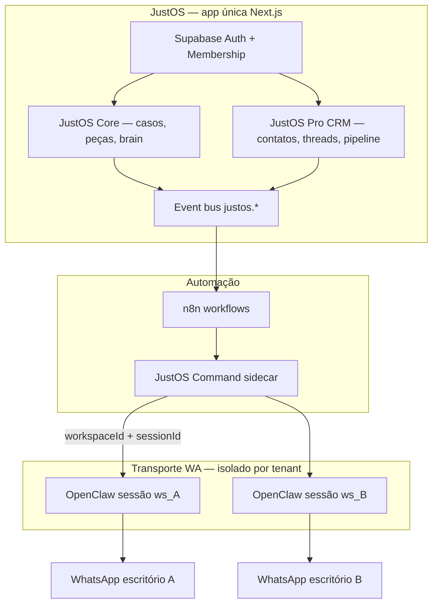

# Plano — JustOS Pro CRM Profissional

**Status:** planejamento (mai/2026)  
**Escopo:** transformar **JustOS Pro** (assinatura) em CRM operacional multi-tenant, com WhatsApp por escritório via OpenClaw, mantendo o motor jurídico no mesmo produto — **JustOS** (renomeação completa de Lex).  
**Documentos relacionados:** [`JUSTOS.md`](./JUSTOS.md) · [`UX_FLOW_AUDIT.md`](./UX_FLOW_AUDIT.md)

---

## 1. Visão e posicionamento

### 1.1 Renomeação Lex → JustOS

| Antes | Depois |
|-------|--------|
| Produto “Lex” | **JustOS** — sistema operacional do escritório de advocacia |
| Módulo jurídico (casos, peças, Case Brain) | **JustOS Core** (motor jurídico) |
| Integração n8n + eventos | **JustOS** (plano base, incluído ou ativável) |
| Secretária + automação WA | **JustOS Pro** (assinatura) |
| CRM contatos, pipeline, inbox WA | **JustOS Pro CRM** (mesma assinatura Pro) |

**Regra:** uma única identidade de login (Supabase + `workspaceId` + `MembershipRole`). Não há “conta Lex” e “conta CRM” separadas — é o mesmo tenant, mesmas credenciais, escopo por workspace.

### 1.2 O que o Pro desbloqueia

Sem **JustOS Pro** ativo (`justos.proEnabled` + assinatura válida):

- Core jurídico (casos, minutas, revisão) permanece utilizável conforme licença do workspace.
- JustOS base pode permanecer desligado ou limitado (config técnica, sem automação).

Com **JustOS Pro**:

| Capacidade | Descrição |
|------------|-----------|
| **CRM Contatos** | Clientes, leads, partes, testemunhas; telefone E.164; vínculo a casos |
| **CRM Pipeline** | Estágios comerciais/operacionais por contato ou caso |
| **CRM Conversas** | Threads WhatsApp (e futuro e-mail) por contato/caso |
| **CRM Atividades** | Timeline unificada (ligação, WA, nota, prazo, evento Lex) |
| **WhatsApp escritório** | Sessão OpenClaw **dedicada ao workspace** (QR onboarding) |
| **Automações** | n8n + eventos `justos.*` com sessão e allowlist do tenant |
| **Inbox operacional** | Receber e responder no número do escritório, roteado ao caso certo |

---

## 2. Princípios de arquitetura



### 2.1 Regras inegociáveis (segurança multi-tenant)

1. **Todo dado CRM** tem `workspaceId` NOT NULL + índice composto; queries sempre filtram pelo workspace da sessão.
2. **Nenhum** arquivo de sessão OpenClaw/SOLD global (`sessions/5547…json`) armazena conversa de cliente Lex/JustOS em produção.
3. **Outbound WA:** `to` deve passar por `assertNotificationRecipientAuthorized` (evoluir para `CrmContact` + allowlist).
4. **Inbound WA:** resolver `workspaceId` **antes** de persistir mensagem ou chamar LLM (por `whatsappSessionId` + número mapeado).
5. **Tokens de serviço (n8n, Command):** escopo por workspace (`JUSTOS_SERVICE_TOKEN` com claim ou token por workspace + rotação).
6. **Pro gate:** middleware `requireJustosPro(workspaceId)` em todas as rotas CRM e envio WA.
7. **LGPD:** opt-out por contato; retenção configurável; exportação por workspace (owner).

### 2.2 O que NÃO reutilizar do SOLD pessoal

- CRM `leads.jsonl` local, agentes Life OS, memória global Thales.
- Bridge `:3300/webhook/n8n` **sem** `workspaceId` em produção multi-tenant.
- Sessão OpenClaw `credentials/whatsapp/default` para clientes pagantes.

---

## 3. Modelo de dados (Prisma)

### 3.1 Evolução de entidades existentes

| Modelo atual | Evolução |
|--------------|----------|
| `Workspace.onboardingJson.justos` | Campos CRM + WA: `whatsappSessionId`, `whatsappStatus`, `crmSettings` |
| `Client` | `whatsapp`, `crmStage`, `source`, link opcional a `CrmContact` unificado |
| `Case` | `primaryContactId`, manter `metadataJson.n8nSecretary` até migrar para tabelas |
| `Activity` | Tipos CRM: `CRM_MESSAGE`, `CRM_CALL`, `CRM_STAGE_CHANGE` |
| `CaseTimelineEvent` | Espelhar atividades CRM relevantes no caso |

### 3.2 Novas tabelas (Pro)

```prisma
// Esboço — implementar na Fase B com migration

enum CrmContactKind {
  CLIENT
  LEAD
  COUNTERPARTY
  WITNESS
  OTHER
}

enum CrmPipelineStage {
  NEW
  QUALIFIED
  ACTIVE
  WAITING_CLIENT
  PROPOSAL
  WON
  LOST
  ARCHIVED
}

enum CrmChannel {
  WHATSAPP
  EMAIL
  PHONE
  IN_PERSON
  SYSTEM
}

enum CrmMessageDirection {
  INBOUND
  OUTBOUND
}

model CrmContact {
  id            String   @id @default(cuid())
  workspaceId   String
  kind          CrmContactKind
  displayName   String
  phoneE164     String?   // índice único parcial por workspace
  email         String?
  documentId    String?
  pipelineStage CrmPipelineStage @default(NEW)
  clientId      String?   // link opcional Client legado
  caseId        String?   // caso principal sugerido
  optOutWhatsapp Boolean  @default(false)
  metadataJson  Json?
  deletedAt     DateTime?
  createdAt     DateTime @default(now())
  updatedAt     DateTime @updatedAt
  @@unique([workspaceId, phoneE164])
  @@index([workspaceId, pipelineStage])
}

model CrmConversation {
  id            String   @id @default(cuid())
  workspaceId   String
  contactId     String
  caseId        String?
  channel       CrmChannel @default(WHATSAPP)
  externalChatId String?  // chatId OpenClaw
  lastMessageAt DateTime?
  unreadCount   Int      @default(0)
  @@index([workspaceId, lastMessageAt])
}

model CrmMessage {
  id              String   @id @default(cuid())
  workspaceId     String
  conversationId  String
  direction       CrmMessageDirection
  body            String   @db.Text
  sentAt          DateTime
  traceId         String?
  deliveryStatus  String?  // sent, delivered, failed
  metaJson        Json?
  @@index([conversationId, sentAt])
}

model JustosWhatsappSession {
  id            String   @id @default(cuid())
  workspaceId   String   @unique
  sessionKey    String   // ex. ws_{workspaceId}
  openclawPort  Int?     // pool dinâmico ou ref orchestrator
  status        String   // disconnected | pairing | connected | error
  connectedAt   DateTime?
  phoneE164     String?  // número do escritório conectado
  lastHealthAt  DateTime?
}
```

**Migração:** backfill `CrmContact` a partir de `Client.phone` + `Case.metadataJson.n8nSecretary`.

---

## 4. Autenticação e credenciais (mesmo Lex → JustOS)

| Superfície | Mecanismo |
|------------|-----------|
| UI browser | Supabase session (inalterado) |
| API app | `getWorkspaceContext()` + `can(role, …)` |
| n8n → API | `Authorization: Bearer` — renomear env `LEX_N8N_*` → `JUSTOS_N8N_*` (aliases deprecados 2 releases) |
| Command → API | Mesmo token ou `JUSTOS_COMMAND_SECRET` + header `x-justos-workspace-id` |
| OpenClaw → Command | `x-justos-session-key` mapeado 1:1 `workspaceId` |
| Stripe / billing | Webhook atualiza `onboardingJson.justos.proSubscriptionStatus` |

### 4.1 Gate JustOS Pro (central)

```ts
// src/lib/justos/require-pro.ts
export async function requireJustosPro(workspaceId: string): Promise<void>
```

Usar em: rotas `/api/crm/*`, `/api/justos/whatsapp/*`, webhooks outbound, UI `/crm/*`.

---

## 5. Módulos CRM (funcional)

### 5.1 Contatos

- CRUD `/api/crm/contacts` (Pro)
- Importar de `Client` existente
- Normalização E.164 (`phone-normalize.ts` já existe)
- Vínculo N:N contato ↔ casos (`CrmContactCase` opcional Fase B+)

### 5.2 Pipeline

- Kanban por estágio (`CrmPipelineStage`)
- Filtros: responsável, caso, origem
- Automação n8n: mudança de estágio → mensagem template (Pro)

### 5.3 Conversas (inbox)

- UI `/crm/inbox` — lista conversas + painel mensagens
- Envio manual: advogado digita → API → Command → OpenClaw (sessão do workspace)
- Histórico em `CrmMessage` (fonte de verdade)
- Anexar conversa a `caseId` (sugestão IA opcional Fase C)

### 5.4 Atividades

- Unificar `Activity` + `CaseTimelineEvent` + `CrmMessage` na timeline do caso
- Tipos: nota, ligação, WA, e-mail, prazo, evento automático JustOS

### 5.5 WhatsApp (OpenClaw por assinatura)

| Etapa | Comportamento |
|-------|----------------|
| Onboarding Pro | UI “Conectar WhatsApp do escritório” → QR OpenClaw |
| Persistência | `JustosWhatsappSession` + credenciais isoladas `credentials/whatsapp/{sessionKey}/` |
| Outbound automático | n8n inclui `workspaceId`, `sessionKey`, `allowedRecipients` |
| Inbound | OpenClaw → Command `/webhook/justos/inbound` → resolve contact → grava `CrmMessage` |
| Desconectar | Revoga sessão; limpa tokens; mantém histórico read-only |

**Command sidecar (fork SOLD CC):** `local-ai-control/services/justos-command/` — sem agentes pessoais; só rotas jurídicas + CRM.

### 5.6 Automações (evolução n8n)

- Renomear workflow: `JustOS — Secretária por Caso`
- Payload obrigatório: `workspaceId`, `caseId`, `sessionKey`
- Nó WhatsApp: `POST {JUSTOS_COMMAND_URL}/whatsapp/send` (não SOLD global)
- Eventos: prefixo `justos.` (manter alias `lex.*` 1 release)

---

## 6. Renomeação técnica Lex → JustOS

### 6.1 Fases de rename (evitar big-bang quebrar deploy)

| Fase | Escopo | Risco |
|------|--------|-------|
| **R0** | Docs, UI strings, README, `JUSTOS.md` canônico | Baixo |
| **R1** | Env aliases: `JUSTOS_N8N_WEBHOOK_URL` lê fallback `LEX_N8N_*` | Baixo |
| **R2** | Rotas públicas: `/settings/integracoes/justos` principal; redirect `/lex` → `/` | Médio |
| **R3** | Pacote npm / Vercel project display name / domínio | Médio |
| **R4** | Remover prefixo `lex.` em eventos e código interno | Alto — 1 release com dual emit |

### 6.2 Checklist rename (R0–R1)

- [ ] `README.md` → JustOS
- [ ] UI: título app, emails, metadados
- [ ] `src/lib/justos/copy.ts` — termos usuário
- [ ] Scripts `setup-justos-env.sh` — vars novas + fallback
- [ ] Vercel env documentation
- [ ] Manter `prisma` e tabelas `Case` (nome técnico OK; UI “Caso”)

---

## 7. Roadmap de implementação

### Fase 0 — Fundação (2–3 semanas)

**Objetivo:** Pro gate sólido + rename R0/R1 + corrigir WA single-tenant em dev.

| # | Entrega | Critério de pronto |
|---|---------|-------------------|
| 0.1 | `requireJustosPro` em APIs sensíveis | 403 sem Pro |
| 0.2 | Stripe/webhook assinatura → `proEnabled` | UI reflete estado real |
| 0.3 | Env `JUSTOS_*` com fallback `LEX_*` | Scripts test verdes |
| 0.4 | Doc rename + UI “JustOS” | Sem “Lex” em superfícies usuário |
| 0.5 | Testes usam número do workspace DB | Zero hardcode `5547984696731` em CI |

### Fase A — Command + sessão WA (3–4 semanas)

**Objetivo:** um workspace = uma sessão OpenClaw; sem vazamento.

| # | Entrega | Critério de pronto |
|---|---------|-------------------|
| A.1 | `justos-command` service (fork mínimo SOLD) | Health + send com `workspaceId` |
| A.2 | `JustosWhatsappSession` + API connect/status | QR conecta; status `connected` |
| A.3 | Orquestrador sessão (porta ou container por `sessionKey`) | 2 workspaces isolados em staging |
| A.4 | n8n nó WhatsApp → Command | Execução success; log no caso |
| A.5 | Desligar bridge SOLD global para Lex tenants | Flag `JUSTOS_USE_LEGACY_BRIDGE=false` prod |

### Fase B — CRM dados + APIs (4–5 semanas)

| # | Entrega | Critério de pronto |
|---|---------|-------------------|
| B.1 | Migration Prisma `CrmContact`, `CrmConversation`, `CrmMessage` | `prisma migrate` OK |
| B.2 | APIs CRUD contatos + pipeline | Testes integração + workspace isolation |
| B.3 | Backfill contatos de `Client` / secretary metadata | Script idempotente |
| B.4 | UI `/crm/contacts`, `/crm/pipeline` | Pro gate na rota |
| B.5 | Timeline caso agrega CRM | Caso mostra últimas mensagens |

### Fase C — Inbox + inbound (3–4 semanas)

| # | Entrega | Critério de pronto |
|---|---------|-------------------|
| C.1 | Webhook inbound Command → `CrmMessage` | Mensagem recebida aparece na inbox |
| C.2 | UI `/crm/inbox` envio/resposta | Advogado responde pelo número do escritório |
| C.3 | Roteamento contato → caso (manual + sugestão) | Vincular thread a `caseId` |
| C.4 | Opt-out por contato | Não envia automação se `optOutWhatsapp` |

### Fase D — Automações Pro + polish (2–3 semanas)

| # | Entrega | Critério de pronto |
|---|---------|-------------------|
| D.1 | Templates n8n por evento JustOS | 5 eventos com template CRM |
| D.2 | Relatórios básicos (mensagens/semana, estágio) | Dashboard `/crm` |
| D.3 | Export LGPD workspace | Owner baixa CSV |
| D.4 | Hardening segurança (pentest checklist §9) | Doc atualizado |

### Fase E — Produção SaaS (paralelo contínuo)

- n8n público (tunnel/VPS/Cloud)
- Vercel env `JUSTOS_*`
- Compose `docker/justos-compose.yml` (Lex app + Command + n8n + pool OpenClaw)
- Monitoramento por `workspaceId` (métricas, alertas sessão WA down)

---

## 8. UI / navegação (JustOS)

```
/                          → Dashboard JustOS
/cases                     → JustOS Core (casos)
/crm                       → JustOS Pro CRM (gate Pro)
/crm/contacts
/crm/inbox
/crm/pipeline
/settings/integracoes/justos → Plano, WhatsApp, billing
```

**Nav:** item “CRM” visível só com Pro ativo; badge “Pro” no menu.

---

## 9. Segurança — checklist de release Pro CRM

| # | Controle |
|---|----------|
| 1 | Row-level: todas queries CRM com `workspaceId` da sessão |
| 2 | Pro subscription validada server-side (não só UI) |
| 3 | Token n8n não aceita `caseId` de outro workspace |
| 4 | Inbound não grava sem `workspaceId` resolvido |
| 5 | OpenClaw credentials separadas por `sessionKey` |
| 6 | Logs sem corpo completo de mensagem em produção (só hash/trace) |
| 7 | Rate limit envio WA por workspace |
| 8 | Confirmação humana para envio em massa (>N destinatários) |
| 9 | Auditoria: `CrmMessage` + `justos-notification-log` unificados |

---

## 10. Estado atual vs plano

| Item | Hoje | Após plano |
|------|------|------------|
| Produto | Lex + extensão JustOS | **JustOS** (Core + Pro) |
| CRM | Metadata + `Client` solto | Tabelas CRM + inbox |
| WA | 1 OpenClaw pessoal + SOLD :3300 | Sessão por workspace via Command |
| Auth | Supabase + workspace | **Igual** |
| Pro | UI + `proEnabled` placeholder | Stripe + gate + CRM |
| n8n | `lex-case-secretary` | `justos-case-secretary` + `workspaceId` |

### Já implementado (reaproveitar)

- `src/lib/justos/*` (config, emit, contact-access, secretary store)
- UI `/settings/integracoes/justos` + subscribe API
- Workflow n8n secretária (HTTP Lex, allowlist)
- `notification-log` API
- Testes `test-justos-full.sh`

### Não refazer

- Motor jurídico (Case Brain, draft, review)
- Modelo `Workspace` / `Membership` / Supabase auth
- Substituição PG no n8n por APIs Lex (manter padrão HTTP)

---

## 11. Riscos e mitigação

| Risco | Mitigação |
|-------|-----------|
| Vazamento conversas entre escritórios | Sessão OpenClaw isolada + DB com `workspaceId`; sem SOLD global |
| Custo OpenClaw N instâncias | Pool com limite assentos Pro; escalar por host |
| Rename quebra integrações | Aliases env `LEX_*` por 2 releases |
| LGPD mensagens cliente | Templates genéricos + opt-out + política retenção |
| Complexidade n8n multi-tenant | Command abstrai WA; n8n só fala com Command |

---

## 12. Métricas de sucesso (Pro CRM v1)

1. Escritório conecta WhatsApp próprio em &lt; 10 min (QR).
2. Mensagem inbound aparece na inbox em &lt; 5 s (p95).
3. Automação `draft.generated` envia do número **do escritório**, não de sessão pessoal.
4. Zero tickets de “mensagem no workspace errado” em staging (teste 2+ tenants).
5. Assinatura Pro bloqueia CRM API (403) sem pagamento ativo.

---

## 13. Próximo passo imediato

1. Aprovar este plano e prioridade de fases.  
2. Abrir épico **Fase 0** (issues: `requireJustosPro`, rename env, testes sem número fixo).  
3. Paralelo: esboço `services/justos-command` no `local-ai-control`.  
4. Atualizar [`JUSTOS.md`](./JUSTOS.md) com link para este plano e matriz de renomeação.

---

*Documento vivo — atualizar ao concluir cada fase (marcar entregas, comandos rodados, falhas). Não declarar “release ready” sem migrate + testes integração + isolamento 2 tenants em staging.*
