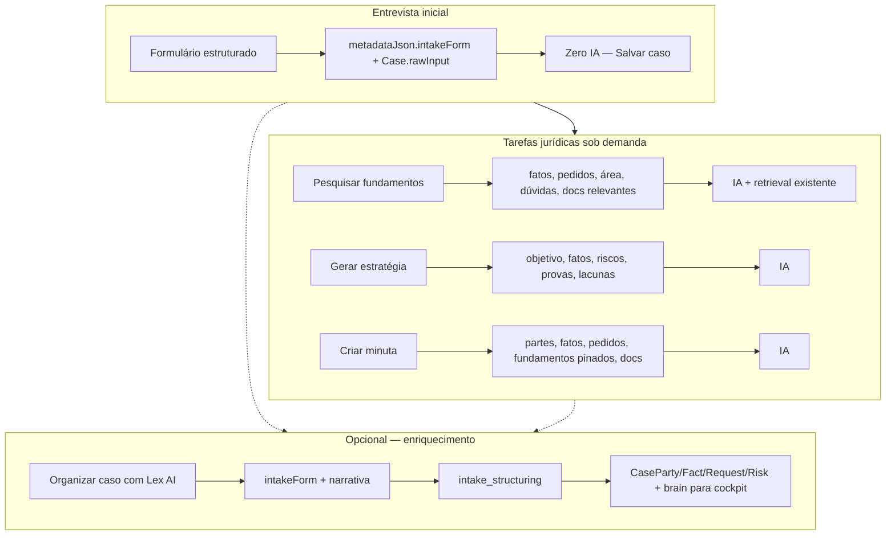
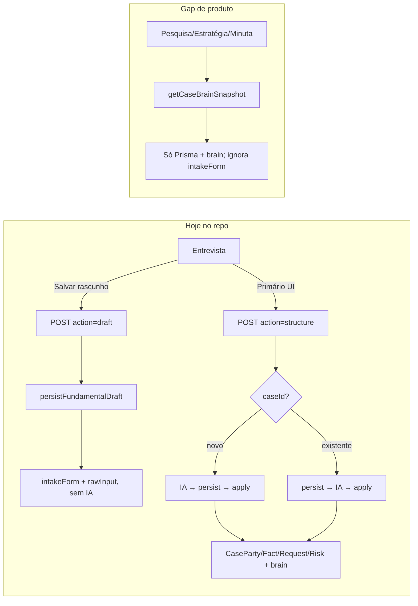

# P0.2 — Lazy Intake Jurídico

**Última revisão de status:** 2026-05-15 (código em `main`, commit recente `e152239`)

## Status de execução

### Já feito (fora ou antes do P0.2 — não reimplementar)

| Item | Estado | Evidência |
|------|--------|-----------|
| Fluxo fundamental intake (formulário, API, persist, apply) | Feito (P0.1) | `cb22346` — `fundamental-intake/*`, `POST /api/cases/fundamental-intake` |
| `action=draft` sem chamada de IA | Feito | [`fundamental-intake/route.ts`](src/app/api/cases/fundamental-intake/route.ts) — só `persistFundamentalDraft` |
| `buildIntakeNarrativeForModel` + gravação `intakeForm` / `rawInput` | Feito | [`build-narrative.ts`](src/lib/cases/fundamental-intake/build-narrative.ts), [`fundamental-intake-service.ts`](src/lib/cases/fundamental-intake/fundamental-intake-service.ts) |
| `parseFundamentalIntakeFromMetadata` / detecção fluxo fundamental | Feito | [`case-intake-source.ts`](src/lib/cases/case-intake-source.ts) |
| `applyFundamentalStructure` + `intakeStructuredAt` + tabelas relacionais | Feito | [`fundamental-intake-service.ts`](src/lib/cases/fundamental-intake/fundamental-intake-service.ts) |
| Entrevista embutida, checklist bootstrap, 409 checklist legado | Feito | [`UX_FLOW_AUDIT.md`](docs/UX_FLOW_AUDIT.md) secções 2026-05-14 |
| DeepSeek v4 flash/pro via `@ai-sdk/deepseek` | Feito | `8c30635` |
| Remoção Google/Gemini/Gemma do stack de chat | Feito | `factory.ts` só deepseek/openai/anthropic/openrouter; sem `@ai-sdk/google` |
| Fix hydration `nonce` no script de tema | Feito | [`layout.tsx`](src/app/layout.tsx) — script nativo + `headers().get("x-nonce")` |
| Testes contrato P0.1 + ordem rota intake | Feito | `tests/cases/fundamental-intake-route-order.test.ts`, `p0-case-flow-qa-contracts.test.ts` |
| E2E setup autenticado (spec fundamental) | Feito (estruturar-first) | `tests/e2e/case-flow-fundamental.spec.ts` — **precisa atualizar** para save-first |

### Parcial (base técnica existe; produto P0.2 ainda não)

| Item | O que falta para P0.2 |
|------|------------------------|
| Salvar sem IA | API ok; UI ainda diz **“Salvar rascunho”** e botão primário é **estruturar** |
| Caso utilizável sem `intakeStructuredAt` | Draft persiste; pesquisa/estratégia/minuta **não** leem `intakeForm` |
| Estruturação opcional | `action=structure` existe; UX trata como caminho principal; novo caso ainda **IA antes de persist** |
| Erro de IA na estruturação | Com `caseId`: caso já salvo; sem `caseId`: falha IA não cria caso — alinhar persist-first + `structureError` |

### Pendente (escopo P0.2 — implementar)

1. **Helpers** — `src/lib/cases/intake/case-intake-context.ts`: `getCaseIntakeForm`, `buildCaseDisplaySnapshot`, `buildCaseTaskContext`, `compactContextPayload`, `pickStructuredSource`
2. **Salvar caso** — alias `save`, campos determinísticos extras (`uf`, `summary`, CNJ…), copy/toasts, inverter botões, `data-testid` novos
3. **Organizar opcional** — persist → IA → apply para caso novo; `structureError` em falha; `reorganize` + dialog; “Reorganizar com Lex AI”
4. **Wire tarefas** — research / strategy / draft usam contexto mínimo por `taskType`; corrigir bug brain vazio; relaxar `drafting-guard` com intake derivado
5. **UI fallbacks** — banner partes-fatos; cockpit chips “Entrevista salva” vs “Organizado com Lex AI”
6. **Prompts** — revisão cirúrgica para receber só bloco filtrado
7. **Testes + doc** — `lazy-intake-*.test.ts`, E2E save-first, secção P0.2 em `UX_FLOW_AUDIT.md`
8. **Gates** — `lint`, `typecheck`, `npm test`, `build:clean`

### Não feito / fora desta entrega

- RAG, Qdrant, embeddings
- Commit dedicado P0.2 (nenhum diff lazy intake no working tree)
- `chromium-auth` E2E completo no CI (depende secrets)
- Secção P0.2 em `UX_FLOW_AUDIT.md`

---

## Princípio de produto (fonte de verdade)

O Lex deixa de usar IA como **etapa obrigatória de cadastro** e passa a usá-la como **ferramenta jurídica sob demanda**. Isso reduz custo, reduz erro, mantém o caso editável na entrevista e força prompts específicos por tarefa.



| Momento | O que entra | IA? | Saída |
|---------|-------------|-----|--------|
| **Entrevista inicial** | Formulário completo | **Não** | `intakeForm` (JSON) + `rawInput` (narrativa determinística) + campos básicos do `Case` |
| **Pesquisar fundamentos** | Fatos, pedidos, área, dúvidas, documentos relevantes | **Sim** (+ retrieval já existente) | Recomendações / pins — sem reorganizar o caso |
| **Gerar estratégia** | Objetivo, fatos, riscos, provas, lacunas | **Sim** | `draftingStrategy` — sem redigir peça |
| **Criar minuta** | Partes, fatos, pedidos, fundamentos pinados, documentos | **Sim** | Rascunho revisável — sem inventar provas |
| **Organizar caso com Lex AI** | Entrevista salva | **Sim** (opcional) | Partes/fatos/pedidos/riscos + brain — **só** para enriquecer cockpit/checklist; não pré-requisito das outras tarefas |

**Ordem natural do advogado:** salvar entrevista → (quando quiser) pesquisar → estratégia → minuta. Organizar com IA é atalho de cockpit, não porta de entrada.

---

## Estado atual no código (pré-P0.2)



| Área | Ficheiros-chave | Comportamento hoje |
|------|-----------------|-------------------|
| UI entrevista | [`fundamental-intake-chrome.tsx`](src/components/cases/fundamental-intake-chrome.tsx), [`fundamental-intake-form.tsx`](src/components/cases/fundamental-intake-form.tsx) | Botão **violeta primário** = estruturar; secundário = rascunho |
| API | [`fundamental-intake/route.ts`](src/app/api/cases/fundamental-intake/route.ts) | `draft` sem IA; `structure` com DeepSeek `intake_structuring` |
| Persistência | [`fundamental-intake-service.ts`](src/lib/cases/fundamental-intake/fundamental-intake-service.ts) | `persistFundamentalDraft` já grava `title`, `rawInput`, `metadataJson.intakeForm`; timeline menciona estruturar |
| Intake metadata | [`case-intake-source.ts`](src/lib/cases/case-intake-source.ts) | `parseFundamentalIntakeFromMetadata` existe; **não** há `getCaseIntakeForm` |
| Contexto IA | [`case-brain/snapshot.ts`](src/lib/cases/case-brain/snapshot.ts), [`generate-strategy.ts`](src/lib/cases/drafting/generate-strategy.ts), [`generate-draft.ts`](src/lib/cases/drafting/generate-draft.ts), [`recommend-for-case/route.ts`](src/app/api/legal-research/recommend-for-case/route.ts) | Preferem `brain` vazio sobre tabelas; **não leem** `intakeForm` |
| Guard minuta | [`drafting-guard.ts`](src/lib/cases/drafting/drafting-guard.ts) | Exige `CaseParty`/`CaseFact` ou brain — bloqueia casos só com entrevista |
| `intakeStructuredAt` | route 409, [`entrevista/page.tsx`](src/app/(app)/cases/[id]/entrevista/page.tsx), [`case-checklist-state.ts`](src/lib/cases/case-checklist-state.ts) | Obrigatório só para **re-estruturar** (409) e modo `fundamental_done`; **não** bloqueia draft |

**Conclusão:** o caminho “sem IA” já existe (`action=draft`). O trabalho P0.2 é **inverter hierarquia UX**, **enriquecer save determinístico**, **unificar contexto por tarefa**, e **degradar com graça** quando não há materialização relacional.

### Mapa fases → status

| Fase | Conteúdo | Status |
|------|----------|--------|
| 1 | Helpers `case-intake-context` | Pendente |
| 2 | Salvar caso (API + persist + UI) | Pendente (API draft parcial) |
| 3 | Organizar caso opcional / reorganizar | Pendente (structure existe; UX e persist-first não) |
| 4 | Pesquisa / estratégia / minuta + fallbacks UI | Pendente |
| 5 | Prompts cirúrgicos | Pendente |
| 6 | Testes + gates + UX_FLOW_AUDIT | Pendente |

---

## Fase 1 — Fonte canónica e helpers (sem mudar RAG) — PENDENTE

Novo módulo sugerido: [`src/lib/cases/intake/case-intake-context.ts`](src/lib/cases/intake/case-intake-context.ts) (ou expandir [`case-intake-source.ts`](src/lib/cases/case-intake-source.ts)).

| Helper | Responsabilidade |
|--------|------------------|
| `getCaseIntakeForm(metadata)` | Alias tipado de `parseFundamentalIntakeFromMetadata`; normaliza defaults |
| `buildIntakeNarrativeForModel` | Manter em [`build-narrative.ts`](src/lib/cases/fundamental-intake/build-narrative.ts); só ajustes se faltar campo usado em pesquisa |
| `buildCaseDisplaySnapshot(caseRow)` | Vista UI: se `intakeStructuredAt` → relacional + brain; senão → derivar **partes/fatos/pedidos/riscos lacunas** do `intakeForm` (somente leitura, sem criar linhas Prisma) |
| `buildCaseTaskContext(caseId, workspaceId, taskType)` | **Núcleo P0.2** — ver tabela abaixo |
| `compactContextPayload(obj, limits)` | Orçamento de tokens: omitir vazios, truncar textos longos, deduplicar narrativa vs campos estruturados |

**`buildCaseTaskContext` — contrato alinhado à lógica ideal (nunca enviar `intakeForm` inteiro):**

| `taskType` | Campos permitidos (intakeForm → derivado, ou brain/tabelas se organizado) | Não enviar |
|------------|---------------------------------------------------------------------------|------------|
| `legal_research` | **área jurídica**, **fatos** (relato + timeline resumida), **pedidos**, **dúvidas** do advogado, **documentos relevantes** (pinados + checklist marcado), UF/tribunal/CNJ se preenchidos | metadados internos, JSON bruto, campos vazios, duplicar narrativa inteira se fatos já extraídos |
| `strategy` | **objetivo do cliente**, **fatos**, **riscos** (declarados + lacunas), **provas** (checklist/docs), **lacunas** | pedidos completos se irrelevantes; pins de fundamentos (opcional como hint) |
| `draft` | **partes**, **fatos**, **pedidos**, **fundamentos pinados**, **documentos** de prova, tipo de peça, observações | estratégia JSON inteira; brain cru |
| `organize_case` | narrativa + intakeForm (única tarefa que pode ver o formulário quase completo) | N/A — só rota `intake_structuring` |
| `document_analysis` | metadados doc + trecho extraído | resto do caso |
| `review` | minuta + subset de `draft` | idem draft |

Limites: truncar textos longos (ex. narrativa ≤ 6k em pesquisa); `compactContextPayload` remove vazios e deduplica.

**Regra de merge (corrige bug atual):**

```ts
// Preferir brain só se tiver conteúdo útil; senão relacional; senão intakeForm
function pickStructuredSource(snap, intakeForm) { ... }
```

Aplicar em [`generate-strategy.ts`](src/lib/cases/drafting/generate-strategy.ts), [`generate-draft.ts`](src/lib/cases/drafting/generate-draft.ts), [`recommend-for-case/route.ts`](src/app/api/legal-research/recommend-for-case/route.ts) — **substituir** blocos inline `snap.brain ? … : snap.parties` por helper partilhado.

Incluir `rawInput` truncado no contexto de pesquisa quando não houver fatos estruturados (hoje o snapshot expõe `rawInput` mas recommend não usa).

Comentários no topo do módulo explicando: **IA não corre na entrevista por defeito**; corre em organizar / pesquisar / estratégia / minuta.

---

## Fase 2 — “Salvar caso” (fluxo padrão, sem IA) — PENDENTE

### API — manter `action=draft` (compat) + alias `save`

- [`fundamental-intake/route.ts`](src/app/api/cases/fundamental-intake/route.ts): `z.enum(["draft", "save", "structure"])` com `save` → mesmo handler que `draft`; resposta `mode: "fundamental_saved"`.
- **Estruturação:** para **novo caso**, alinhar ao pedido de produto: **`persistFundamentalDraft` → IA → `applyFundamentalStructure`** (igual ao ramo com `caseId`). Trade-off aceite: caso pode existir sem materialização se a IA falhar — resposta **200** com `{ case, mode: "fundamental_saved", structureError?: string }` quando persist OK e structure falhou.

### `persistFundamentalDraft` — campos determinísticos extras

Em [`fundamental-intake-service.ts`](src/lib/cases/fundamental-intake/fundamental-intake-service.ts), além de `title` / `rawInput`:

- `uf` ← `form.attend.uf`
- `processNumber` ← CNJ normalizado se `preOrProcess === existing_process`
- `tribunalCode` / metadados de vara ← `form.attend.tribunalVara` (em `metadataJson` se não houver coluna)
- `summary` ← 1–2 linhas determinísticas (ex.: área + início do relato, ≤ 280 chars)
- `metadataJson.intakeLegalArea` ← `probableLegalArea` (display cockpit)
- Timeline/copy: **“Entrevista salva”** em vez de mandar estruturar

**Não** criar `CaseParty` no save (evita duplicar com `applyFundamentalStructure` depois).

### UI / copy — Fase 3+9

| Antes | Depois |
|-------|--------|
| Salvar rascunho (secundário) | **Salvar caso** (primário, `variant="default"`) |
| Salvar e estruturar com Lex AI (primário violeta) | **Organizar caso com Lex AI** (secundário `variant="outline"`) — copy: enriquecer cockpit, não obrigatório |
| Toast rascunho | **“Caso salvo. Você pode pesquisar fundamentos ou criar uma minuta quando quiser.”** |
| Falha estruturar | **“O caso foi salvo. A organização automática pode ser feita depois.”** (se `case.id` presente) |

Ficheiros: [`fundamental-intake-chrome.tsx`](src/components/cases/fundamental-intake-chrome.tsx), [`fundamental-intake-form.tsx`](src/components/cases/fundamental-intake-form.tsx), [`entrevista/page.tsx`](src/app/(app)/cases/[id]/entrevista/page.tsx), [`form-schema.ts`](src/lib/cases/fundamental-intake/form-schema.ts) (copy de ajuda na secção narrative).

`structureLocked` / `isReadyForLexStructure`: **só** desabilita “Organizar”, nunca “Salvar caso”.

Após save em `/cases/new`: redirect opcional para `/cases/[id]/entrevista` ou `/cases/[id]` (manter refresh + toast; evitar parecer que falhou por não ir à overview).

---

## Fase 3 — Organizar caso com Lex AI (opcional / reorganizar) — PENDENTE

**Papel no produto:** única tarefa que materializa `CaseParty`/`CaseFact`/`CaseRequest`/`CaseRisk` e `metadataJson.brain` para **cockpit, checklist e partes-fatos editáveis**. Pesquisa, estratégia e minuta **não dependem** disto — leem `buildCaseTaskContext` da entrevista salva.

- Manter [`applyFundamentalStructure`](src/lib/cases/fundamental-intake/fundamental-intake-service.ts) e [`deepseek-structure.ts`](src/lib/cases/fundamental-intake/deepseek-structure.ts) intactos.
- **Reorganizar:** novo body flag `reorganize: true` ou `action: "reorganize"`; substituir 409 por:
  - exigir confirmação no cliente (`window.confirm` ou dialog shadcn) com copy: *“Pode atualizar partes, fatos, pedidos e riscos derivados. Campos que você confirmou na entrevista não serão sobrescritos.”*
  - respeitar `userConfirmedPaths` / merge existente em `applyFundamentalStructure`
- Botão: **“Reorganizar com Lex AI”** quando `isFundamentalIntakeStructured(meta)`.

---

## Fase 4 — Consumidores downstream (sem RAG) — PENDENTE

Cada endpoint chama **só** o `taskType` correspondente — ver tabela do princípio de produto.

| Consumidor | `buildCaseTaskContext` | Alteração |
|------------|------------------------|-----------|
| **Pesquisar fundamentos** | `legal_research` | [`recommend-for-case/route.ts`](src/app/api/legal-research/recommend-for-case/route.ts) — substituir `JSON.stringify(snap)` genérico; retrieval inalterado |
| **Gerar estratégia** | `strategy` | [`generate-strategy.ts`](src/lib/cases/drafting/generate-strategy.ts) |
| **Criar minuta** | `draft` | [`generate-draft.ts`](src/lib/cases/drafting/generate-draft.ts) + [`drafting-guard.ts`](src/lib/cases/drafting/drafting-guard.ts): partes/fatos do intake derivado; **mantém** exigência de fundamentos pinados + estratégia aprovada |
| **Organizar caso** | `organize_case` | rota `action=structure` — não misturar com save |
| Partes e fatos UI | [`case-facts-parties-tab.tsx`](src/components/cases/case-facts-parties-tab.tsx) + page: banner se `!intakeStructuredAt && intakeForm`: *“Este caso ainda não foi organizado automaticamente. As informações abaixo vêm da entrevista salva.”* + secção read-only derivada de `buildCaseDisplaySnapshot` |
| Cockpit / checklist | [`case-checklist-state.ts`](src/lib/cases/case-checklist-state.ts): manter `fundamental_draft`; chips podem mostrar “Entrevista salva” vs “Organizado com Lex AI” |
| Casos antigos | Sem migração; `intakeStructuredAt` continua a preferir relacional |

---

## Fase 5 — Prompts (revisão cirúrgica) — PENDENTE

Não reescrever tudo; alinhar **system/user** para receber só o bloco `buildCaseTaskContext` já filtrado:

| Prompt | Ficheiro | Ajuste |
|--------|----------|--------|
| `intake_structuring` | [`deepseek-structure.ts`](src/lib/cases/fundamental-intake/deepseek-structure.ts) | Reforçar opcionalidade; não mencionar “obrigatório para usar o caso” |
| Pesquisa | [`legal-research-prompts.ts`](src/lib/legal-research/legal-research-prompts.ts) | Questão jurídica, fontes do sistema, lacunas, sem inventar |
| Estratégia | [`generate-strategy.ts`](src/lib/cases/drafting/generate-strategy.ts) | Tese/riscos/provas; **não** redigir peça |
| Minuta | [`generate-draft.ts`](src/lib/cases/drafting/generate-draft.ts) | Só fatos disponíveis; ressalvas; fundamentos pinados |
| Análise doc | localizar `document` analysis routes | Resumo/obrigações/prazos (se existir no repo) |

---

## Fase 6 — Testes e gates — PENDENTE

**Novos/ajustados** (Vitest):

- `tests/cases/lazy-intake-save.test.ts` — mock provider: save não chama `generateText`
- `tests/cases/lazy-intake-structure-optional.test.ts` — structure mock; intakeForm preservado
- `tests/cases/build-case-task-context.test.ts` — intakeForm-only vs structured
- Atualizar [`p0-case-flow-qa-contracts.test.ts`](tests/cases/p0-case-flow-qa-contracts.test.ts) e E2E helpers se `data-testid` mudar (`save-case-sidebar`, etc.)

**E2E** [`case-flow-fundamental.spec.ts`](tests/e2e/case-flow-fundamental.spec.ts): cenário “save only” + pesquisa sem estruturar (com skip se sem API key).

**Comandos de fecho:** `npm run lint`, `npm run typecheck`, `npm test -- tests/cases`, `npm run build:clean`.

**Doc:** secção em [`docs/UX_FLOW_AUDIT.md`](docs/UX_FLOW_AUDIT.md) — P0.2 lazy intake (sem declarar release ready).

---

## Fora de escopo (explícito)

- RAG, Qdrant, embeddings, corpus
- Remover `CaseParty` / `CaseFact` / `applyFundamentalStructure`
- OAuth Google / providers removidos na rodada anterior
- Refatorar `reconcileCaseBrain` / Inngest

---

## Riscos técnicos

1. **Novo caso + estruturar:** persist-before-IA pode criar caso sem linhas Prisma se IA falhar — aceite de produto; mitigar com `structureError` na resposta e copy clara.
2. **Brain vazio com arrays:** corrigir com `pickStructuredSource` evita regressão em casos parcialmente reconciliados.
3. **Minuta:** guard continua a exigir fundamentos pinados e estratégia — lazy intake não dispensa pesquisa prévia para minuta (comportamento desejado).
4. **E2E:** specs que assumem “estruturar como passo 1” precisam de fluxo save-first.
