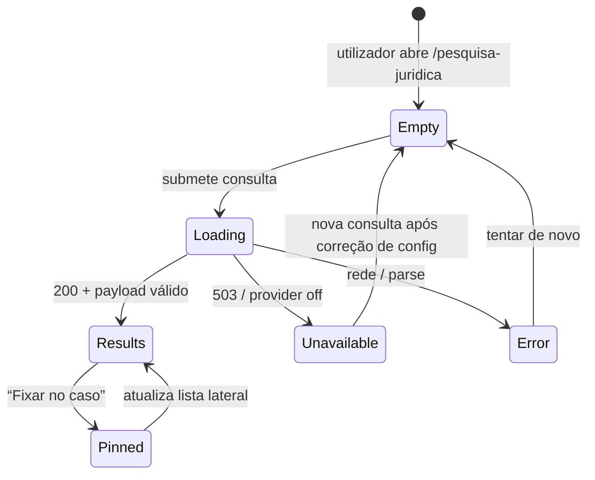
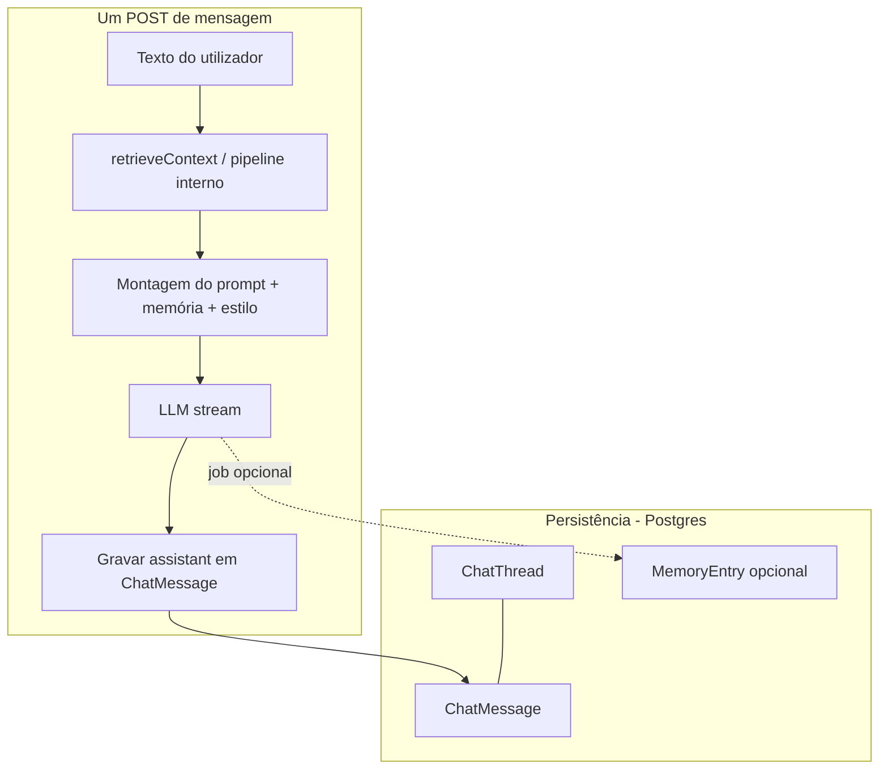
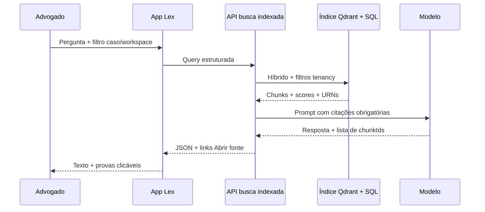

# Fase futura — busca indexada reunificada + Wiki LLM

> **Status:** plano de produto / arquitetura — **não** é escopo da sprint atual.  
> **Hoje:** pesquisa assistida ao utilizador prioriza Lex AI / DeepSeek com validação humana; motor interno em `src/lib/retrieval/**` permanece para diagnóstico, busca global e enriquecimento de contexto. Ver `docs/CORPUS_INDEXED_RETRIEVAL_ARCHITECTURE.md` e `docs/decisions/ADR_DEEPSEEK_LEGAL_RESEARCH_MODE.md`.

---

## 1. Por que este documento existe

- Alinhar **equipa**, **agentes** e **revisões de código** sobre o que significa “voltar a priorizar o motor interno” **sem** misturar isso com “memória de chat” ou “export de peças”.
- Servir de **brief único** para desenho de UI, APIs e gates de qualidade quando a fase for priorizada.

---

## 2. Pergunta frequente: desligar `retrieveContext` / `retrieveLegalContext` apaga a memória dos chats?

**Não.** São camadas diferentes no Lex:

| Camada | O que é | O que acontece se desligar só a recuperação de documentos/corpus no prompt |
|--------|---------|-------------------------------------------------------------------------------|
| **Histórico de chat** | `ChatThread` + `ChatMessage` no Postgres (mensagens user/assistant, citações em JSON). | **Continua gravado.** O utilizador vê o mesmo fio de conversa. |
| **Memória resumida do processo** | `MemoryEntry` (ex.: job Inngest que resume trechos do chat). | **Não é apagada** por remover retrieval; só deixa de ser alimentada por novos resumos se o fluxo que os gera depender do mesmo pipeline. |
| **Memória / opt-ins do escritório** | `OfficeMemory`, `StyleProfile`, pins em Case Brain, etc. | **Dados persistem**; o que muda é se o modelo **consulta** chunks do Qdrant/SQL naquele request. |
| **Recuperação no request** (`retrieveContext` no `POST /api/chat/[threadId]`, etc.) | Trechos de `Document` / `LegalChunk` / peças injetados no *prompt* para grounding. | **Some o contexto automático** — respostas podem ficar mais genéricas ou depender só do texto que o utilizador colou; **não** apaga mensagens antigas. |

**Conclusão para decisão (C):** “Desligar busca indexada no fluxo do chat” é uma alteração de **comportamento do modelo** (menos ancoragem em documentos), **não** de **retention** de conversas. Se quiser apagar histórico, isso é **feature de retenção / GDPR / botão explícito**, independente do motor de busca.

---

## 3. Visão da fase futura: o que é “Wiki LLM” no Lex

**Wiki LLM** (nome de trabalho) = camada de **conhecimento curado e explicável** que combina:

1. **Entradas humanas e oficiais** (normas, súmulas, fundamentos aprovados, notas do caso, memória opt-in do escritório).
2. **Sincronização e versionamento** (quem alterou, quando, qual fonte primária).
3. **Consulta híbrida** (BM25 + denso + rerank + regras de tenancy) com **resposta sempre ligada a IDs de chunk / URL / URN** exibíveis na UI.
4. **Modo conversacional** (“pergunte à wiki deste caso”) que **não** substitui o advogado: rotula confiança, lacunas e “não encontrado” honestamente.

Diferença em relação ao “só LLM”: a Wiki LLM **obriga** traço de fonte; o LLM organiza e resume **em cima** de material indexado, não inventa artigo.

---

## 4. Mapa de rotas e APIs (trabalho atual + extensões futuras)

### 4.1 Superfícies já existentes (referência)

| Área | Rota UI | APIs / Server actions relevantes |
|------|---------|-------------------------------------|
| Pesquisa assistida | `/pesquisa-juridica` | `GET /api/retrieval/search`, `POST /api/legal-research/search`, adapter em `src/lib/legal-research/retrieval-adapter.ts` |
| Redirecionamento legado | `GET /retrieval` | `src/app/(app)/retrieval/page.tsx` → `/pesquisa-juridica` |
| Busca global | `/busca` | `GET /api/search` |
| Chat do processo | `/processos/[processId]` (painel chat) | `POST /api/chat/[threadId]`, `GET /api/chat/[threadId]/messages` |
| Estratégia / minuta | `/cases/[id]/…` | `POST /api/cases/[id]/strategy`, fluxos em `src/lib/cases/orchestrator.ts` |
| Fundamentos / memória | `/biblioteca/fundamentos`, `/biblioteca/memoria` | rotas `/api/library/*`, `/api/office-memory/*` |

### 4.2 Extensões típicas da fase Wiki (a desenhar quando priorizado)

- `/pesquisa-juridica` (ou sub-rota): separador **“Acervo indexado”** vs **“Assistente Lex AI”** com o mesmo contrato de confiança.
- `/cases/[id]/wiki` (exemplo): vista “notas + pins + trechos indexados” unificada (opcional).
- `GET /api/corpus/debug/trace` (só **OWNER**, já alinhado à governança): reconstruir por que um chunk entrou no contexto (substitui mentalmente o antigo “explain” de produto).

---

## 5. Wireframes lógicos (Mermaid)

### 5.1 Pesquisa jurídica — estados na página

### 5.2 Chat do processo — contexto vs persistência

**Leitura:** remover ou encurtar `R` **não** apaga `MS`; altera o que entra em `P`.

### 5.3 Wiki LLM futura — consulta com prova

---

## 6. Workflows profissionais (checklist de aceite)

### 6.1 Pesquisa jurídica

1. Utilizador autenticado com `workspaceId` válido.
2. Consulta registada com `requestId` e sem PII em logs brutos.
3. Cada fundamento mostra: título, citação, **porquê apareceu** (opcional na fase 2), estado de verificação.
4. **503** traduzido para mensagem humana se modo assistido estiver desligado.
5. Pin no caso gera traço em `CaseLegalSource` / Case Brain conforme regras atuais.

### 6.2 Chat do processo

1. Mensagens persistidas com ordem estável (`GET messages`).
2. Se recuperação ativa: número máximo de chunks, deduplicação, e **exclusão** de demo em produção.
3. Se recuperação desativada: banner opcional “Respostas sem trechos automáticos dos documentos indexados”.
4. Custo e telemetria (`recordCostEntry` / observabilidade) coerentes com o modo.

### 6.3 Wiki LLM (fase futura)

1. Toda frase normativa citável liga a **ID estável** (chunk / norma / versão).
2. Modo “só corpus” e modo “corpus + notas do caso” explicitamente selecionáveis.
3. Exportação (PDF/DOCX) inclui **secção Fontes** gerada a partir dos mesmos IDs.
4. **A/B legal:** gold-set + revisão humana antes de tornar caminho padrão no comercial.

---

## 7. Critérios de promoção (quando sair do “só DeepSeek” na pesquisa principal)

Reutilizar e endurecer a lista em `docs/CORPUS_INDEXED_RETRIEVAL_ARCHITECTURE.md` + gates do ADR. Em resumo:

- Precisão em gold-set acordado com Legal.
- Latência e custo p95 dentro do orçamento.
- Zero tolerância a inventar número de processo em modo não fictício.
- Sign-off **não provisório** de Legal / Security / QA.

---

## 8. Relação com outros documentos

- **Arquitetura técnica do motor interno:** `docs/CORPUS_INDEXED_RETRIEVAL_ARCHITECTURE.md`
- **Modo assistido atual:** `docs/features/LEGAL_RESEARCH_DEEPSEEK_MODE.md`
- **Decisão e rollback:** `docs/decisions/ADR_DEEPSEEK_LEGAL_RESEARCH_MODE.md`
- **Plano de migração P0:** `docs/plans/P0_DEEPSEEK_LEGAL_RESEARCH_MIGRATION.md`
