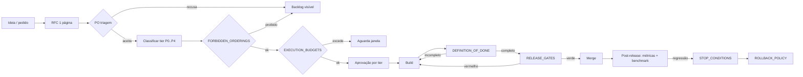

# Execution Governance

> **Documento canônico de governança de execução do Lex.** Define quem decide, como decide, em que velocidade e sob que disciplina. Tem precedência hierárquica sobre qualquer outro doc em `docs/**` que entre em conflito.

> **Princípio mestre**: o Lex deve **estabilizar > consolidar > validar > medir > benchmarkar > endurecer** antes de **expandir**. Toda decisão é avaliada por uma única pergunta: **"isso aproxima o advogado de confiar e usar diariamente?"**

---

## 1. Escopo

Este documento governa, sem exceção:

- Toda mudança de código em `src/**`, `prisma/**`, `scripts/**`, `tests/**`.
- Toda mudança de documentação em `docs/**` que afete contratos, fluxos ou critérios de aceite.
- Toda mudança de configuração em `vercel.json`, `next.config.ts`, workflows `.github/`, ambientes `.env*`.
- Toda integração externa (provider IA, embeddings, tribunais, billing, autenticação).
- Toda promessa pública ao cliente (landing, pitch, demo).

Mudanças triviais (typos, comentários, formatação) seguem fast-path em §6.4.

---

## 2. Papéis e responsabilidades (RACI mínimo)

A papeleria oficial do Lex tem **5 papéis funcionais** independentes da hierarquia da empresa. Uma pessoa pode acumular papéis enquanto a equipe é pequena, **desde que declarado** no [OWNER_MATRIX.md](OWNER_MATRIX.md).

| Papel | Responsabilidade primária | Autoridade declarada |
|-------|---------------------------|----------------------|
| **PO de Produto** | Define o **quê** e o **porquê**. Aprova entrada de feature no roadmap. Valida `DEFINITION_OF_DONE`. | Bloqueia features fora de roadmap. Aprova override de prioridade. |
| **CTO / Tech Lead** | Define o **como técnico**. Assina gates técnicos. Escala mitigação em incidentes. | Disparo de freeze técnico. Aprovação final de mudanças Tier-S. |
| **Legal Lead** | Defende verdade jurídica do produto. Assina `TRUTH_HIERARCHY` aplicada, `LEGAL_QUALITY_ENGINE`, LGPD/OAB. | Veto sobre qualquer afirmação de qualidade jurídica sem evidência. |
| **Security Lead** | Defende isolamento multi-tenant, LGPD operacional, gates de segurança. | Veto sobre rota/feature com risco IDOR/PII/secret leak. |
| **QA / Benchmark Lead** | Dono dos `QUALITY_THRESHOLDS` e da suíte `BENCHMARK_STRATEGY`. | Veto sobre release que regrida métrica acima da banda. |

**Regra de acúmulo**: PO + CTO podem ser a mesma pessoa em fase < 5 pessoas. Legal Lead **não pode** acumular com QA Lead (conflito de auditoria interna). Security Lead **não pode** acumular com Owner de subsystem que ele próprio audita (Tier-S).

**Single point of failure**: nenhum papel pode estar com **bus factor 1**. O [OWNER_MATRIX.md](OWNER_MATRIX.md) exige `owner_secundario` para Tier-S e Tier-A.

---

## 3. RFC mínima (1 página) — gatilho obrigatório de mudança

Toda mudança que **não** seja fast-path (§6.4) começa com uma **RFC de 1 página** (Markdown, em `docs/rfcs/YYYY-MM-DD-slug.md` quando o diretório for criado em F0; até lá, em `docs/governance/rfcs/` ou no PR template).

**Template obrigatório (10 campos)**:

```markdown
# RFC: <título curto>

- **Autor**: <nome>
- **Data**: YYYY-MM-DD
- **Subsystem afetado** (lista do OWNER_MATRIX): <…>
- **Tier proposto** (P0/P1/P2/P3/P4 — ver PRIORITY_MATRIX): <…>
- **Owner principal do subsystem**: <…>

## 1. Problema (3-5 linhas, ponto de vista do advogado quando aplicável)
## 2. Solução proposta (5-15 linhas)
## 3. Alternativas consideradas (≥1)
## 4. Dependências (subsystems, dados, integrações)
## 5. Custo estimado (build em pessoa-dia + run em $/mês)
## 6. Risco (jurídico, técnico, comercial, reputacional)
## 7. Integração 12 pilares (checklist da Parte B do MASTER_ROADMAP)
## 8. Critério de aceite (testável)
## 9. Plano de rollback (referenciar ROLLBACK_POLICY)
## 10. Gates aplicáveis (referenciar RELEASE_GATES)
```

**Tamanho**: máximo **1 página A4 renderizada** (≈80 linhas markdown). RFC longa é sinal de problema mal formulado — **rejeição automática** com pedido de redução de escopo.

**Aprovação por tier**:

| Tier | Aprovadores obrigatórios |
|------|--------------------------|
| **P0** | PO + Owner principal + (Legal Lead **se** afeta verdade jurídica) + (Security Lead **se** afeta segurança/LGPD) |
| **P1** | PO + Owner principal |
| **P2** | PO + Owner principal + CTO |
| **P3** | PO + CTO + Security Lead + Legal Lead |
| **P4** | PO + CTO + Legal Lead + revisão de roadmap (FORBIDDEN_ORDERINGS) |

Aprovação registrada no PR vinculado (comentário com `Approved-by: <nome> <papel>`).

---

## 4. Processo de proposta de feature (do desejo ao merge)



**Estado oficial de uma proposta**: `idea` → `rfc-draft` → `rfc-review` → `approved` → `in-development` → `done-pending-gates` → `merged` → `monitored` → `stable` (após 14 dias sem regressão) ou `rolled-back`.

---

## 5. Regra "no scope creep"

**Definição operacional de scope creep**: PR cresce **mais que 30%** (linhas trocadas) **ou** cobre **mais que 1 subsystem** **ou** introduz mudança não declarada na RFC.

**Ação obrigatória**:

1. Bot/reviewer rotula PR como `scope-creep`.
2. Autor reduz para o escopo da RFC original **ou** abre nova RFC para o excedente.
3. Merge bloqueado até resolução.

**Anti-padrões explicitamente proibidos**:

- "Já que estou aqui, vou ajeitar X também" sem RFC.
- "Pequena melhoria de UX" misturada em PR de retrieval.
- Refactor "casual" durante feature.
- Migration introduzida em PR de UI.
- Mudança de prompt LLM introduzida em PR de drafting sem benchmark.

---

## 6. Cadência operacional (sprint padrão = 2 semanas)

### 6.1 Eventos fixos

| Evento | Cadência | Duração | Output |
|--------|----------|---------|--------|
| **Planning** | início do sprint | 60 min | sprint backlog respeitando `EXECUTION_BUDGETS` |
| **Daily quality check** | diário | 10 min | leitura de métricas vs `QUALITY_THRESHOLDS`; flag se trend ruim |
| **RFC review** | 2× por semana | 30 min | aprovações/rejeições registradas |
| **Release review** | toda 2ª de release | 45 min | gates verdes + `RELEASE_GATES` assinado |
| **Retrospective** | fim do sprint | 60 min | atualização de `EXECUTION_BUDGETS` se necessário |
| **Stability review** | a cada 4 sprints | 90 min | leitura de divergência docs↔código; ajuste de `OWNER_MATRIX` |
| **Benchmark cycle** | a cada 8 semanas | 1 sprint | suíte completa rodada; baseline atualizado |
| **Hardening cycle** | a cada 12 semanas | 1 sprint | redução de débito catalogado em `CODE_REVIEW_AUDIT` |

### 6.2 Janelas obrigatórias

- **Stabilization week**: 1 semana a cada 4 — apenas paper-cuts UX, fix P0/P1, benchmark. **Zero feature nova**.
- **Freeze window**: **5 dias úteis antes de release público** — apenas hotfix; PR de feature bloqueado por bot.
- **No-new-feature period**: ativado automaticamente quando `STOP_CONDITIONS.md` dispara.

### 6.3 Pausa obrigatória

Após **2 incidentes Tier-S consecutivos** em janela de 30 dias: **pausa de 1 semana** com revisão de governança + atualização de runbooks. Aprovação de retomada exige PO + CTO + Security Lead.

### 6.4 Fast-path (sem RFC)

Liberado **sem** RFC apenas para:

- Typos em copy ou docs.
- Atualização de dependência **patch** (`x.y.Z`) sem CVE conhecido.
- Renomeação interna de variável **com** zero efeito em contrato externo.
- Adição de teste unitário a código existente.
- Atualização de comentário/JSDoc.

**Tudo o mais** exige RFC.

---

## 7. Forbidden practices (proibições absolutas em execução)

Documentadas em [`FORBIDDEN_ORDERINGS.md`](FORBIDDEN_ORDERINGS.md) (ordem de roadmap) e [`ARCHITECTURE_STABILITY_POLICY.md`](ARCHITECTURE_STABILITY_POLICY.md) (mudanças estruturais). Aqui ficam as **proibições de execução diária**:

1. **Merge sem PR** (mesmo em hotfix; usar branch `hotfix/*` + PR fast-path).
2. **Merge sem checklist DoD assinado** no PR (ver `DEFINITION_OF_DONE.md`).
3. **Merge com gates vermelhos** sem override formal registrado.
4. **Merge durante stop condition ativa** (exceto remediation lane).
5. **Atalho de aprovação** via DM/voz sem registro no PR.
6. **"Eu testei localmente, pode subir"** sem CI verde.
7. **Retomar feature sem revisar `DOC_VS_CODE_DIVERGENCE.md`** quando ela já apareceu lá como divergência.
8. **Esconder regressão** em changelog "various improvements".
9. **Promessa pública (landing/pitch/demo) de feature `status: planned`** sem rotular claramente.
10. **Usar prod data em ambiente local** (mesmo "só pra testar"); usar fixtures/seed.

---

## 8. Disciplina de documentação como código

- Toda PR que altere comportamento jurídico, integração externa ou contrato de API **deve** atualizar a doc correspondente em `docs/features/`, `docs/architecture/` ou `docs/security/` no **mesmo PR** (mesma janela de revisão).
- Doc desatualizada após 2 sprints sem revisão entra automaticamente em `DOC_VS_CODE_DIVERGENCE.md`.
- `MASTER_INDEX.md` é atualizado a cada lote de docs mergeado.

---

## 9. Aplicação automática (specs textuais — implementação pós-F1)

A governança é **enforced**, não confiada a memória. Especifica-se aqui o que precisa ser implementado nos checks de PR/CI **depois** de F0/F1 (não nesta onda):

- **PR template** com checklist DoD + tier proposto + RFC link + owner principal + gates aplicáveis.
- **Bot de PR** valida: RFC referenciada, owner do subsystem aprovou, EXECUTION_BUDGETS não excedido, STOP_CONDITION não ativa, scope-creep ≤ 30%.
- **CI gate** lê `RELEASE_GATES.md` e aplica thresholds.
- **Status badge** no README com estado de cada cycle (stabilization / freeze / no-new-feature / benchmark / hardening / debt-reduction).

Esses pontos viram tarefas em F6 (`CI_CD.md` + `RELEASE_PROCESS.md`).

---

## 10. Override formal

Override de **qualquer** regra deste documento exige:

1. RFC com **3 alternativas** consideradas e **rejeitadas**.
2. **Assinatura tripla**: PO + CTO + (Legal Lead **ou** Security Lead, conforme natureza).
3. Registro em `docs/governance/OVERRIDES_LOG.md` (criado quando o primeiro override ocorrer).
4. **Revisão pós-mortem** em 30 dias avaliando se override deveria virar regra ou ser revertido.

Override frequente (≥3 em trimestre) sobre a **mesma** regra dispara revisão da regra (não tolerância).

---

## 11. Métricas de saúde de governança

Mensais, registradas em `docs/governance/HEALTH_METRICS.md` (criado em F1):

- % PRs com DoD assinado.
- % PRs com RFC vinculada.
- % PRs com gates verdes na primeira tentativa.
- Lead time RFC → merge (mediana).
- Nº de stop conditions disparadas.
- Nº de overrides aprovados.
- Nº de scope-creep flags.
- Nº de incidentes pós-merge em 7 dias.
- Bus factor médio dos subsystems Tier-S/A.

Governança é **boa** quando essas métricas se movem **na direção saudável** sem sufocar entrega. Trimestralmente revisar e ajustar caps.

---

## 12. Como aplicar este doc

1. **Hoje**: leia + assine (PO + CTO + Legal + Security + QA Lead) → registre em §13.
2. **Próximo PR**: aplique RFC + checklist DoD + gates. Se algum item não tem dono no `OWNER_MATRIX`, pare e atribua antes de mergear.
3. **Próximo sprint**: institua `Daily quality check` (10 min lendo métricas atuais, mesmo que ainda em planilha).
4. **Próximas 4 semanas**: estabilize cadência §6 e produza primeira `HEALTH_METRICS`.

---

## 13. Assinaturas — checkpoint F-1 (sign-off provisório de governance)

> **Status (2026-05-10)**: assinatura **provisória** registrada para destravar **F0 — Auditoria** (escopo interno). Os papéis com tag `[PROVISÓRIO]` precisam ser substituídos por humano nomeado **antes de qualquer promoção a produção pública**. Detalhes em [`F-1_SIGNOFF.md`](F-1_SIGNOFF.md).

| Papel | Nome | Data | Assinatura |
|-------|------|------|-------------|
| PO de Produto | Thales | 2026-05-10 | sign-off provisório registrado em `F-1_SIGNOFF.md` (commit hash do merge será preenchido na PR que mergear este checkpoint) |
| CTO / Tech Lead | Thales + Cursor agent (CTO interim) | 2026-05-10 | sign-off provisório; **PROVISÓRIO** — precisa de segundo humano técnico antes de produção |
| Legal Lead | **PROVISÓRIO** — advogado parceiro / consultor jurídico a nomear antes de produção | 2026-05-10 | sign-off **adiado**; F0 prossegue com escopo interno; nomeação obrigatória antes de release público |
| Security Lead | **PROVISÓRIO** — responsável técnico de segurança a nomear antes de produção | 2026-05-10 | sign-off **adiado**; F0 prossegue com escopo interno; nomeação obrigatória antes de release público |
| QA / Benchmark Lead | **PROVISÓRIO** — responsável técnico de QA a nomear antes de produção | 2026-05-10 | sign-off **adiado**; F0 prossegue com escopo interno; nomeação obrigatória antes de release público |

**Decisão F0**: **autorizada** para iniciar **com restrições** (vide `F-1_SIGNOFF.md` §5). **Promoção a produção pública** continua bloqueada até `[PROVISÓRIO]` ser substituído por humano nomeado em todos os Tier-S/A relevantes.

**Regra original** (mantida): "Sem essas 5 assinaturas, F0 não começa". **Aplicação atualizada**: assinatura provisória **conta** como assinatura para fins de F0 interno; **não conta** para release público (gate G-62).

---

## Veja também

- [`PRIORITY_MATRIX.md`](PRIORITY_MATRIX.md) — taxonomia P0/P1/P2/P3/P4 oficial.
- [`OWNER_MATRIX.md`](OWNER_MATRIX.md) — 25 subsystems × ownership.
- [`RELEASE_GATES.md`](RELEASE_GATES.md) — gates por tier.
- [`DEFINITION_OF_DONE.md`](DEFINITION_OF_DONE.md) — 19 itens obrigatórios.
- [`STOP_CONDITIONS.md`](STOP_CONDITIONS.md) — gatilhos de freeze automático.
- [`ROLLBACK_POLICY.md`](ROLLBACK_POLICY.md) — política de reverter.
- [`/home/thales/.cursor/plans/lex_master_documentation_plan_9a6a48df.plan.md`](../../.cursor/plans/lex_master_documentation_plan_9a6a48df.plan.md) — plano mestre v3.2.
