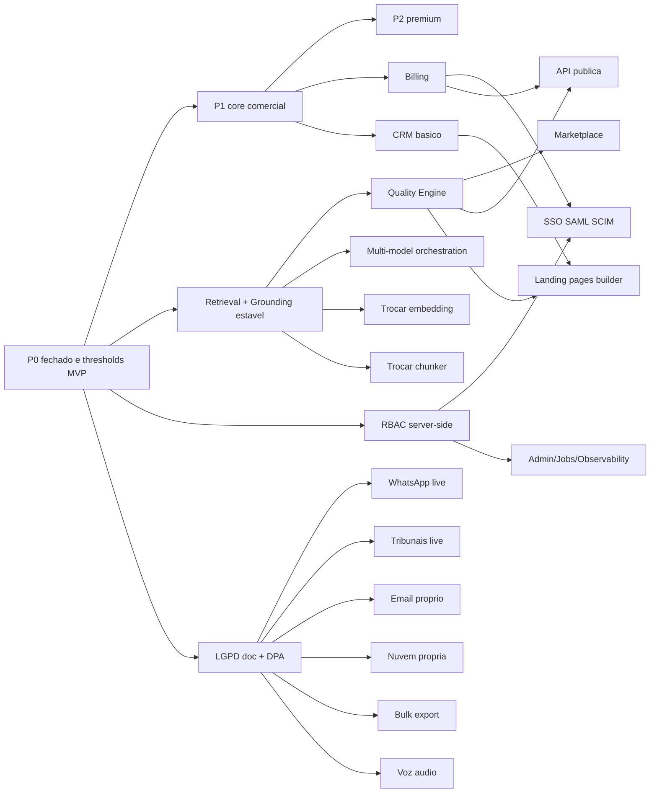

# Forbidden Orderings — Lex

> **Documento canônico de proibições absolutas de ordem de execução.** Lista o que **não** pode acontecer antes do quê. Expande e formaliza a §3 da [`PRIORITY_MATRIX.md`](PRIORITY_MATRIX.md). Tem precedência sobre qualquer roadmap, pitch ou pedido de cliente.
>
> **Princípio**: **ordem importa**. Construir feature B antes de feature A pode parecer barato hoje, mas custa **muito mais** depois (refactor, retrabalho, bug acumulado, incidente em produção, perda de confiança).

---

## 1. Schema de cada regra

| Campo | Definição |
|-------|-----------|
| `id` | identificador estável (`F-O-NN`) |
| `regra` | descrição em 1 frase |
| `motivo` | por que a ordem importa |
| `risco_se_violar` | o que quebra se violado |
| `excecao_permitida` | quando (se em algum caso) o override pode ser concedido |
| `aprovacao_necessaria` | quem assina para liberar |
| `documento_relacionado` | docs onde a regra é referenciada |
| `stop_condition_relacionada` | S-id em [`STOP_CONDITIONS.md`](STOP_CONDITIONS.md) |
| `gate_relacionado` | G-id em [`RELEASE_GATES.md`](RELEASE_GATES.md) quando aplicável |

---

## 2. Lista oficial (15 regras canônicas + 5 complementares)

### F-O-01 — Não implementar P3/P4 antes de P0/P1 atingirem thresholds

- **regra**: nenhuma feature classificada P3 ou P4 entra em desenvolvimento enquanto **alguma** feature P0 ou P1 dependente estiver `partial`/`pending` ou abaixo do threshold MVP em [`QUALITY_THRESHOLDS.md`](QUALITY_THRESHOLDS.md).
- **motivo**: dispersa esforço; ergue o produto em base instável; vende falsa percepção de maturidade.
- **risco_se_violar**: P0 atrasa indefinidamente; P3/P4 fica meio-pronto; débito técnico explode; cliente enterprise piloto vê gaps básicos.
- **excecao_permitida**: nenhuma. Mesmo que cliente enterprise prometa contrato, prioridade fica em fechar P0.
- **aprovacao_necessaria**: para override (raro): RFC + PO + CTO + Legal Lead + registro em `OVERRIDES_LOG.md`.
- **documento_relacionado**: `PRIORITY_MATRIX.md` §3, `PRODUCT_SURVIVAL_MODE.md` §4.
- **stop_condition**: S-44 (stop por > 14 dias), S-43 (divergência aspiracional).

### F-O-02 — Não marketplace antes de biblioteca/memória/quality engine maduros

- **regra**: marketplace jurídico (P4 / F8) só entra em desenvolvimento depois de `Biblioteca` (P0/P1), `Memória do escritório` (P1/P2) e `Legal Quality Engine` (P2) em estado `done` ou `stable`.
- **motivo**: marketplace amplifica conteúdo; sem quality engine ele amplifica também conteúdo ruim.
- **risco_se_violar**: terceiros publicam fundamentos sem curadoria; risco jurídico (responsabilidade indireta); descrédito coletivo.
- **excecao_permitida**: nenhuma para o lançamento; protótipo interno sandbox sem público é permitido se isolado.
- **aprovacao_necessaria**: PO + CTO + Legal Lead + Marketplace owner + revisão de `FORBIDDEN_ORDERINGS`.
- **documento_relacionado**: `PRIORITY_MATRIX.md`, `PRODUCT_SURVIVAL_MODE.md` §4 F-01.
- **stop_condition**: S-43.

### F-O-03 — Não landing pages do escritório (subdomínio) antes de UX comercial + intake + CRM básico

- **regra**: builder de landing pages para o escritório (P4) só depois de UX comercial (P0), guided intake (P0/P1) e CRM básico (P1) `done`.
- **motivo**: landing pages criam expectativa de fluxo cliente→caso; sem CRM/intake, o lead morre.
- **risco_se_violar**: leads perdidos; má impressão de marca para o cliente final do escritório.
- **excecao_permitida**: landing **estática** institucional do escritório sem captura de lead é aceitável (não é "builder").
- **aprovacao_necessaria**: PO + UX owner + CRM owner + CTO.
- **documento_relacionado**: `PRIORITY_MATRIX.md`, `PRODUCT_SURVIVAL_MODE.md` §4 F-02.
- **stop_condition**: indireta.

### F-O-04 — Não email/nuvem própria antes de segurança, storage, billing e LGPD

- **regra**: email próprio para o escritório (P4) e nuvem própria (P4) só depois de pacote `security/`, `storage` (Supabase), `billing` (P1) e LGPD doc + DPA prontos.
- **motivo**: ambos lidam com PII em volume; sem LGPD/security/billing maduros, é negligência.
- **risco_se_violar**: vazamento de e-mail; multa LGPD; reputação irreversível.
- **excecao_permitida**: nenhuma para release público.
- **aprovacao_necessaria**: PO + CTO + Security Lead + Legal Lead.
- **documento_relacionado**: `PRODUCT_SURVIVAL_MODE.md` §4 F-03.
- **stop_condition**: S-10..S-14.

### F-O-05 — Não integração live com tribunais antes de mock + logs + secrets + rate limit

- **regra**: adapter de tribunal (PJe/eSAJ/Projudi/eproc) só vira `live` quando: (a) modo `mock` 100% testado; (b) logs estruturados sem PII; (c) `secretRef` armazenado em vault/env (nunca plaintext); (d) rate limit configurado; (e) idempotência verificada (`fingerprint`).
- **motivo**: tribunais tem limites severos; falha cruzada entre clientes; risco de exposição de PII de processos.
- **risco_se_violar**: bloqueio do escritório no tribunal; vazamento de andamento processual entre workspaces; multa.
- **excecao_permitida**: nenhuma para live em produção.
- **aprovacao_necessaria**: PO + CTO + Security Lead + Legal Lead + Owner subsystem `integrações`.
- **documento_relacionado**: `OWNER_MATRIX.md §3.21`, `STOP_CONDITIONS.md S-10/S-12/S-14`.
- **stop_condition**: S-10, S-12, S-14, S-23.

### F-O-06 — Não WhatsApp live antes de consentimento, opt-in, logs e LGPD

- **regra**: `whatsappAdapter` só vira `live` quando: (a) opt-in UX claro por cliente; (b) consent log persistido; (c) logs sem PII além do necessário; (d) DPA + LGPD doc públicos; (e) política de retenção definida; (f) rate limit + dedup ativos.
- **motivo**: WhatsApp envolve PII direta + base legal LGPD obrigatória + risco de spam classificatório.
- **risco_se_violar**: ANPD; bloqueio Meta; reputação.
- **excecao_permitida**: nenhuma para live; testes internos com números de equipe são aceitos.
- **aprovacao_necessaria**: PO + Legal Lead + Security Lead + LGPD owner.
- **documento_relacionado**: `PRODUCT_SURVIVAL_MODE.md` §4 F-12.
- **stop_condition**: S-10, S-11, S-14.

### F-O-07 — Não multi-model orchestration antes de retrieval/grounding estável

- **regra**: provider routing avançado, fallback inter-modelo, custo adaptativo (P2 / F28) só depois de Suíte A + Suíte B de [`QUALITY_THRESHOLDS.md`](QUALITY_THRESHOLDS.md) atingirem MVP por **30 dias** consecutivos.
- **motivo**: trocar modelo enquanto retrieval ruim mascara o problema real; engenheiro fica caçando modelo fantasma quando o gargalo é o RAG.
- **risco_se_violar**: regressão silenciosa; custo sobe sem qualidade subir.
- **excecao_permitida**: nenhuma; é melhor estabilizar 1 modelo bem do que 3 mal.
- **aprovacao_necessaria**: CTO + IA owner + QA Lead + Legal Lead.
- **documento_relacionado**: `PRODUCT_SURVIVAL_MODE.md` §4 F-08.
- **stop_condition**: S-01.

### F-O-08 — Não trocar embeddings sem benchmark comparativo e rollback

- **regra**: troca de modelo de embeddings exige: (a) benchmark gold-set CF/88 + domínios + adversarial **antes** e **depois**; (b) coexistência de coleções (`legal-corpus-v2`); (c) rollback declarado em [`ROLLBACK_POLICY.md §4.4`](ROLLBACK_POLICY.md); (d) cap de custo recalculado.
- **motivo**: embedding novo invalida vetores antigos; reindex caro; troca cega quebra retrieval.
- **risco_se_violar**: hits@5 cai; `groundingScore` despenca; custo explode; clientes pagantes perdem confiança.
- **excecao_permitida**: nenhuma; até hotfix de provider exige plano.
- **aprovacao_necessaria**: CTO + IA owner + QA Lead + retrieval owner.
- **documento_relacionado**: `ARCHITECTURE_STABILITY_POLICY.md` §C, `BENCHMARK_STRATEGY.md`.
- **stop_condition**: S-04, S-24.

### F-O-09 — Não trocar chunker sem corpus validation e replay tests

- **regra**: troca de chunker (`legal-chunker-v2.ts` ou similar) exige: (a) `pnpm corpus:rechunk:articles:dry` em corpus completo; (b) `cf-semantic-validate` aprovado; (c) `cf-coverage-audit` sem regressão; (d) replay com gold-set (Q-A-01..Q-A-05).
- **motivo**: chunker novo muda granularidade, `articleRef`, `parentChunkId`; índice fica inconsistente; citações erram posição.
- **risco_se_violar**: citation accuracy despenca; review reprova em massa; export bloqueia.
- **excecao_permitida**: nenhuma.
- **aprovacao_necessaria**: chunking owner + retrieval owner + QA Lead + Legal Lead.
- **documento_relacionado**: `ARCHITECTURE_STABILITY_POLICY.md` §D.
- **stop_condition**: S-02, S-03.

**Nota (2026-05-10) — modo DeepSeek na pesquisa jurídica (P0):** expor pesquisa assistida via API DeepSeek para **sugestões estruturadas** na UX **não** viola F-O-08 nem F-O-09: não substitui modelo de embeddings nem chunker do corpus interno; RAG interno e Qdrant permanecem nos mesmos contratos de estabilidade. O que muda é apenas a **camada de apresentação/síntese assistida** documentada em `docs/decisions/ADR_DEEPSEEK_LEGAL_RESEARCH_MODE.md`.

### F-O-10 — Não alterar prompts de drafting sem benchmark adversarial

- **regra**: mudança em prompts de `drafting.ts`, `review.ts`, `intake.ts`, `lawyer-brain/**` exige: (a) versão registrada (`LEX_PROMPT_VERSION`); (b) gold-set adversarial executado (Suíte B do `BENCHMARK_STRATEGY.md`); (c) revisão Legal Lead.
- **motivo**: 1 caractere a menos no prompt = peça que perde estrutura; difícil reverter sem versionamento.
- **risco_se_violar**: peça com placeholder; fundamento inventado; review reprova; export bloqueia.
- **excecao_permitida**: nenhuma.
- **aprovacao_necessaria**: IA owner + Legal Lead + QA Lead.
- **documento_relacionado**: `ARCHITECTURE_STABILITY_POLICY.md` §G, `ROLLBACK_POLICY.md §4.6`.
- **stop_condition**: S-03.

### F-O-11 — Não vender Pro/Enterprise com P0 partial

- **regra**: comercial **não** anuncia, vende ou negocia plano Pro/Enterprise enquanto algum P0 da [`PRIORITY_MATRIX.md`](PRIORITY_MATRIX.md) §4 estiver `partial`/`pending`.
- **motivo**: cliente paga por funcionalidade que não tem; inevitável churn + reputação ruim.
- **risco_se_violar**: refund obrigatório; má reputação no mercado jurídico (que se comunica em rede).
- **excecao_permitida**: nenhuma. Demonstrações exploratórias são aceitas com declaração explícita "feature em desenvolvimento — sem prazo público".
- **aprovacao_necessaria**: PO + CTO.
- **documento_relacionado**: `PRODUCT_SURVIVAL_MODE.md` §10 EX-10.
- **stop_condition**: indireta.

### F-O-12 — Não chamar de "jurimetria" sem fonte, metodologia e disclaimer

- **regra**: termo "jurimetria" é proibido em UI/landing/pitch sem: (a) fonte de dados declarada (DataJud, tribunal específico); (b) metodologia documentada; (c) disclaimer de janela temporal e cobertura; (d) link para fonte original.
- **motivo**: "jurimetria" carrega expectativa de rigor científico; usar como buzzword é fraude técnica.
- **risco_se_violar**: descrédito acadêmico/profissional; processo por publicidade enganosa.
- **excecao_permitida**: nenhuma.
- **aprovacao_necessaria**: PO + Legal Lead + (futuramente) Data owner.
- **documento_relacionado**: `TRUTH_HIERARCHY.md`.
- **stop_condition**: indireta.

### F-O-13 — Não prometer "integração com todos os tribunais" sem matriz de cobertura real

- **regra**: comunicação pública e UI **não** afirmam cobertura nacional sem matriz publicada (`docs/integrations/TRIBUNALS_COVERAGE.md`) que indique para cada um dos 92 tribunais catalogados: (a) status (mock/scaffold/live); (b) última sincronização; (c) limitações.
- **motivo**: registro de 92 tribunais ≠ integração funcional; muitos exigem API key CNJ ou credenciais por escritório.
- **risco_se_violar**: cliente espera integração que não existe; perda imediata de confiança.
- **excecao_permitida**: nenhuma.
- **aprovacao_necessaria**: PO + CTO + integrações owner.
- **documento_relacionado**: `OWNER_MATRIX.md §3.21`.
- **stop_condition**: indireta.

### F-O-14 — Não expor Admin/Jobs/Observability para usuário comum

- **regra**: rotas e UI de `/observability`, `/settings/admin`, `/settings/jobs`, `/settings/readiness`, `/cockpit` (parcial) protegidas por `can(role, 'observabilityView')` ou equivalente — **não** apenas escondidas no menu; **não** apenas client-side.
- **motivo**: jargão técnico (chunk, vector, embedding, queue) confunde advogado; expor cron/jobs cria sensação de produto em produção mas frágil.
- **risco_se_violar**: dead-end UX; vazamento de informação operacional sensível.
- **excecao_permitida**: nenhuma; admin/dev panels só para `OWNER` (e equipe técnica do Lex via flag).
- **aprovacao_necessaria**: Security Lead + UX owner + PO.
- **documento_relacionado**: `RELEASE_GATES.md` G-19, `STOP_CONDITIONS.md` S-13, `EXECUTION_REPORT_F-1_LEVA_1.md` §5.7.
- **stop_condition**: S-13.

### F-O-15 — Não promover feature `planned` em pitch sem rotular como futuro

- **regra**: qualquer feature em estado `planned`/`partial`/`pending` em [`PRIORITY_MATRIX.md`](PRIORITY_MATRIX.md) §4 que apareça em landing/pitch/demo deve ser rotulada explicitamente "em roadmap" / "planejado para 20XX H2" / "em beta interno".
- **motivo**: gerar expectativa que o produto não cumpre = churn imediato.
- **risco_se_violar**: cliente cancela após onboarding; má reputação.
- **excecao_permitida**: nenhuma.
- **aprovacao_necessaria**: PO + CTO assinam toda landing/pitch.
- **documento_relacionado**: `PRODUCT_SURVIVAL_MODE.md` §10 EX-10.
- **stop_condition**: indireta.

---

## 3. Regras complementares (5 adicionais)

### F-O-16 — Não abrir API pública antes de quality engine + billing + LGPD

- **regra**: APIs públicas externas (P4) só depois de quality engine (P2), billing (P1) e LGPD/DPA (P0/F4) `done`.
- **motivo**: APIs amplificam consumo; sem cap, custo explode; sem DPA, terceiros viram risco LGPD.
- **risco_se_violar**: custo + risco LGPD descontrolados.
- **aprovacao_necessaria**: PO + CTO + Legal Lead + Security Lead.
- **stop_condition**: S-05, S-14.

### F-O-17 — Não abrir SSO/SAML/SCIM antes de RBAC básico maduro + admin gating server-side

- **regra**: SSO/SAML/SCIM (P3) só depois de `MembershipRole` enforced server-side em **todas** as rotas sensíveis (Q-E-03 + RBAC_COVERAGE_MATRIX).
- **motivo**: SSO importa identidade externa; sem RBAC sólido vira amplificador de bug de auth.
- **risco_se_violar**: usuários SSO assumem permissões erradas; risco S-13.
- **aprovacao_necessaria**: Security Lead + CTO + integrações owner.
- **stop_condition**: S-13.

### F-O-18 — Não implementar billing antes de definir modelo de pricing + cap de custo IA

- **regra**: billing (P1) só implementado depois de pricing definido (PO/comercial) e cap de custo IA por workspace (`Q-G-04`).
- **motivo**: cobrar antes de saber quanto custa = perda por cliente.
- **risco_se_violar**: margem negativa; precisão de cobrança ruim.
- **aprovacao_necessaria**: PO + CTO.
- **stop_condition**: indireta.

### F-O-19 — Não habilitar exportação massiva ou bulk fora do workspace antes de auditoria LGPD

- **regra**: nenhum export que envolva dados de mais de 1 caso/cliente em um único arquivo, ou export para destino fora do workspace, antes de auditoria LGPD com retention policy + base legal + DPA.
- **motivo**: bulk export = vetor crítico de vazamento.
- **risco_se_violar**: incidente LGPD massivo; multa.
- **aprovacao_necessaria**: PO + Legal Lead + Security Lead + LGPD owner.
- **stop_condition**: S-10, S-11, S-14.

### F-O-20 — Não introduzir gravação de áudio/voz antes de LGPD + transcrição com PII redaction

- **regra**: features de gravação por voz (futuro F25/F-09) só depois de pipeline com transcrição segura, redaction de PII e consentimento expresso.
- **motivo**: voz é PII especialmente sensível.
- **risco_se_violar**: violação LGPD + risco profissional para advogado.
- **aprovacao_necessaria**: PO + Legal Lead + LGPD owner + Security Lead.
- **stop_condition**: S-11, S-14.

### F-O-21 — Não promover jurisprudência assistida a “verificada” sem fonte oficial; release público com owners provisórios

- **regra**: (a) jurisprudência sugerida por inferência externa (ex.: DeepSeek) **sem** `processNumber` e URL/fonte oficial verificável pelo fluxo humano **não** pode ser tratada como fundamento verificado nem citada em peça final; (b) enquanto Legal Lead, Security Lead e QA Lead estiverem `[PROVISÓRIO]` no sign-off F-1, **não há** promoção a produção pública pagante, mesmo com modo assistido ativo.
- **motivo**: risco reputacional e risco OAB; “verificado” sem prova é falsa segurança.
- **risco_se_violar**: citação de julgado inexistente ou inaplicável; incidente de confiança; violação de `TRUTH_HIERARCHY.md`.
- **excecao_permitida**: demo interna / piloto controlado com termo explícito de uso e revisão humana obrigatória (F0), conforme `F-1_SIGNOFF.md`.
- **aprovacao_necessaria**: qualquer exceção exige dupla revisão Thales (PO) + Cursor (CTO interim) + registro em ADR/plano.
- **documento_relacionado**: `docs/decisions/ADR_DEEPSEEK_LEGAL_RESEARCH_MODE.md`, `docs/features/LEGAL_RESEARCH_DEEPSEEK_MODE.md`, `docs/governance/TRUTH_HIERARCHY.md`.
- **stop_condition**: relacionada a S-03 (grounding) e gates de release público.

---

## 4. Diagrama de dependência (visão executiva)

> **Como ler**: a aresta `A → B` significa "B só pode existir depois de A". Toda violação dessa direção é uma forbidden ordering.

---

## 5. Aplicação automática (specs textuais — implementação pós-F1)

- **PR template** inclui campo "tier proposto" + "esta PR viola alguma `F-O-NN`? (não / sim — qual + RFC)".
- **Bot de PR** lê o tier do PR + estado das features dependentes em `PRIORITY_MATRIX.md` §4 e bloqueia merge se houver violação.
- **Landing/pitch** revisados por PO usando checklist baseado em `F-O-12`, `F-O-13`, `F-O-15`.

---

## 6. Override

Override exige sempre:

1. RFC com **3 alternativas consideradas e rejeitadas**.
2. Assinaturas (variam por regra; ver coluna `aprovacao_necessaria`).
3. Registro em `OVERRIDES_LOG.md` (criado quando o primeiro override ocorrer).
4. **Pós-mortem em 30 dias** avaliando se override deveria virar regra ou ser revertido.

Override frequente (≥3 / trimestre / mesma regra) dispara revisão da regra (sintoma de classificação errada **ou** de mercado mudando).

---

## 7. Como aplicar

1. **Hoje**: doc é canônico; toda RFC nova é avaliada contra estas 20 regras antes de seguir.
2. **F0**: confirmar que cada PR existente em backlog respeita essas regras; mover violadores para fila futura.
3. **F1**: instrumentar bot/CI para enforcer (specs §5).
4. **A cada release**: registrar quais regras foram tocadas (positivamente — isto é, dependência cumprida).

---

## 8. Anti-padrões proibidos

- "Só dessa vez" → palavra que precede 90% dos incidentes.
- "Cliente exige antes do prazo" → renegocie escopo, **não** ordem.
- "Se anunciarmos antes, vendemos mais" → curto prazo; longo prazo paga em churn.
- "Vamos prototipar primeiro pra ver" → permitido em sandbox isolado; não em produção; não com clientes reais.

---

## Veja também

- [`PRIORITY_MATRIX.md`](PRIORITY_MATRIX.md), [`PRODUCT_SURVIVAL_MODE.md`](PRODUCT_SURVIVAL_MODE.md), [`QUALITY_THRESHOLDS.md`](QUALITY_THRESHOLDS.md), [`TRUTH_HIERARCHY.md`](TRUTH_HIERARCHY.md), [`STOP_CONDITIONS.md`](STOP_CONDITIONS.md), [`ARCHITECTURE_STABILITY_POLICY.md`](ARCHITECTURE_STABILITY_POLICY.md), [`OWNER_MATRIX.md`](OWNER_MATRIX.md).
