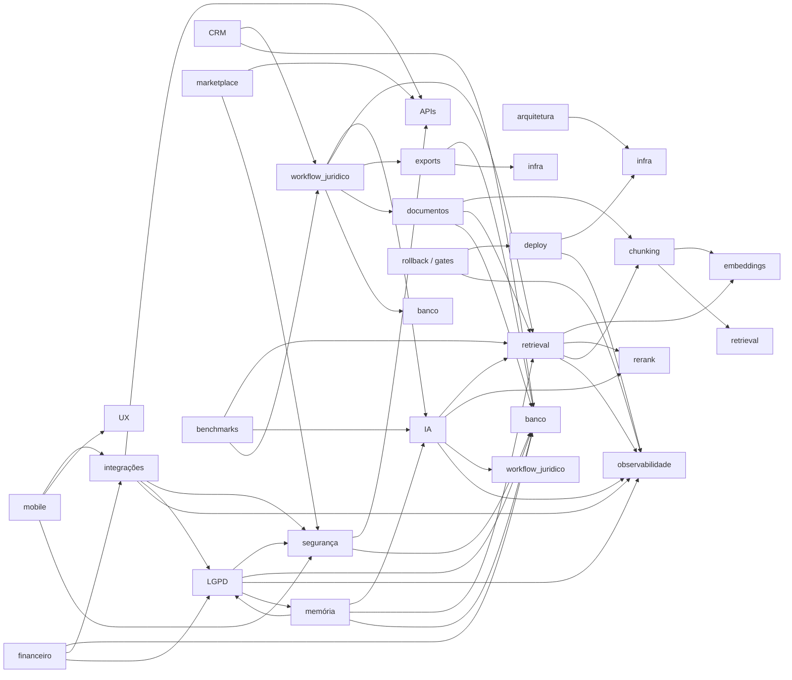

# Owner Matrix — Lex

> **Mapa canônico de ownership por subsystem.** Sem dono, não há mudança. Toda PR que toque um subsystem **sem** owner principal preenchido é bloqueada por bot. Toda mudança em subsystem **Tier-S** sem reviewer obrigatório + approval chain completa é rejeitada automaticamente.
>
> **Bus factor mínimo**: subsystems Tier-S e Tier-A exigem `owner_secundario` preenchido; um único humano não pode ser ponto único de falha.
>
> **Status atual** (checkpoint F-1, 2026-05-10): **preenchido provisoriamente** com o roster da §0. Bus factor humano real ainda é **1**; ver restrições em [`F-1_SIGNOFF.md`](F-1_SIGNOFF.md). Substituição obrigatória dos papéis provisórios antes de promoção a produção pública.

---

## 0. Roster funcional provisório (2026-05-10)

> Convenção de aliases usados nas seções §3 abaixo. Cada substituição obrigatória de provisório → humano nomeado é registrada em `F-1_SIGNOFF.md`.

| Alias | Significado | Status |
|-------|-------------|--------|
| `Thales (PO)` | Thales como Product Owner | **DEFINITIVO** |
| `Thales/Cursor (CTO interim)` | Thales + agente Cursor como executor técnico assistido | **PROVISÓRIO** — precisa de segundo humano técnico antes de produção |
| `Legal Lead [PROVISÓRIO]` | Advogado parceiro / consultor jurídico | **PROVISÓRIO** — a nomear antes de produção |
| `Security Lead [PROVISÓRIO]` | Responsável técnico de segurança | **PROVISÓRIO** — a nomear antes de produção |
| `QA Lead [PROVISÓRIO]` | Responsável técnico de QA / Benchmarks | **PROVISÓRIO** — a nomear antes de produção |

**Restrições operacionais enquanto há `[PROVISÓRIO]` ativo** (vide [`F-1_SIGNOFF.md`](F-1_SIGNOFF.md) §5):

1. F0 — Auditoria autorizada para iniciar (escopo de **trabalho interno**: medir baselines, corrigir docs, popular gold-sets).
2. **Nenhuma promoção a produção pública** com `partial`/`pending` enquanto qualquer Tier-S/A tiver papel `[PROVISÓRIO]`.
3. Decisões `S-03`/`S-10`/`S-13`/`S-14` (qualidade jurídica, segurança, LGPD) registradas; **execução** delas exige consulta antecipada ao titular do papel quando nomeado.
4. PRs que toquem `IA / retrieval / embeddings / chunking / drafting / segurança / LGPD` em Tier-S exigem **dupla revisão**: o owner provisório + o `Thales (PO)` ou `Thales/Cursor (CTO interim)` na função correspondente.

---

## 1. Schema

Cada subsystem tem **8 campos**:

| Campo | Definição |
|-------|-----------|
| `subsystem` | Nome canônico (lista oficial em §3) |
| `owner_principal` | Pessoa única, responsável final pela qualidade e roadmap |
| `owner_secundario` | Substituto em férias/incidentes; pode aprovar PRs P0/P1 |
| `reviewer_obrigatorio` | Quem revisa todo PR que toque o subsystem |
| `approval_chain` | Sequência declarada (ex.: `Tech Lead → CTO`; ou `Owner → Legal → CTO` para subsystems sensíveis) |
| `criticidade` | `Tier-S` (quebra produto) / `Tier-A` (degrada qualidade) / `Tier-B` (operacional) / `Tier-C` (auxiliar) |
| `dependencias` | Outros subsystems que mudam quando este muda |
| `autoridade_rollback` | Quem pode disparar rollback **sem** consulta |
| `autoridade_freeze` | Quem pode disparar freeze em PRs do subsystem |

**Observação**: a versão F-1 deste doc tinha todas as células de pessoa marcadas `_a preencher_`. **Checkpoint de 2026-05-10** preencheu provisoriamente com o roster §0; toda célula provisória continua **válida operacionalmente** mas sinalizada como dívida governance até virar humano nomeado.

---

## 2. Tiers de criticidade

- **Tier-S — Quebra produto**: queda do subsystem deixa o Lex inutilizável ou inseguro. Mudança exige cadeia completa + 2 owners.
- **Tier-A — Degrada qualidade**: queda reduz qualidade jurídica ou UX, mas o produto segue funcional. Mudança exige owner principal + reviewer.
- **Tier-B — Operacional**: importante para ops/escala mas não bloqueia o usuário final. Owner principal basta.
- **Tier-C — Auxiliar**: features periféricas; revisão padrão de PR suficiente.

---

## 3. Tabela oficial dos 25 subsystems

> Convenção de paths: `src/lib/...` para domínio; `src/app/...` para UI/APIs; `prisma/...` para schema; `scripts/...` para ops.
> Convenção de owners: ver §0 (aliases).

### Tier-S (14 subsystems)

#### 3.1 arquitetura geral
- `subsystem`: arquitetura geral
- `owner_principal`: Thales/Cursor (CTO interim)
- `owner_secundario`: Thales (PO)
- `reviewer_obrigatorio`: Thales/Cursor (CTO interim)
- `approval_chain`: Thales/Cursor (CTO interim) → Thales (PO)
- `criticidade`: Tier-S
- `dependencias`: todos
- `autoridade_rollback`: Thales/Cursor (CTO interim)
- `autoridade_freeze`: Thales/Cursor (CTO interim) + Thales (PO)
- **Paths cobertos**: `src/app/layout.tsx`, `src/middleware.ts`, `instrumentation.ts`, `next.config.ts`

#### 3.2 IA (LLMs, prompts, providers)
- `subsystem`: IA (LLMs, prompts, providers)
- `owner_principal`: Thales/Cursor (CTO interim)
- `owner_secundario`: Legal Lead [PROVISÓRIO]
- `reviewer_obrigatorio`: Legal Lead [PROVISÓRIO] (qualidade jurídica) + Thales/Cursor (CTO interim) (custo/latência)
- `approval_chain`: Owner → Legal Lead [PROVISÓRIO] → Thales/Cursor (CTO interim)
- `criticidade`: Tier-S
- `dependencias`: retrieval, rerank, drafting, review, observabilidade
- `autoridade_rollback`: Thales/Cursor (CTO interim)
- `autoridade_freeze`: Thales/Cursor (CTO interim) + Legal Lead [PROVISÓRIO]
- **Paths cobertos**: `src/lib/ai/llm.ts`, `src/lib/ai/providers/factory.ts`, `src/lib/ai/style-engine.ts`, `src/lib/ai/prompts/*`, `src/lib/legal/reasoning/*`

#### 3.3 retrieval (pipeline híbrido)
- `subsystem`: retrieval
- `owner_principal`: Thales/Cursor (CTO interim)
- `owner_secundario`: QA Lead [PROVISÓRIO]
- `reviewer_obrigatorio`: QA Lead [PROVISÓRIO]
- `approval_chain`: Owner → QA Lead [PROVISÓRIO] → Thales/Cursor (CTO interim)
- `criticidade`: Tier-S
- `dependencias`: embeddings, rerank, chunking, observabilidade, IA
- `autoridade_rollback`: Thales/Cursor (CTO interim)
- `autoridade_freeze`: Thales/Cursor (CTO interim) + QA Lead [PROVISÓRIO]
- **Paths cobertos**: `src/lib/retrieval/legal/**`, `src/lib/retrieval/hybrid-retriever.ts`, `src/lib/retrieval/vector-store/qdrant-store.ts`, `src/app/api/retrieval/**`

#### 3.5 embeddings (provider + model)
- `subsystem`: embeddings
- `owner_principal`: Thales/Cursor (CTO interim)
- `owner_secundario`: QA Lead [PROVISÓRIO]
- `reviewer_obrigatorio`: QA Lead [PROVISÓRIO] + Thales/Cursor (CTO interim)
- `approval_chain`: Owner → QA Lead [PROVISÓRIO] → Thales/Cursor (CTO interim)
- `criticidade`: Tier-S
- `dependencias`: chunking, retrieval, infra, custo
- `autoridade_rollback`: Thales/Cursor (CTO interim)
- `autoridade_freeze`: Thales/Cursor (CTO interim)
- **Paths cobertos**: integração DeepInfra (BGE-M3), `src/lib/corpus/embeddings-pipeline.ts` (referenciado em README)

#### 3.6 chunking
- `subsystem`: chunking
- `owner_principal`: Thales/Cursor (CTO interim)
- `owner_secundario`: Legal Lead [PROVISÓRIO]
- `reviewer_obrigatorio`: Legal Lead [PROVISÓRIO] (estrutura jurídica)
- `approval_chain`: Owner → Legal Lead [PROVISÓRIO] → QA Lead [PROVISÓRIO]
- `criticidade`: Tier-S
- `dependencias`: retrieval, embeddings, citations
- `autoridade_rollback`: Thales/Cursor (CTO interim)
- `autoridade_freeze`: Thales/Cursor (CTO interim) + Legal Lead [PROVISÓRIO]
- **Paths cobertos**: `src/lib/corpus/legal-chunker-v2.ts`, `src/lib/corpus/normalize.ts`, scripts `corpus-rechunk-articles.ts`

#### 3.7 UX (design system + jornada caso-cêntrica)
- `subsystem`: UX
- `owner_principal`: Thales (PO)
- `owner_secundario`: Thales/Cursor (CTO interim)
- `reviewer_obrigatorio`: Thales (PO)
- `approval_chain`: Owner → Thales (PO)
- `criticidade`: Tier-S
- `dependencias`: workflow jurídico, IA (Trust UX), todos os módulos com UI
- `autoridade_rollback`: Thales (PO)
- `autoridade_freeze`: Thales (PO)
- **Paths cobertos**: `src/app/(app)/**`, `src/components/cases/*`, `src/components/trust/*`, design tokens

#### 3.8 workflow jurídico (intake → review → export)
- `subsystem`: workflow jurídico
- `owner_principal`: Thales (PO)
- `owner_secundario`: Thales/Cursor (CTO interim)
- `reviewer_obrigatorio`: Legal Lead [PROVISÓRIO]
- `approval_chain`: Owner → Legal Lead [PROVISÓRIO] → Thales (PO)
- `criticidade`: Tier-S
- `dependencias`: IA, retrieval, exports, documentos, casos
- `autoridade_rollback`: Thales (PO) + Legal Lead [PROVISÓRIO]
- `autoridade_freeze`: Thales (PO) + Legal Lead [PROVISÓRIO]
- **Paths cobertos**: `src/lib/cases/intake.ts`, `drafting.ts`, `review.ts`, `drafting-guard.ts`, `cases/checklists/templates/*`, `src/app/api/cases/[id]/**`

#### 3.9 segurança (authZ, IDOR, secrets, admin gating)
- `subsystem`: segurança
- `owner_principal`: Security Lead [PROVISÓRIO]
- `owner_secundario`: Thales/Cursor (CTO interim)
- `reviewer_obrigatorio`: Security Lead [PROVISÓRIO]
- `approval_chain`: Owner → Security Lead [PROVISÓRIO] → Thales/Cursor (CTO interim)
- `criticidade`: Tier-S
- `dependencias`: APIs, banco, multi-tenant, infra
- `autoridade_rollback`: Security Lead [PROVISÓRIO] + Thales/Cursor (CTO interim)
- `autoridade_freeze`: Security Lead [PROVISÓRIO]
- **Paths cobertos**: `src/lib/auth/**` (`permissions.ts`, `workspace.ts`, `session.ts`, `sync-user.ts`, `invitations.ts`), `src/middleware.ts`, headers em `next.config.ts`

#### 3.10 LGPD (consentimento, retenção, anonimização, export)
- `subsystem`: LGPD
- `owner_principal`: Legal Lead [PROVISÓRIO]
- `owner_secundario`: Security Lead [PROVISÓRIO]
- `reviewer_obrigatorio`: Legal Lead [PROVISÓRIO] + Security Lead [PROVISÓRIO]
- `approval_chain`: Owner → Legal Lead [PROVISÓRIO] → Security Lead [PROVISÓRIO] → Thales/Cursor (CTO interim)
- `criticidade`: Tier-S
- `dependencias`: segurança, banco, observabilidade, memória
- `autoridade_rollback`: Legal Lead [PROVISÓRIO] + Security Lead [PROVISÓRIO]
- `autoridade_freeze`: Legal Lead [PROVISÓRIO]
- **Paths cobertos**: `src/lib/format/pii.ts`, retention policies em `prisma/schema.prisma`, scripts de export/anonimização (a criar)

#### 3.12 infra (Vercel, Supabase, Redis, Qdrant, Inngest)
- `subsystem`: infra
- `owner_principal`: Thales/Cursor (CTO interim)
- `owner_secundario`: Thales (PO)
- `reviewer_obrigatorio`: Thales/Cursor (CTO interim)
- `approval_chain`: Owner → Thales/Cursor (CTO interim)
- `criticidade`: Tier-S
- `dependencias`: deploy, observabilidade, todos os subsystems que tocam serviços externos
- `autoridade_rollback`: Thales/Cursor (CTO interim)
- `autoridade_freeze`: Thales/Cursor (CTO interim) + Thales (PO)
- **Paths cobertos**: `vercel.json`, `docker/**`, `Dockerfile`, scripts `qdrant:*`, `redis:check`, `inngest:check`, `deploy:check`, `.env.production.example`

#### 3.13 banco (Prisma schema + migrations)
- `subsystem`: banco
- `owner_principal`: Thales/Cursor (CTO interim)
- `owner_secundario`: Thales (PO)
- `reviewer_obrigatorio`: Thales/Cursor (CTO interim)
- `approval_chain`: Owner → Thales/Cursor (CTO interim) (+ Security Lead [PROVISÓRIO] **se** mudar coluna sensível ou RLS)
- `criticidade`: Tier-S
- `dependencias`: APIs, segurança, LGPD, todos os subsystems com persistência
- `autoridade_rollback`: Thales/Cursor (CTO interim)
- `autoridade_freeze`: Thales/Cursor (CTO interim)
- **Paths cobertos**: `prisma/schema.prisma`, `prisma/migrations/**`, `prisma.config.ts`, `supabase/workspace_rls_template.sql`

#### 3.14 APIs (`src/app/api/**`)
- `subsystem`: APIs
- `owner_principal`: Thales/Cursor (CTO interim)
- `owner_secundario`: Security Lead [PROVISÓRIO]
- `reviewer_obrigatorio`: Security Lead [PROVISÓRIO] (rotas autenticadas) + Thales/Cursor (CTO interim)
- `approval_chain`: Owner → Security Lead [PROVISÓRIO] → Thales/Cursor (CTO interim)
- `criticidade`: Tier-S
- `dependencias`: segurança, banco, multi-tenant, todos os módulos
- `autoridade_rollback`: Thales/Cursor (CTO interim)
- `autoridade_freeze`: Security Lead [PROVISÓRIO] + Thales/Cursor (CTO interim)
- **Paths cobertos**: `src/app/api/**` (65 rotas em 2026-05-09: cases, documents, retrieval, pieces, integrations, webhooks Inngest, etc.)

#### 3.23 deploy (CI/CD, rolling releases, env management)
- `subsystem`: deploy
- `owner_principal`: Thales/Cursor (CTO interim)
- `owner_secundario`: Thales (PO)
- `reviewer_obrigatorio`: Thales/Cursor (CTO interim)
- `approval_chain`: Owner → Thales/Cursor (CTO interim)
- `criticidade`: Tier-S
- `dependencias`: infra, observabilidade
- `autoridade_rollback`: Thales/Cursor (CTO interim)
- `autoridade_freeze`: Thales/Cursor (CTO interim) + Thales (PO)
- **Paths cobertos**: `.github/workflows/**`, `Dockerfile`, `vercel.json`, scripts `deploy:check`, `vercel:check`

#### 3.25 rollback / release gates (governance operacional)
- `subsystem`: rollback / release gates
- `owner_principal`: Thales/Cursor (CTO interim)
- `owner_secundario`: Thales (PO)
- `reviewer_obrigatorio`: Thales/Cursor (CTO interim) + Thales (PO)
- `approval_chain`: Owner → Thales/Cursor (CTO interim) + Thales (PO)
- `criticidade`: Tier-S
- `dependencias`: deploy, observabilidade, todos os subsystems Tier-S
- `autoridade_rollback`: Thales/Cursor (CTO interim) + Thales (PO)
- `autoridade_freeze`: Thales/Cursor (CTO interim) + Thales (PO)
- **Paths cobertos**: este pacote `docs/governance/**`

### Tier-A (7 subsystems)

#### 3.4 rerank
- `subsystem`: rerank
- `owner_principal`: Thales/Cursor (CTO interim)
- `owner_secundario`: QA Lead [PROVISÓRIO]
- `reviewer_obrigatorio`: QA Lead [PROVISÓRIO]
- `approval_chain`: Owner → QA Lead [PROVISÓRIO]
- `criticidade`: Tier-A
- `dependencias`: retrieval, embeddings, IA
- `autoridade_rollback`: Thales/Cursor (CTO interim)
- `autoridade_freeze`: Thales/Cursor (CTO interim) + QA Lead [PROVISÓRIO]
- **Paths cobertos**: integração BGE-reranker-v2-m3 via DeepInfra; chamada em `src/lib/retrieval/legal/index.ts`

#### 3.11 observabilidade (logs, traces, métricas, dashboards)
- `subsystem`: observabilidade
- `owner_principal`: Thales/Cursor (CTO interim)
- `owner_secundario`: Thales (PO)
- `reviewer_obrigatorio`: Thales/Cursor (CTO interim)
- `approval_chain`: Owner → Thales/Cursor (CTO interim)
- `criticidade`: Tier-A
- `dependencias`: todos
- `autoridade_rollback`: Thales/Cursor (CTO interim)
- `autoridade_freeze`: Thales/Cursor (CTO interim)
- **Paths cobertos**: `src/lib/logger.ts`, `src/lib/observability/**`, integração Langfuse, `recordObservabilityLog`, `fallbackFlags` em retrieval trace

#### 3.15 exports (DOCX, PDF, Markdown)
- `subsystem`: exports
- `owner_principal`: Thales/Cursor (CTO interim)
- `owner_secundario`: Thales (PO)
- `reviewer_obrigatorio`: Thales (PO) + Legal Lead [PROVISÓRIO] (consistência de peça)
- `approval_chain`: Owner → Thales (PO)
- `criticidade`: Tier-A
- `dependencias`: workflow jurídico, banco, storage
- `autoridade_rollback`: Thales/Cursor (CTO interim)
- `autoridade_freeze`: Thales/Cursor (CTO interim) + Thales (PO)
- **Paths cobertos**: `src/app/api/cases/[id]/drafts/[draftId]/export/route.ts`, `src/app/api/pieces/[id]/export/route.ts`, libs `docx`, `pdf-lib`

#### 3.16 documentos (upload, parsing, OCR, viewer)
- `subsystem`: documentos
- `owner_principal`: Thales/Cursor (CTO interim)
- `owner_secundario`: Security Lead [PROVISÓRIO]
- `reviewer_obrigatorio`: Security Lead [PROVISÓRIO] (PII em OCR) + Legal Lead [PROVISÓRIO]
- `approval_chain`: Owner → Security Lead [PROVISÓRIO]
- `criticidade`: Tier-A
- `dependencias`: chunking, retrieval, banco, storage
- `autoridade_rollback`: Thales/Cursor (CTO interim)
- `autoridade_freeze`: Thales/Cursor (CTO interim) + Security Lead [PROVISÓRIO]
- **Paths cobertos**: `src/app/api/documents/**`, `src/lib/parsers/**`, OCR via tesseract.js, viewer em UI

#### 3.17 memória (lawyer-brain, style-engine, ApprovedLegalFoundation)
- `subsystem`: memória
- `owner_principal`: Thales (PO)
- `owner_secundario`: Legal Lead [PROVISÓRIO]
- `reviewer_obrigatorio`: Legal Lead [PROVISÓRIO] + Legal Lead [PROVISÓRIO] (LGPD owner — mesma pessoa enquanto provisório)
- `approval_chain`: Owner → Legal Lead [PROVISÓRIO]
- `criticidade`: Tier-A
- `dependencias`: IA, retrieval, banco, LGPD
- `autoridade_rollback`: Thales (PO) + Legal Lead [PROVISÓRIO]
- `autoridade_freeze`: Legal Lead [PROVISÓRIO]
- **Paths cobertos**: `src/lib/lawyer-brain/**`, `src/lib/memory/**`, `src/lib/ai/style-engine.ts`, migration `office_memory` (2026-05-09)

#### 3.21 integrações (PJe, e-SAJ, Projudi, eproc, DOU, DJEN, Docusign)
- `subsystem`: integrações
- `owner_principal`: Thales/Cursor (CTO interim)
- `owner_secundario`: Security Lead [PROVISÓRIO]
- `reviewer_obrigatorio`: Security Lead [PROVISÓRIO] (segredos + escopos)
- `approval_chain`: Owner → Security Lead [PROVISÓRIO]
- `criticidade`: Tier-A
- `dependencias`: APIs, segurança, LGPD, observabilidade
- `autoridade_rollback`: Thales/Cursor (CTO interim)
- `autoridade_freeze`: Security Lead [PROVISÓRIO]
- **Paths cobertos**: `src/lib/integrations/**` (adapters PJe/eSAJ/Projudi/eproc + DOU/DJE + email + WhatsApp + calendar + webhook); rotas `src/app/api/integrations/**`

#### 3.24 benchmarks (gold-set, suíte de regressão)
- `subsystem`: benchmarks
- `owner_principal`: QA Lead [PROVISÓRIO]
- `owner_secundario`: Thales/Cursor (CTO interim)
- `reviewer_obrigatorio`: QA Lead [PROVISÓRIO]
- `approval_chain`: Owner → Thales/Cursor (CTO interim)
- `criticidade`: Tier-A
- `dependencias`: retrieval, IA, workflow jurídico
- `autoridade_rollback`: QA Lead [PROVISÓRIO]
- `autoridade_freeze`: QA Lead [PROVISÓRIO]
- **Paths cobertos**: `scripts/qa-production.ts`, `scripts/legal-retrieval-domains-qa.ts`, `scripts/cf-coverage-audit.ts`, `scripts/cf-retrieval-briefing.ts`, `scripts/cf-retrieval-smoke.ts`, `scripts/retrieval-smoke.ts`, `scripts/documents-audit.ts`, `scripts/cf-semantic-validate.ts`

### Tier-B (3 subsystems)

#### 3.18 CRM (leads, conversão lead→caso)
- `criticidade`: Tier-B
- `owner_principal`: Thales (PO); `owner_secundario`: Thales/Cursor (CTO interim); `reviewer_obrigatorio`: Thales (PO); `approval_chain`: Owner → Thales (PO); `dependencias`: workflow jurídico, banco; `autoridade_rollback`: Thales (PO); `autoridade_freeze`: Thales (PO).
- **Paths cobertos**: ainda não existe — entra com tabela própria em F1 quando virar feature P1.

#### 3.19 financeiro (contratos, cobranças, NFS-e)
- `criticidade`: Tier-B
- `owner_principal`: Thales (PO); `owner_secundario`: Legal Lead [PROVISÓRIO]; `reviewer_obrigatorio`: Legal Lead [PROVISÓRIO] + Security Lead [PROVISÓRIO]; `approval_chain`: Owner → Legal → Security; `dependencias`: banco, integrações, LGPD; `autoridade_rollback`: Thales (PO) + Thales/Cursor (CTO interim); `autoridade_freeze`: Thales (PO).
- **Paths cobertos**: ainda não existe — F2/F4.

#### 3.22 mobile / canais (PWA, WhatsApp, voz)
- `criticidade`: Tier-B
- `owner_principal`: Thales (PO); `owner_secundario`: Thales/Cursor (CTO interim); `reviewer_obrigatorio`: Thales (PO) + Security Lead [PROVISÓRIO]; `approval_chain`: Owner → Security; `dependencias`: integrações, UX, segurança; `autoridade_rollback`: Thales (PO); `autoridade_freeze`: Security Lead [PROVISÓRIO].
- **Paths cobertos**: `src/lib/integrations/messaging.ts` (WhatsApp adapter); PWA/voz pendentes.

### Tier-C (1 subsystem)

#### 3.20 marketplace
- `criticidade`: Tier-C
- `owner_principal`: Thales (PO); `owner_secundario`: Thales/Cursor (CTO interim); `reviewer_obrigatorio`: Thales (PO) + Legal Lead [PROVISÓRIO]; `approval_chain`: Owner → PO → Legal → CTO; `dependencias`: APIs, segurança, billing; `autoridade_rollback`: Thales (PO) + Thales/Cursor (CTO interim); `autoridade_freeze`: Thales (PO).
- **Paths cobertos**: ainda não existe — F8 (depois que P0/P1/P2 estiverem maduros).

---

## 4. Regras gerais

1. **Tier-S sem owner principal preenchido**: PR rejeitado automaticamente (bot + reviewer).
2. **Tier-S/A sem `owner_secundario` preenchido**: PR fica em "draft governance pending".
3. **Mudança em subsystem com `dependencias` listadas**: PR exige notificação aos owners das dependências (comentário automático no PR).
4. **Rotação de pessoal**: este doc é atualizado **no mesmo dia** que a rotação ocorre.
5. **Auditoria trimestral**: validar que os owners declarados continuam ativos no projeto e que `bus factor ≥ 2` para Tier-S/A.
6. **Conflito de papéis** (mesma pessoa em owner + reviewer obrigatório): permitido apenas em equipe < 5 pessoas, com declaração explícita no PR e aprovação extra do PO. **Estado atual (2026-05-10)**: equipe é < 5; conflitos múltiplos existem e estão registrados em [`F-1_SIGNOFF.md`](F-1_SIGNOFF.md) §5; cada PR Tier-S/A em fase F0 deve registrar isso explicitamente.
7. **Substituição obrigatória de provisórios antes de produção pública**: nenhum subsystem com Tier-S ou Tier-A pode ter dependência declarada em `[PROVISÓRIO]` no momento da promoção a produção pública (release público pago). Para uso interno / sandbox / smoke / F0 / F1 internas: provisórios autorizados com restrições da §0.

---

## 5. Override de approval chain

Override exige RFC + assinatura **PO + CTO + Legal Lead** + registro em `OVERRIDES_LOG.md`. Override frequente (≥3 em trimestre) sobre o **mesmo subsystem** dispara revisão da approval chain.

Em vigor enquanto roster §0 está provisório: assinaturas que envolvem `[PROVISÓRIO]` de Legal/Security/QA podem ser **adiadas** com nota explícita no PR ("aguarda titular nomeado") **se** o conteúdo for: (a) interno; (b) reversível; (c) sem impacto LGPD/segurança/qualidade jurídica imediata. Promoção a produção pública **anula** essa flexibilidade.

---

## 6. Matriz de dependências (resumo)

---

## 7. Como aplicar

1. **Hoje (2026-05-10)**: roster §0 ativo; toda PR em F0 declara owner conforme §3.
2. **Próximo PR**: bot lê este doc para identificar owner; se ausente, bloqueia. Sem nomes humanos para Legal/Security/QA, owner cai em provisório com nota.
3. **Próxima rotação / nomeação**: substituir alias `[PROVISÓRIO]` por nome real **no mesmo dia**; registrar em `F-1_SIGNOFF.md` ledger.
4. **Trimestral**: revisão de bus factor; alertar quando Tier-S/A cair para 1 humano real.
5. **Antes de produção pública**: **zero** `[PROVISÓRIO]` em Tier-S/A. Sem isso, gate G-62 (release review) bloqueia promote.

---

## 8. Notas operacionais sobre o roster provisório

> Esta seção registra honestamente as limitações decorrentes do roster §0 estar parcialmente provisório.

1. **Bus factor humano real** = 1 (Thales). Cursor agent é executor técnico, não substituto operacional independente em incidente.
2. **Reviewer obrigatório duplicado** quando o "secundário" é provisório: a função de revisão recai temporariamente sobre Thales (PO) + Thales/Cursor (CTO interim); declarar isso explicitamente em todo PR Tier-S.
3. **Subsystems críticos com cobertura provisória dupla**: `IA`, `retrieval`, `embeddings`, `chunking`, `segurança`, `LGPD`, `workflow jurídico`, `documentos`, `memória`, `integrações`, `benchmarks` — qualquer mudança nesses subsystems durante a janela provisória deve ser **conservadora** (sem trocar embedding/chunker/prompt; sem live de tribunais; sem WhatsApp live; sem release público).
4. **Decisões adiadas**: nenhuma promoção a produção pública pode acontecer enquanto qualquer Tier-S/A tiver Legal Lead, Security Lead ou QA Lead provisório. Releases internos (sandbox, demo controlada com 1 advogado piloto sob acordo) são permitidos com restrição.
5. **Ledger de substituição**: cada `[PROVISÓRIO]` → humano nomeado é registrado em `F-1_SIGNOFF.md` §6 com data, escopo e PR de atualização.

---

## Veja também

- [`EXECUTION_GOVERNANCE.md`](EXECUTION_GOVERNANCE.md) — papéis macro (PO/CTO/Legal/Security/QA).
- [`F-1_SIGNOFF.md`](F-1_SIGNOFF.md) — registro do checkpoint de sign-off provisório de governance.
- [`PRIORITY_MATRIX.md`](PRIORITY_MATRIX.md) — tier por feature.
- [`RELEASE_GATES.md`](RELEASE_GATES.md) — gates aplicáveis.
- [`ROLLBACK_POLICY.md`](ROLLBACK_POLICY.md) — quem pode reverter o quê.
- [`STOP_CONDITIONS.md`](STOP_CONDITIONS.md) — quem pode disparar freeze.
- [`PRODUCT_SURVIVAL_MODE.md`](PRODUCT_SURVIVAL_MODE.md) — restrições enquanto Survival Mode ativo.
