# Product Survival Mode — Lex

> **Documento canônico do que importa para o Lex sobreviver.** Não é doc inspiracional. É filtro operacional: **toda decisão que entrar em conflito com este documento perde**.

> **Tese**: o Lex **não vencerá por quantidade de features**. Vencerá por **qualidade jurídica + retrieval confiável + grounding + workflow + UX clara + memória viva + confiança + auditabilidade + estabilidade + operação real do escritório**. O resto é distração.

---

## 1. Definição operacional de "Survival Mode"

**Survival Mode** é o estado do produto quando **alguma** das seguintes for verdadeira:

- Algum item P0 da [`PRIORITY_MATRIX.md`](PRIORITY_MATRIX.md) está em estado `partial` ou `pending`.
- Alguma stop condition `S-01..S-44` da [`STOP_CONDITIONS.md`](STOP_CONDITIONS.md) está `triggered`.
- Algum threshold P0 da [`QUALITY_THRESHOLDS.md`](QUALITY_THRESHOLDS.md) está abaixo do mínimo MVP.
- O time tem 5 ou menos engenheiros ativos no produto.
- O produto não atingiu o primeiro escritório pagante e ativo por **2 sprints** consecutivos.

**Hoje** (2026-05-09), o Lex está em **Survival Mode** por todos os critérios acima — vide [`EXECUTION_REPORT_F-1_LEVA_1.md`](EXECUTION_REPORT_F-1_LEVA_1.md) §4–§8.

Sair de Survival Mode exige assinatura **PO + CTO + Legal Lead + QA Lead** + evidência de §6.

---

## 2. Riscos existenciais (em ordem decrescente de letalidade)

| ID | Risco | Por que é existencial | Como detectar | Mitigação primária |
|----|-------|------------------------|----------------|---------------------|
| **EX-01** | **IA ruim** (gera lixo, sem coerência jurídica) | Quebra confiança em 1 demo; cliente nunca volta | benchmark adversarial (`BENCHMARK_STRATEGY` §B); review humano amostral | bloquear export quando review reprovar; voltar para v anterior do prompt |
| **EX-02** | **Retrieval ruim** (não acha base, traz lixo, ranking ruim) | Tudo o mais (drafting, review, memória) depende de retrieval | hits@5/MRR/cobertura/`groundingScore` (`QUALITY_THRESHOLDS` §A) | `S-01`/`S-02` triggered → freeze + benchmark obrigatório |
| **EX-03** | **Fundamento inventado** (artigo/súmula que não existe ou existe mas com sentido errado) | Risco profissional (OAB) + risco legal + descrédito imediato | citation accuracy + source existence (§B); spot-check Legal Lead | `drafting-guard.ts` + `source-sufficiency.ts`; bloquear export; `S-03` |
| **EX-04** | **Peça juridicamente fraca** (sem pedido principal, sem fundamento, sem coerência) | Advogado descobre na primeira peça e desinstala | review checklist 8 critérios; taxa de reprovação | bloquear export se review = `REJECTED`/`CHANGES_REQUESTED` |
| **EX-05** | **UX confusa** (advogado se perde, mistura biblioteca/pesquisa/documentos, vê jargão dev) | Advogado abandona em 5 minutos | dead-end reports (`S-30`); completion rate jornada principal | smoke manual G-57; consolidar entradas duplicadas (ver Leva 1 §4.1) |
| **EX-06** | **Excesso de features** (produto fica diluído, manutenção explode) | Time perde foco; bugs se acumulam; nenhuma feature fica sólida | `EXECUTION_BUDGETS` §A (parallelism cap); contagem de features `partial` | freeze de novas features quando `S-43`/`S-44` |
| **EX-07** | **Overengineering** (abstração prematura, "vamos preparar para enterprise antes do MVP") | Código fica ininteligível; novo dev demora semanas para contribuir | code review red flags; tempo médio onboarding | `ARCHITECTURE_STABILITY_POLICY §H` (anti-chaos) |
| **EX-08** | **Falta de foco** (mudança de prioridade semanal) | Nada termina; débito vira o produto | scope-creep flags; lead time RFC→merge | `EXECUTION_GOVERNANCE §5` no scope creep + `PRIORITY_MATRIX` |
| **EX-09** | **Custo IA fora de controle** (1 cliente = perda mensal) | Modelo de negócio impossível | custo por workspace/dia (`QUALITY_THRESHOLDS §G`) | `S-05` triggered; cap por workspace |
| **EX-10** | **Promessa pública maior que produto real** ("integramos com todos os tribunais", "jurimetria") | Demanda judicial + churn em onboarding + descrédito | spot-check landing × `PRIORITY_MATRIX §4`; rotular `planned`/`partial` | `FORBIDDEN_ORDERINGS` §10; PO assina toda mudança em landing/pitch |

**Regra dura**: se EX-01..EX-04 estiver ativo em qualquer release, **rollback automático sugerido** + freeze de drafting até clearance (`ROLLBACK_POLICY §4.1`).

---

## 3. Foco de sobrevivência (a "jornada feliz mínima")

> O Lex sobrevive quando o **advogado real** consegue, **sem ajuda do time**, completar **toda** a jornada abaixo, em ≤ **20 minutos**, com **confiança suficiente para usar a peça**.

```mermaid
flowchart LR
  Login[Login] --> CriarCaso[Criar caso]
  CriarCaso --> Estruturar[Estruturar fatos / partes / pedidos / riscos]
  Estruturar --> EnviarDoc[Enviar documento]
  EnviarDoc --> Pesquisar[Pesquisar fundamento real]
  Pesquisar --> Entender[Entender fonte: legislação x jurisprudência x doc x memória]
  Entender --> Pinar[Pinar fundamento]
  Pinar --> Gerar[Gerar peça coerente com base apenas em fundamento citável]
  Gerar --> Revisar[Revisar com checklist 8 critérios]
  Revisar --> Exportar[Exportar DOCX/PDF com Trust UX visível]
  Exportar --> Confiar[Confiar no resultado o suficiente para protocolar com revisão própria]
```

**Cada etapa tem aceite testável** (referência: smoke manual G-57 em [`RELEASE_GATES.md`](RELEASE_GATES.md) §6):

| Etapa | Aceite mínimo (MVP) |
|-------|---------------------|
| Login | magic link funciona; workspace cookie persiste |
| Criar caso | `/cases/new` com 5 campos, sem jargão dev |
| Estruturar | abas Fatos/Partes/Pedidos/Riscos persistem; CRUD inline |
| Enviar documento | upload + parsing + chunking concluem; status visível |
| Pesquisar | `/pesquisa-juridica` retorna ≥ 3 fontes citáveis com `groundingScore` ≥ MVP |
| Entender fonte | render legível (URN-LEX, fullPath, tribunal, vigência) |
| Pinar | `ApprovedLegalFoundation` salva e aparece no caso |
| Gerar peça | `drafting.ts` produz minuta sem placeholder; `source-sufficiency` aprovou |
| Revisar | `review.ts` retorna verdict; UI mostra checklist 8/8 |
| Exportar | DOCX + PDF baixam; Trust UX renderizado no documento |
| Confiar | advogado consegue justificar cada parágrafo da peça (rastreabilidade total) |

**Se 1 etapa quebra para 1 advogado real, isso é P0**. Ponto.

**Nota (2026-05-10 — F-1 / Lane P0):** a pesquisa jurídica assistida via DeepSeek entra como parte da **jornada feliz mínima interna** (demo/piloto controlado) para obter feedback útil sem bloquear o escritório na ausência de benchmarks do motor interno de busca no corpus. Isso **não** suspende as restrições do sign-off F-1: **release público pagante continua bloqueado** enquanto Legal/Security/QA Lead estiverem provisórios e os gates de produção não forem reavaliados (`F-1_SIGNOFF.md`).

---

## 4. O que **deve ser congelado** quando P0 está fraco

> Lista oficial de **freeze automático** quando survival mode estiver ativo. Tentar avançar nestes itens enquanto P0 estiver `partial` viola [`FORBIDDEN_ORDERINGS.md`](FORBIDDEN_ORDERINGS.md).

| ID | Item congelado | Justificativa | Quando descongelar |
|----|----------------|---------------|---------------------|
| **F-01** | Marketplace jurídico (P4) | Depende de quality engine + biblioteca + memória maduros | Todos os P0 e P1 críticos `done`; quality engine (P2) `done`; primeiros 5 escritórios pagantes ativos por 90 dias |
| **F-02** | Landing pages builder (subdomínio do escritório, P4) | UX comercial e intake/CRM ainda não fechados | UX comercial `done`; CRM básico (P1) `done` |
| **F-03** | Email próprio (P4) | Segurança/storage/billing/LGPD ainda em hardening | Pacote security/LGPD/billing `done`; SOC2 escopo definido |
| **F-04** | Nuvem própria / on-premise (P3) | Sem demanda concreta documentada; consome time de core | 1 contrato enterprise assinado exigindo isso |
| **F-05** | White-label (P4) | Sem produto core estável, white-label vira amplificador de bug | Produto core `stable` por 90 dias |
| **F-06** | Enterprise avançado: SSO/SAML/SCIM, audit imutável, isolated VDB, multi-region (P3) | Não há cliente enterprise validado; foco é MVP/Pro | 1 contrato enterprise assinado exigindo essas features |
| **F-07** | Integrações **live** com tribunais (PJe/eSAJ/Projudi/eproc — P3 quando "live") | Depende de mock testado, secrets, rate limit, LGPD | Mock 100% testado; secrets vault implementado; LGPD doc + DPA prontos |
| **F-08** | Multi-model orchestration avançada (P2 — F28) | Depende de retrieval/grounding estável (P0) | Thresholds P0 atingidos por 30 dias |
| **F-09** | DataJud/jurimetria avançada (P2) | Sem matriz de cobertura real publicada | DataJud doc atualizada com cobertura real; provider `live` por tribunal validado |
| **F-10** | API pública (P4) | Sem quality engine + billing + LGPD | quality engine (P2) `done`; billing/LGPD `done` |
| **F-11** | Plugins de terceiros (P4) | Aumenta superfície de ataque | API pública (P4) `done`; marketplace `done` |
| **F-12** | WhatsApp **live** (P1 quando live) | Adapter mock pronto; live exige opt-in, logs, LGPD | LGPD `done`; opt-in UX `done`; rate limit + dedup `done` |

**Override** exige: RFC + assinaturas PO + CTO + Legal Lead + registro em `OVERRIDES_LOG.md` + revisão pós-30 dias.

---

## 5. O que continua **sempre** mesmo em Survival Mode

Survival Mode **não** congela:

- **Hardening** de P0 já implementado (estabilidade, fallback, observabilidade).
- **Paper-cut UX** (correções pequenas que reduzem dead-ends).
- **Fix de bug** com severidade ≥ Tier-A.
- **Documentação** que reduza divergência docs↔código.
- **Benchmarks e gold-sets** (a regra é justamente medir mais).
- **Auditorias de segurança** e LGPD.
- **Testes** novos que cubram caminho crítico.
- **Refactors estritamente cirúrgicos** que respeitem `EXECUTION_BUDGETS`.

---

## 6. Métricas de sobrevivência (saída de Survival Mode)

> Para sair de Survival Mode, **todas** as métricas abaixo devem cumprir **threshold MVP** por **30 dias** consecutivos. Thresholds numéricos exatos vivem em [`QUALITY_THRESHOLDS.md`](QUALITY_THRESHOLDS.md); aqui resumimos o **conjunto exigido**.

| # | Métrica | Definição operacional | Threshold MVP (resumo) | Owner |
|---|---------|------------------------|--------------------------|-------|
| 1 | **Conclusão da jornada principal** | % de sessões que completam Login → Export sem ajuda | ≥ alvo MVP §A em `QUALITY_THRESHOLDS` | PO + UX owner |
| 2 | **Taxa de peça útil** | % de peças exportadas usadas (com ou sem edição leve) pelo advogado real | ≥ alvo §D | PO + Legal Lead |
| 3 | **Taxa de fundamento aprovado** | % de fundamentos pinados que passam revisão Legal e entram em peça | ≥ alvo §C | Legal Lead |
| 4 | **Tempo até primeira peça** | mediana do tempo entre criar caso e exportar a 1ª peça | ≤ alvo §E | UX owner + workflow owner |
| 5 | **Queries sem resposta** | % queries com `groundingScore` "Baixa" e `chunks.length == 0` | ≤ alvo §B | retrieval owner |
| 6 | **Taxa de hallucination** | % de afirmações IA sem fonte válida em amostra revisada por Legal Lead | ≤ alvo §C | Legal Lead + IA owner |
| 7 | **Retrabalho humano** | % de peças que o advogado precisa reescrever > 30% antes de protocolar | ≤ alvo §D | Legal Lead |
| 8 | **Latência p95 retrieval/drafting/export** | medida em produção (Langfuse + middleware) | ≤ alvo §F | observabilidade owner |
| 9 | **Custo por caso** | custo IA acumulado por caso completo (intake → export) | ≤ alvo §G | IA owner + CTO |
| 10 | **NPS / declaração explícita do advogado** | "eu confio o suficiente para usar essa peça" amostra ≥ 10 | ≥ alvo qualitativo | PO |

> Várias dessas métricas estão em **`baseline_status: unknown`** hoje (vide `QUALITY_THRESHOLDS.md`). Survival Mode **não** se levanta antes que sejam **medidas** em F0/F2.

---

## 7. Filtro de decisão (Survival Mode Test)

Toda RFC nova passa por **5 perguntas obrigatórias**. Se a resposta a alguma for "não", a RFC entra em fila atrás de quem responde "sim" a todas.

1. **Aproxima o advogado de confiar e usar diariamente**? (sem isso, é vaidade)
2. **Reduz risco existencial EX-01..EX-10**? (se não, por que agora?)
3. **Respeita o tier**? (P3/P4 com P0 partial → recusa automática)
4. **Cabe no `EXECUTION_BUDGETS`**? (parallelism, custo, janela)
5. **Tem owner principal **com bus factor ≥ 2****? (se não, é dívida governance, não feature)

---

## 8. Sinais de saída (descongelar Survival Mode)

Combinação **necessária** (não suficiente):

- Todos os itens P0 da `PRIORITY_MATRIX.md` em estado `done` ou `stable`.
- Todas as métricas §6 em threshold MVP por 30 dias consecutivos.
- Zero stop conditions S-01..S-44 ativas por 30 dias.
- DOC_VS_CODE_DIVERGENCE.md em downward trend (≥ 50% redução em 60 dias).
- 1 escritório pagante ativo declarando uso ≥ 3 dias/semana há ≥ 60 dias.
- Bus factor ≥ 2 em **todos** os subsystems Tier-S/A.

Após sinais cumpridos: PO + CTO + Legal Lead + QA Lead assinam clearance → Survival Mode **pausado** (não eliminado: pode ser reativado por gatilho automático).

---

## 9. Comportamento do time durante Survival Mode

- **Cadence**: stabilization week toda 4ª semana (não 1 a cada 4).
- **Rituais**: Daily quality check (10 min) **vira obrigatório**.
- **Comunicação externa**: zero promessa nova; backlog visível; `ROADMAP.md` público marca "estabilizando" com transparência.
- **Comercial**: vendas focadas em MVP + 1 cliente piloto por vez.
- **Investidor**: pitch foca em **profundidade de qualidade jurídica**, não em volume de features.

---

## 10. Como aplicar este doc

1. **Hoje**: este doc é canônico. Toda RFC, decisão de roadmap e promessa pública é filtrada por §3, §4, §7.
2. **Próximo PR**: bot bloqueia merge que toque item §4 enquanto algum P0 estiver `partial`.
3. **Próxima reunião de roadmap**: revisar §6 com métricas atuais (mesmo `unknown`) e marcar próximas medições.
4. **A cada release**: confirmar se Survival Mode segue ativo ou pode pausar (assinatura §8).

---

## 11. Anti-padrões proibidos sob Survival Mode

- "Vamos só anunciar para acelerar funding" → **proibido** se viola §10 EX-10.
- "Esse cliente quer SSO, vamos colocar agora" → **proibido** se P0 `partial`; resposta correta = "MVP em N semanas".
- "Vamos abrir API pública, é fácil" → **proibido** §F-10.
- "Estamos atrás dos concorrentes em features X/Y/Z" → **resposta**: estamos atrás em **profundidade**? Se não, ignorar.
- "Refactor para preparar enterprise" → **proibido** §EX-07.

---

## Veja também

- [`EXECUTION_GOVERNANCE.md`](EXECUTION_GOVERNANCE.md), [`PRIORITY_MATRIX.md`](PRIORITY_MATRIX.md), [`OWNER_MATRIX.md`](OWNER_MATRIX.md), [`STOP_CONDITIONS.md`](STOP_CONDITIONS.md), [`QUALITY_THRESHOLDS.md`](QUALITY_THRESHOLDS.md), [`FORBIDDEN_ORDERINGS.md`](FORBIDDEN_ORDERINGS.md), [`EXECUTION_BUDGETS.md`](EXECUTION_BUDGETS.md), [`ARCHITECTURE_STABILITY_POLICY.md`](ARCHITECTURE_STABILITY_POLICY.md), [`BENCHMARK_STRATEGY.md`](BENCHMARK_STRATEGY.md), [`EXECUTION_REPORT_F-1_LEVA_1.md`](EXECUTION_REPORT_F-1_LEVA_1.md).
