# Release Gates — Lex

> **Documento canônico dos gates de release.** Sem todos os gates aplicáveis verdes, **não há merge para `main`** e **não há promoção para produção**. Aplicado por subsystem tier (Tier-S/A/B/C) e por priority tier (P0/P1/P2/P3/P4).

> **Princípio**: gates são **enforced**, não opcionais. Override exige RFC + 3 assinaturas + entrada em `OVERRIDES_LOG.md`.

---

## 1. Conceito de gate

Um **gate** é uma verificação **automática ou manual** que **deve** estar verde antes de avançar para a próxima etapa do release. Cada gate tem:

- **ID** estável (`G-xx`).
- **Tipo**: `automated` (CI), `manual-checklist` (humano com evidência) ou `metric` (lê dashboard/script).
- **Threshold**: ver `QUALITY_THRESHOLDS.md` quando aplicável.
- **Owner**: quem assina.
- **Ação em caso vermelho**: `block-merge`, `block-promote`, `dispatch-stop` ou `require-override`.
- **Tier mínimo aplicável**: a partir de qual subsystem/feature tier o gate é exigido.

---

## 2. Estágios do release

```mermaid
flowchart LR
  PR[PR aberto] --> CI[CI checks]
  CI --> ReviewCode[Code review humano]
  ReviewCode --> DoD[DoD assinado]
  DoD --> Merge[Merge para main]
  Merge --> Preview[Preview deploy Vercel]
  Preview --> Smoke[Smoke tests + manual checklist]
  Smoke --> Promote[Promote production]
  Promote --> Monitor[Monitor 60 min]
  Monitor --> Stable[Estável após 14 dias sem regressão]
```

Os gates a seguir aplicam-se **por estágio**.

---

## 3. Gates por estágio

### 3.1 Estágio: PR aberto (G-01 a G-05)

| ID | Gate | Tipo | Owner | Threshold / regra | Ação se vermelho |
|----|------|------|-------|-------------------|------------------|
| G-01 | RFC vinculada (link no corpo do PR) | manual-checklist | Autor | Obrigatório para tier ≠ fast-path | block-merge |
| G-02 | Tier proposto e Owner principal preenchidos | manual-checklist | PO | Obrigatório | block-merge |
| G-03 | Subsystem owner aprovou | manual-checklist | Owner subsystem | Obrigatório (ver `OWNER_MATRIX.md`) | block-merge |
| G-04 | Scope-creep ≤ 30% e ≤ 1 subsystem | automated (heurística + reviewer) | CTO | Hard limit | block-merge |
| G-05 | Stop condition NÃO ativa para o subsystem | automated | CTO | Read `STOP_CONDITIONS.md` state | block-merge |

### 3.2 Estágio: CI checks (G-10 a G-19)

| ID | Gate | Tipo | Owner | Threshold | Ação |
|----|------|------|-------|-----------|------|
| G-10 | `pnpm lint` ok | automated | CTO | 0 errors | block-merge |
| G-11 | `pnpm typecheck` ok | automated | CTO | 0 errors | block-merge |
| G-12 | `pnpm test` ok (unit + integration) | automated | QA Lead | 0 failures | block-merge |
| G-13 | `pnpm build` ok (Next.js) | automated | CTO | 0 errors, 0 warning crítico | block-merge |
| G-14 | Migrations Prisma reversíveis declaradas | manual-checklist | Owner banco | Existir `down.sql` ou plano em PR; subir SEMPRE backwards-compatible (drop coluna em PR posterior) | block-merge |
| G-15 | Sem secrets commitados | automated | Security Lead | grep + gitleaks-like | block-merge |
| G-16 | Sem `console.log` em prod paths | automated | CTO | grep com allowlist | block-merge |
| G-17 | Sem TODO/FIXME novo sem owner | automated | CTO | regex `// TODO(?!:owner=)` | block-merge |
| G-18 | Logs respeitam `pii.ts` (sem PII vazada) | manual-checklist | LGPD owner | Spot-check em PRs que tocam logger | block-merge |
| G-19 | Multi-tenant: toda query nova filtra por `workspaceId` | manual-checklist | Security Lead | Ver `src/lib/auth/workspace.ts` + sample review | block-merge |

### 3.3 Estágio: Code review humano (G-20 a G-22)

| ID | Gate | Tipo | Owner | Regra | Ação |
|----|------|------|-------|-------|------|
| G-20 | ≥ 1 reviewer obrigatório do subsystem aprovou | manual-checklist | Reviewer | Conforme `OWNER_MATRIX.md` | block-merge |
| G-21 | Tier-S exige ≥ 2 aprovações (incluindo CTO ou Security Lead) | manual-checklist | CTO | Hard rule | block-merge |
| G-22 | Toda mudança em IA/retrieval/embeddings/chunker exige aprovação adicional do QA Lead | manual-checklist | QA Lead | Hard rule | block-merge |

### 3.4 Estágio: DoD assinado (G-30)

| ID | Gate | Tipo | Owner | Regra | Ação |
|----|------|------|-------|-------|------|
| G-30 | Checklist de 19 itens em [`DEFINITION_OF_DONE.md`](DEFINITION_OF_DONE.md) marcado **e** evidência referenciada por item aplicável | manual-checklist | Autor + Owner subsystem | Itens não aplicáveis devem ser justificados ("N/A: motivo") | block-merge |

### 3.5 Estágio: Preview deploy (G-40 a G-44)

| ID | Gate | Tipo | Owner | Regra | Ação |
|----|------|------|-------|-------|------|
| G-40 | Preview Vercel buildou e healthcheck `/api/health` 200 | automated | CTO | — | block-promote |
| G-41 | `scripts/deploy-check.ts` ok no preview | automated | CTO | Exit 0 | block-promote |
| G-42 | `scripts/redis-check.ts` ok | automated | CTO | Exit 0 | block-promote |
| G-43 | `scripts/inngest-check.ts` ok | automated | CTO | Exit 0 | block-promote |
| G-44 | `scripts/qdrant-stats.ts` retorna número de chunks ≥ baseline | automated | retrieval owner | Não aceitar quebra silenciosa de corpus | block-promote |

### 3.6 Estágio: Smoke + manual checklist (G-50 a G-58)

| ID | Gate | Tipo | Owner | Regra | Ação |
|----|------|------|-------|-------|------|
| G-50 | `scripts/cf-retrieval-smoke.ts` (12 queries CF/88) verde | automated | retrieval owner | hits@5 ≥ baseline (`QUALITY_THRESHOLDS`) | block-promote |
| G-51 | `scripts/retrieval-smoke.ts` (corpus geral) verde | automated | retrieval owner | hits@5 ≥ baseline | block-promote |
| G-52 | `scripts/legal-retrieval-domains-qa.ts` ok | automated | QA Lead | Por domínio: hits@5 ≥ baseline | block-promote |
| G-53 | `scripts/cf-coverage-audit.ts` sem regressão | automated | retrieval owner | Cobertura por capítulo ≥ baseline | block-promote |
| G-54 | `scripts/cf-semantic-validate.ts` ok | automated | retrieval owner | Diff semântico < banda | block-promote |
| G-55 | `scripts/qa-production.ts` (smoke produção) ok | automated | QA Lead | Mediana sem regressão | block-promote |
| G-56 | `scripts/documents-audit.ts` ok | automated | documentos owner | Sem chunks órfãos | block-promote |
| G-57 | Smoke manual da jornada caso → documento → pesquisa → peça → revisão → export | manual-checklist | PO | Roteiro fixo (ver §6) | block-promote |
| G-58 | Trust UX visível e legível em peça gerada | manual-checklist | PO + Legal Lead | Spot-check 1 peça por release | block-promote |

### 3.7 Estágio: Promote production (G-60 a G-63)

| ID | Gate | Tipo | Owner | Regra | Ação |
|----|------|------|-------|-------|------|
| G-60 | Janela de freeze NÃO ativa | automated | CTO | Read `STOP_CONDITIONS.md` | block-promote |
| G-61 | Plano de rollback declarado no PR (referência a `ROLLBACK_POLICY.md`) | manual-checklist | Autor | Obrigatório | block-promote |
| G-62 | Aprovação final PO + CTO em release notes | manual-checklist | PO + CTO | Hard | block-promote |
| G-63 | Para Tier-S/A: aprovação adicional Legal Lead OU Security Lead conforme natureza | manual-checklist | Legal/Security | Hard | block-promote |

### 3.8 Estágio: Monitor pós-promote (G-70 a G-73)

| ID | Gate | Tipo | Owner | Regra | Ação |
|----|------|------|-------|-------|------|
| G-70 | Healthcheck `/api/health` 200 nos 60 min seguintes | metric | CTO | — | dispatch-stop + rollback |
| G-71 | Erro 5xx sem aumento > 2x baseline | metric | observabilidade owner | Janela 60 min | dispatch-stop |
| G-72 | Latência p95 retrieval sem aumento > 1.5x baseline | metric | retrieval owner | Janela 60 min | dispatch-stop |
| G-73 | Custo IA por workspace sem spike > 2x baseline | metric | IA owner | Janela 24 h | dispatch-stop |

### 3.9 Estágio: Estável (G-80)

| ID | Gate | Tipo | Owner | Regra | Ação |
|----|------|------|-------|-------|------|
| G-80 | 14 dias corridos sem regressão de métrica chave | metric | QA Lead | Marca release como `stable` | habilita refactor pós-feature |

---

## 4. Gates por priority tier (resumo)

Toda PR/feature deve passar **pelo menos** os gates listados no tier correspondente:

| Tier | Gates obrigatórios mínimos |
|------|----------------------------|
| **P0** | G-01..G-22 (todos), G-30, G-40..G-44, G-50..G-58 (todos aplicáveis), G-60..G-63, G-70..G-73 |
| **P1** | G-01..G-22, G-30, G-40..G-44, G-50, G-51, G-55, G-57, G-60..G-62, G-70, G-71 |
| **P2** | G-01..G-22, G-30, G-40, G-41, G-50/51 conforme escopo, G-55, G-57, G-60..G-62 |
| **P3** | G-01..G-22, G-30, G-40, G-41, G-57, G-60..G-63 + gates específicos enterprise (G-90+ a definir em F7) |
| **P4** | G-01..G-22, G-30, G-40, G-41, G-57, G-60..G-63 + revisão de FORBIDDEN_ORDERINGS |

---

## 5. Gates por subsystem tier (resumo)

| Subsystem tier | Reviewers obrigatórios extras | Gates extras |
|----------------|--------------------------------|--------------|
| **Tier-S** | 2 aprovações + CTO ou Security Lead | G-21 reforçado; G-63 extra; pós-deploy monitorado 7 dias |
| **Tier-A** | 1 aprovação obrigatória (`OWNER_MATRIX`) + reviewer adicional QA/Legal/Security conforme natureza | G-22 quando aplicável |
| **Tier-B** | 1 aprovação obrigatória (`OWNER_MATRIX`) | padrão |
| **Tier-C** | 1 aprovação | padrão |

---

## 6. Roteiro fixo de smoke manual (G-57)

Para o release ser considerado válido, **um humano** percorre a jornada com dados de teste **fictícios** (jamais prod):

1. Login com magic link em `/login`.
2. Selecionar workspace (cookie em `WORKSPACE_COOKIE`).
3. Criar caso novo em `/cases/new` (preencher 5 campos básicos).
4. Em `/cases/[id]`, abrir aba **Documentos**, fazer upload de 1 PDF de teste, esperar parsing/OCR/chunking concluir.
5. Em `/cases/[id]`, abrir **Resumo do caso (intake)** e validar geração.
6. Em `/pesquisa-juridica`, fazer 1 busca; verificar `groundingScore`, citações e `fallbackFlags` no painel debug (se admin/dev).
7. Em `/cases/[id]`, gerar minuta de peça com base nos documentos do caso; validar `drafting-guard` e checklist de fontes.
8. Em `/cases/[id]/drafts/[draftId]`, abrir review; validar checklist 8 critérios.
9. Aprovar e exportar DOCX e PDF; abrir o arquivo gerado e verificar tipografia + Trust UX renderizado.
10. Em `/team`, validar permissões para cada role (OWNER/ADMIN/LAWYER/ASSISTANT/CLIENT) usando contas distintas.
11. Em `/observability` (apenas OWNER), confirmar entrada de logs sem PII e métricas básicas.
12. Em `/notifications`, validar entrega de notificação relevante.
13. Provocar erro intencional (ex.: subir arquivo inválido) e validar mensagem de erro **legível ao advogado** (não stack trace).

Roteiro completo em `docs/test-guide/SMOKE_RUNBOOK.md` (criado em F1).

---

## 7. Override

Override de qualquer gate exige:

1. RFC com motivo + impacto + plano de mitigação.
2. Assinaturas: PO + CTO + (Security Lead se G-15..G-19, G-63; Legal Lead se G-22, G-58, G-63; QA Lead se G-50..G-55, G-72).
3. Registro em `OVERRIDES_LOG.md`.
4. Revisão pós-release: confirmar se override deveria virar regra ou ser revertido em até 30 dias.

Override frequente (≥3 em trimestre) sobre o **mesmo** gate dispara revisão da regra.

---

## 8. Aplicação automática (specs textuais — implementação pós-F1)

A maior parte dos gates `automated` são scripts já existentes em `scripts/` (vide `package.json`). Em F6 esses scripts são plugados a workflows GitHub Actions com matrizes por ambiente. Em F-1 Leva 1 ficamos no **contrato textual**: cada gate tem ID estável e responsável definido.

---

## 9. Métricas (a publicar em `HEALTH_METRICS.md`)

- % releases com 100% dos gates obrigatórios verdes na primeira tentativa.
- Mediana de tempo "PR aberto → merge" por tier.
- Mediana "merge → produção" por tier.
- Nº de overrides por mês por gate.
- Nº de stop conditions disparadas em pós-promote (G-70..G-73).

---

## Veja também

- [`EXECUTION_GOVERNANCE.md`](EXECUTION_GOVERNANCE.md), [`PRIORITY_MATRIX.md`](PRIORITY_MATRIX.md), [`OWNER_MATRIX.md`](OWNER_MATRIX.md), [`DEFINITION_OF_DONE.md`](DEFINITION_OF_DONE.md), [`STOP_CONDITIONS.md`](STOP_CONDITIONS.md), [`ROLLBACK_POLICY.md`](ROLLBACK_POLICY.md), [`QUALITY_THRESHOLDS.md`](QUALITY_THRESHOLDS.md) (Leva 2).
