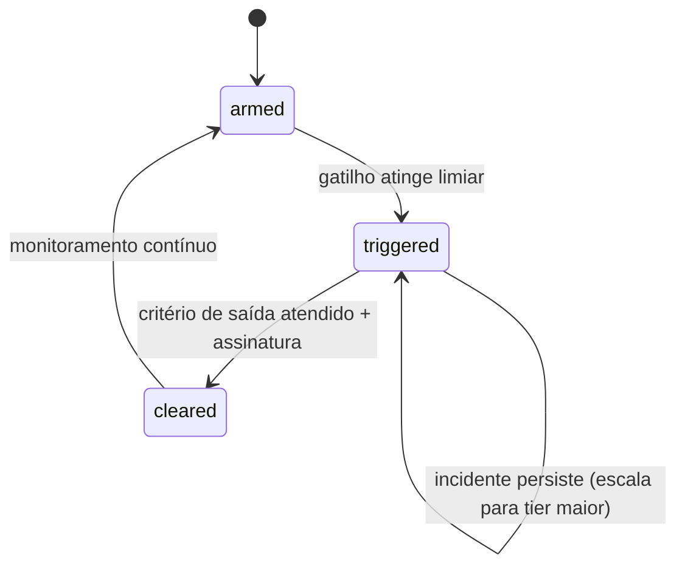

# Stop Conditions — Lex

> **Documento canônico de gatilhos de freeze automático.** Quando um gatilho dispara, o subsystem (ou o produto inteiro) entra em **stop**: nenhuma feature nova entra; somente o que estiver na **remediation lane** (fix do problema) pode mergear.

> **Regra dura**: se uma stop condition está ativa, **G-05** e **G-60** ([`RELEASE_GATES.md`](RELEASE_GATES.md)) bloqueiam merge/promote. Override exige PO + CTO + Owner do subsystem afetado + registro em `OVERRIDES_LOG.md`.

---

## 1. Conceito

Uma **stop condition** é uma combinação `gatilho` + `escopo` + `ação` + `responsável_por_disparar` + `responsável_por_levantar`. Cada uma tem **estado** (`armed` | `triggered` | `cleared`) registrado em `STOP_LEDGER.md` (criado quando a primeira disparar) ou painel `/observability` (interno).

---

## 2. Gatilhos (oficiais)

### 2.1 Qualidade jurídica e IA

| ID | Gatilho | Escopo | Ação | Disparo por | Levantamento por |
|----|---------|--------|------|-------------|------------------|
| **S-01** | `groundingScore` mediano cai > 15% vs baseline em 24 h | retrieval, IA | freeze de retrieval/IA + benchmark obrigatório antes de qualquer merge | observabilidade owner | QA Lead + retrieval owner |
| **S-02** | hits@5 do gold-set CF/88 abaixo de baseline em 2 ciclos seguidos (`scripts/cf-retrieval-smoke.ts`) | retrieval | freeze + diagnóstico (chunker / embedding / corpus) | QA Lead | QA Lead + Owner causa raiz |
| **S-03** | Detecção de **fundamento inventado** em peça gerada confirmada pelo Legal Lead | IA, workflow jurídico | freeze drafting + revisão de prompts/guards | Legal Lead | Legal Lead + IA owner |
| **S-04** | `fallbackFlags` indicam fallback estendido (rerank off, embedding off, qdrant offline) por > 30 min em produção | retrieval, embeddings, infra | freeze de mudanças nos subsystems envolvidos até root cause + mitigation | observabilidade owner | CTO |
| **S-05** | Custo IA/workspace ultrapassa limite definido em `EXECUTION_BUDGETS` em janela de 24 h | IA | freeze de mudanças que aumentem custo + investigação | IA owner | CTO + IA owner |

### 2.2 Segurança e LGPD

| ID | Gatilho | Escopo | Ação | Disparo por | Levantamento por |
|----|---------|--------|------|-------------|------------------|
| **S-10** | Suspeita de IDOR / vazamento entre workspaces (relato confirmado em 1 caso) | segurança, APIs, banco | **freeze global** + investigação imediata + plano de notificação LGPD | Security Lead | CTO + Security Lead + Legal Lead |
| **S-11** | Suspeita de PII em logs/exports (1 ocorrência confirmada) | LGPD, observabilidade, exports | freeze de logs/exports + sanitização + rotina retroativa | LGPD owner | LGPD owner + Security Lead |
| **S-12** | Vazamento de secret detectado (key/token em log, repo, frontend) | infra, segurança | rotação imediata + freeze de pushes para prod até confirmação | Security Lead | Security Lead + CTO |
| **S-13** | Falha de auth (sessão indevida, role escalation, RLS rompida) | segurança, banco | freeze de mudanças em authZ até patch + retest | Security Lead | Security Lead + CTO |
| **S-14** | Pedido formal de ANPD ou cliente sob LGPD | LGPD, comunicação | freeze de promoções ao público + responder em prazo legal | Legal Lead | PO + Legal Lead |

### 2.3 Estabilidade técnica e infra

| ID | Gatilho | Escopo | Ação | Disparo por | Levantamento por |
|----|---------|--------|------|-------------|------------------|
| **S-20** | Erro 5xx > 2x baseline na janela de 60 min pós-promote | APIs, infra | rollback automático sugerido + freeze de novos merges | observabilidade owner | CTO |
| **S-21** | Latência p95 retrieval > 1.5x baseline por 30 min | retrieval, infra | freeze de retrieval; alertar IA/embeddings/Qdrant owners | retrieval owner | retrieval owner + CTO |
| **S-22** | Migration falha em produção (Prisma) | banco, deploy | freeze de migrations + plano de rollforward/rollback | banco owner | banco owner + CTO |
| **S-23** | Inngest job em retry-loop > 1 h | infra, integrações, IA | freeze de jobs novos no namespace afetado; investigar idempotência | infra owner | infra owner + CTO |
| **S-24** | Qdrant cluster degradado (timeouts > 10% req) por > 30 min | retrieval, infra | freeze de reindex + ativar fallback para BM25-only | retrieval owner | retrieval owner + CTO |
| **S-25** | Redis indisponível por > 15 min (impacto rate-limit/cache) | infra | seguir caminho `tryRedisCall` graceful; freeze de mudanças que dependam de Redis até voltar | infra owner | infra owner + CTO |

### 2.4 Produto e UX

| ID | Gatilho | Escopo | Ação | Disparo por | Levantamento por |
|----|---------|--------|------|-------------|------------------|
| **S-30** | Pelo menos 2 usuários distintos relatam o **mesmo dead-end** em 7 dias | UX, workflow jurídico | freeze de UI no fluxo afetado + paper-cut sprint | PO | PO |
| **S-31** | Smoke manual (G-57) reprovado em release | UX, workflow jurídico | freeze de promote até roteiro passar | PO | PO |
| **S-32** | Trust UX ausente em peça gerada em produção | UX, IA | freeze de drafting até render correto | PO + Legal Lead | PO + Legal Lead |
| **S-33** | Métrica de "next action" sugere ≥ 30% dos casos sem próximo passo claro por 14 dias | UX, workflow jurídico | reabrir fluxo de orientação | PO | PO |

### 2.5 Operação e governança

| ID | Gatilho | Escopo | Ação | Disparo por | Levantamento por |
|----|---------|--------|------|-------------|------------------|
| **S-40** | Bus factor de subsystem Tier-S/A cai para 1 | OWNER_MATRIX | freeze de mudanças nesse subsystem até `owner_secundario` definido | PO | PO + CTO |
| **S-41** | ≥ 3 overrides do **mesmo gate** em 90 dias | governança | revisão obrigatória da regra; freeze de novos overrides até decisão | PO | PO + CTO |
| **S-42** | ≥ 2 incidentes Tier-S em 30 dias | governança | pausa de 1 semana, revisão de runbooks | PO + CTO | PO + CTO + Security Lead |
| **S-43** | DOC_VS_CODE_DIVERGENCE.md cresceu > 20% em 30 dias | governança | freeze de novas docs aspiracionais até consolidar divergências | PO | PO |
| **S-44** | Stop condition triggered por > 14 dias sem clearance | governança | escala obrigatória ao board interno | PO | PO + CTO |

---

## 3. Escopos de freeze

| Escopo | O que para | O que continua |
|--------|------------|----------------|
| **Freeze de subsystem** | PRs novos no subsystem (e dependentes em cascata declarada no OWNER_MATRIX) | Demais subsystems |
| **Freeze de tier** (ex.: P3/P4) | Todas as PRs do tier afetado | PRs de tier maior (P0/P1) e fixes do problema |
| **Freeze global** | Todas as PRs de feature/refactor | Apenas hotfix do gatilho via remediation lane |
| **Freeze de promote** | Promoção para produção | Merges para `main` continuam com merge bloqueado pelo gate `G-60` |

---

## 4. Remediation lane

Quando freeze ativo:

1. Abrir branch `remediation/<S-id>-slug`.
2. PR vinculada ao incidente em `INCIDENT_LOG.md` (criado em F1 quando o primeiro incidente ocorrer).
3. Aprovação acelerada: Owner do subsystem + (Security Lead **se** S-10..S-14, Legal Lead **se** S-03/S-14/S-32, QA Lead **se** S-01/S-02/S-21).
4. Após merge da remediation, suíte completa de benchmarks/smoke roda antes de levantar a stop.

---

## 5. Critérios de saída (clearance) por gatilho

| ID | Critério para `cleared` |
|----|--------------------------|
| S-01 | `groundingScore` mediano de volta a baseline ± 5% por **48 h** consecutivas |
| S-02 | hits@5 do gold-set ≥ baseline por **2 ciclos** consecutivos |
| S-03 | Causa identificada + guard atualizado + 10 prompts adversariais novos no gold-set |
| S-04 | Fallback resolvido + 24 h sem novo `fallbackFlags` estendido |
| S-05 | Custo de volta < limite por **3 dias** consecutivos |
| S-10 | Bug corrigido + retest + auditoria de logs + (notificação LGPD se aplicável) |
| S-11 | Sanitização aplicada + auditoria retroativa + spot-check 7 dias |
| S-12 | Secret rotacionado + repo limpo + monitor 30 dias |
| S-13 | Patch + retest com gold-set de auth |
| S-14 | Resposta enviada no prazo + plano de remediação aprovado pelo Legal |
| S-20 | 5xx ≤ baseline por **24 h** |
| S-21 | p95 ≤ 1.2x baseline por **24 h** |
| S-22 | Migration aplicada com sucesso ou revertida + fixtures retest |
| S-23 | Jobs com taxa de erro normalizada por **24 h** |
| S-24 | Qdrant healthy por **24 h** + reindex completo se necessário |
| S-25 | Redis healthy por **24 h** |
| S-30 | Fluxo refeito + 0 dead-ends em 14 dias de monitoramento |
| S-31 | Smoke manual ok em 2 releases consecutivos |
| S-32 | Trust UX visível em 100% das peças geradas em smoke |
| S-33 | "Next action" coberta em ≥ 80% dos casos |
| S-40 | `owner_secundario` ativo + 1 PR co-revisada |
| S-41 | Decisão registrada (regra mantida com justificativa, regra alterada ou eliminada) |
| S-42 | Pausa concluída + runbooks atualizados + revisão de governança assinada |
| S-43 | Backlog de divergências reduzido em 50% |
| S-44 | Resolução escalada e clearance assinada |

---

## 6. Comunicação obrigatória

Ao **disparar** uma stop condition:

1. Comentário no PR/incidente com `STOP-DISPATCHED: <S-id>`.
2. Notificação aos owners listados no `OWNER_MATRIX` para subsystems afetados.
3. Atualização do badge no README/dashboard interno (estado `triggered`).
4. Para S-10..S-14: comunicação ao Legal Lead em ≤ 1 h.

Ao **levantar** uma stop:

1. Comentário no incidente com `STOP-CLEARED: <S-id>` + link para evidência.
2. Atualização do badge.
3. Pós-mortem em 7 dias (se Tier-S) ou 14 dias (Tier-A).

---

## 7. Como aplicar este doc

1. **Hoje**: time alinha sobre os gatilhos; nada precisa estar instrumentado para que a regra exista.
2. **Próximas 4 semanas**: F1 conecta gatilhos a métricas reais (Langfuse, healthcheck, scripts smoke); cria `STOP_LEDGER.md`.
3. **Trimestral**: revisar gatilhos + thresholds; adicionar novos surgidos de incidentes.

---

## 8. Override

Override exige RFC + assinaturas conforme natureza:

- S-01..S-05: PO + CTO + QA Lead + Legal Lead.
- S-10..S-14: PO + CTO + Security Lead + Legal Lead.
- S-20..S-25: PO + CTO + Owner subsystem.
- S-30..S-33: PO + UX owner + (Legal Lead se trust UX).
- S-40..S-44: PO + CTO.

Override frequente (≥3 do **mesmo** S em 90 dias) dispara revisão da própria regra (sintoma de threshold mal calibrado ou problema sistêmico).

---

## Veja também

- [`EXECUTION_GOVERNANCE.md`](EXECUTION_GOVERNANCE.md), [`PRIORITY_MATRIX.md`](PRIORITY_MATRIX.md), [`OWNER_MATRIX.md`](OWNER_MATRIX.md), [`RELEASE_GATES.md`](RELEASE_GATES.md), [`ROLLBACK_POLICY.md`](ROLLBACK_POLICY.md), [`QUALITY_THRESHOLDS.md`](QUALITY_THRESHOLDS.md) (Leva 2), [`PRODUCT_SURVIVAL_MODE.md`](PRODUCT_SURVIVAL_MODE.md) (Leva 2).
