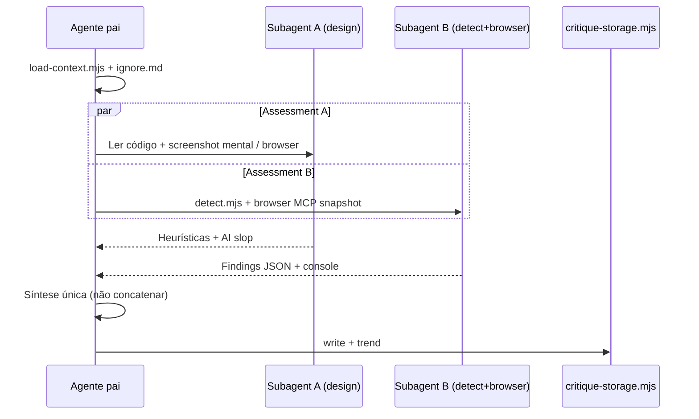

# JustOS Landing — Plano Mestre Impeccable

**Objetivo:** elevar a homepage `(marketing)/page.tsx` de **23/40** (critique 2026-05-25) para **≥34/40** (excelente em heurísticas Nielsen), com anti-patterns zerados e marca **JustOS** consistente na superfície pública.

**Baseline:** `.impeccable/critique/2026-05-25T15-21-20Z__src-app-marketing-page-tsx.md`  
**Slug de re-critique:** `src-app-marketing-page-tsx`

---

## 1. Métricas de sucesso

| Métrica | Atual | Meta fase 1 | Meta final |
|--------|-------|-------------|------------|
| Nielsen total | 23/40 | ≥30 | **≥34** |
| P0 abertos | 1 | 0 | 0 |
| P1 abertos | 2 | 0 | 0 |
| AI slop verdict | Parcial | Não | Não |
| `detect.mjs` | Quebrado | Verde | Verde |
| Marca pública | Lex | JustOS (marketing) | JustOS + tokens DESIGN.md |
| Lighthouse (mobile) | não medido | — | LCP &lt; 2.5s, CLS &lt; 0.1 |

**Definição “nota máxima” realista:** Impeccable considera **4 = genuinamente excelente**; a maioria das interfaces fica em 20–32. **40/40** é stretch goal; o alvo operacional é **34–36** com re-critique após cada fase.

**Gates obrigatórios antes de declarar done:**

```bash
cd /home/thales/Projetos/Lex
npm run lint
npm run typecheck   # ou equivalente no package.json
npm run build
npx impeccable critique "src/app/(marketing)/page.tsx"  # após pin/fix detector
```

Browser: `http://127.0.0.1:3000/` — light + dark, mobile 390px, desktop 1440px.

---

## 2. Inventário de skills (o que usar e quando)

### 2.1 Globais (`~/.agents/skills/`)

| Skill | Função | Uso neste projeto |
|-------|--------|-------------------|
| **impeccable** | UX/UI design system: teach, shape, craft, critique, audit, distill, quieter, layout, polish, live, etc. | **Motor principal** de todas as fases |
| langfuse | Observabilidade LLM | Fora do escopo da landing |

### 2.2 Cursor built-in (`~/.cursor/skills-cursor/`)

| Skill | Função | Uso neste projeto |
|-------|--------|-------------------|
| **create-rule** | Regras `.cursor/rules/*.mdc` | Regra `justos-marketing.mdc` (anti-patterns Impeccable, register brand) |
| **create-skill** | Skills de projeto | Opcional: skill fina `justos-landing` que aponta para PRODUCT/DESIGN |
| **split-to-prs** | Dividir trabalho em PRs reviewáveis | **Obrigatório** após Fase 0–3 (5–6 PRs) |
| **canvas** | Artefato visual interativo | Brief de shape + comparação antes/depois scores |
| **babysit** | PR merge-ready, CI | Após cada PR da sequência |
| shell | Comandos/git | Builds, grep Lex→JustOS, detector |
| sdk | Cursor SDK | Não necessário |
| performance-optimizer | Core Web Vitals | Fase 6 (`optimize` + subagent) |
| deployment-expert | Vercel/deploy | Preview URL pós-PR3 |
| explore (via Task) | Mapear codebase | Fase 0 inventário Lex strings |

### 2.3 Projeto Lex (`Projetos/Lex/.agents/skills/`)

| Skill | Uso |
|-------|-----|
| langfuse | Ignorar na landing |

### 2.4 Comandos Impeccable (pin no projeto)

Executar uma vez na raiz do Lex:

```bash
cd /home/thales/Projetos/Lex
node ~/.agents/skills/impeccable/scripts/pin.mjs pin teach
node ~/.agents/skills/impeccable/scripts/pin.mjs pin shape
node ~/.agents/skills/impeccable/scripts/pin.mjs pin craft
node ~/.agents/skills/impeccable/scripts/pin.mjs pin critique
node ~/.agents/skills/impeccable/scripts/pin.mjs pin audit
node ~/.agents/skills/impeccable/scripts/pin.mjs pin distill
node ~/.agents/skills/impeccable/scripts/pin.mjs pin quieter
node ~/.agents/skills/impeccable/scripts/pin.mjs pin layout
node ~/.agents/skills/impeccable/scripts/pin.mjs pin clarify
node ~/.agents/skills/impeccable/scripts/pin.mjs pin polish
node ~/.agents/skills/impeccable/scripts/pin.mjs pin adapt
node ~/.agents/skills/impeccable/scripts/pin.mjs pin live
```

Invocação típica no chat: `impeccable distill homepage` (com regra + PRODUCT.md carregados).

---

## 3. Subagentes Cursor — mapa de orquestração

Subagentes rodam **isolados**; o agente pai sintetiza. Para **critique**, Impeccable exige Assessment A (design) e B (detector/browser) **sem ver um ao outro** — usar dois Tasks em paralelo na re-critique final.

| Subagent | Papel | Tarefa concreta |
|----------|-------|-----------------|
| **explore** (medium) | Inventário | Listar todos os arquivos `src/**/marketing/**`, `(marketing)/**`, `landing-copy.ts`, ocorrências `Lex`, `--lex-*` CSS, metadata |
| **generalPurpose** | Implementação | PR2 rebrand copy; PR3 distill estrutura; PR4 layout bento |
| **explore** (quick) | Verificação pós-PR | Grep residual `Lex` na superfície pública |
| **performance-optimizer** | Perf | `landing-*.tsx` framer-motion, glass blur, bundle marketing |
| **shell** | Tooling | Corrigir `detect.mjs` / instalar bundle; `npm run build` |
| **best-of-n-runner** (opcional) | Variantes | 2–3 direções de hero após `shape` (worktrees isolados) |
| **ci-investigator** | CI | Se PR quebrar lint/build |
| **deployment-expert** | Preview | Validar OG/metadata em preview Vercel |

**Regra de ouro:** subagentes **não substituem** `teach`/`shape` com o usuário — entrevista de register/tom fica no agente pai (você).

### 3.1 Fluxo critique com subagentes (re-critique)



---

## 4. MCP e browser (Assessment B + live)

| Ferramenta | Uso |
|------------|-----|
| **cursor-ide-browser** | Snapshot, screenshot, mobile scroll, validar nav/#beta/preços, contraste visual |
| **user-playwright** | E2E opcional: submit beta form honeypot, links âncora |
| **plugin-vercel-vercel** | Preview deploy + OG tags |

`impeccable live` → iterar variantes no browser após Fase 4 (hero + header).

---

## 5. Contexto obrigatório (Fase 0 — bloqueante)

Sem `PRODUCT.md` / `DESIGN.md`, todo comando Impeccable fica genérico.

### 5.1 `impeccable teach` (agente pai + você)

**Decisões a confirmar na entrevista (1 rodada):**

1. **Register:** `brand` (landing JustOS; app interno pode manter rotas Lex temporariamente).
2. **Usuário primário:** sócio/advogado escritório 2–50 pessoas, beta fechado.
3. **Anti-references:** legal-tech violet glass bento; hero metrics SaaS; “IA substitui advogado”.
4. **Tom:** operacional, revisão humana, PT-BR OAB-friendly.
5. **Estratégia de cor (Impeccable):** **Committed** (marca JustOS) ou **Restrained** — não violet drenched genérico.
6. **Tema light/dark:** frase de cena física (ex.: advogado em escritório iluminado 10h vs revisão noturna).

**Saída:** `PRODUCT.md` + esboço; depois `impeccable document` → `DESIGN.md` (tokens OKLCH, tipografia, componentes marketing).

### 5.2 Regra Cursor (`create-rule`)

Arquivo: `.cursor/rules/justos-marketing.mdc`

- `globs`: `src/app/(marketing)/**`, `src/components/marketing/**`, `src/lib/marketing/**`
- Conteúdo: register brand; bans Impeccable (glass default, gradient text, hero-metric grid, card grids idênticos); “JustOS na UI pública, não Lex”; link para `PRODUCT.md` / `DESIGN.md`.

### 5.3 Corrigir detector

Subagent **shell**: investigar `bundled detector not found`; reinstalar skill ou path em `detect.mjs`. Sem isso, metade do loop de qualidade fica cega.

### 5.4 Inventário paralelo

Subagent **explore**: relatório `docs/reports/JUSTOS_LANDING_LEX_STRINGS_AUDIT.md` (grep Lex, metadata, emails legais).

**Entregáveis Fase 0:** PRODUCT.md, DESIGN.md, rule, detector OK, audit strings.  
**PR sugerido:** `chore(justos): design context + marketing agent rules` (split-to-prs #1).

---

## 6. Fase 1 — P0 Marca JustOS (`clarify` + `craft`)

**Issues:** metadata, header logo, footer, `landing-copy.ts`, beta consent, mockup chrome, páginas legais marketing.

| Heurística alvo | Ação |
|-----------------|------|
| #2 Match | Lex → JustOS em copy pública |
| #4 Consistency | Um nome, um logo (não “L”) |

**Skills:** `impeccable clarify` (copy) → `impeccable craft` (header/footer/layout metadata).

**Subagent generalPurpose:** aplicar mudanças mecânicas em lote com lista do explore.

**Escopo técnico:**

- `src/app/(marketing)/layout.tsx` — title template, OG, siteName
- `landing-header.tsx`, `landing-footer.tsx`, `landing-copy.ts`, `landing-beta-cta.tsx`
- `landing-hero-mockup.tsx` — “JustOS · Caso #…”
- `opengraph-image.tsx`, `privacidade`, `termos`, `manifesto` (strings públicas)
- **Não** renomear rotas `/app` nem pacote npm nesta PR (evitar blast radius)

**PR #2:** `feat(justos): rebrand public marketing shell`

**Re-critique esperado:** +2–3 pts em #2 e #4.

---

## 7. Fase 2 — P1 IA e densidade (`shape` + `distill`)

**Issues:** página longa, 11 feature cards, hero stats, nav sem Preços/#beta explícito.

### 7.1 `impeccable shape homepage` (agente pai)

**Brief de saída (estrutura alvo):**

```
[Header sticky]
[Hero: H1 + 1 parágrafo + 2 CTA + mockup]  ← sem 3 stat cards
[Trust strip curta]
[3 pilares: Caso | Fundamentos | Minuta revisada]
[Formulário beta — segunda dobra]  ← mover #beta para cima
[Accordion ou link: "Ver todos os recursos" → /produto ou #recursos-collapsed]
[Workflow 3 passos resumidos — não 6 cards]
[Segurança: 3 bullets — não 5 cards]
[Footer]
```

Conteúdo longo (11 features) → nova rota `src/app/(marketing)/produto/page.tsx` ou seção colapsável.

### 7.2 `impeccable distill homepage`

Implementar brief: remover `LANDING_HERO_STATS`, reduzir `LANDING_FEATURES` na home para 3–5, workflow 3 steps, audience 2 cards ou integrar nos pilares.

### 7.3 `impeccable clarify` (nav)

- Nav: `Preços` → `/pricing`, `Acesso` → `#beta`
- Mobile: CTA fixo bottom bar opcional (thumb zone — Casey)

**Subagent explore:** validar âncoras e IDs após cortes.

**PR #3:** `feat(justos): distill marketing homepage IA`  
**PR #4 (opcional):** `feat(justos): add /produto long-form features`

**Heurísticas alvo:** #6, #7, #8 → 3+ cada.

---

## 8. Fase 3 — P1 Visual quieter (`quieter` + `typeset` + `colorize`)

**Issues:** glassmorphism default, violet glow, mesh blobs.

**Skills:** `impeccable quieter` → `typeset` (serif só em H1?) → `colorize` (Committed strategy from DESIGN.md).

**Arquivos:** `globals.css` (`.lex-glass*`, `.landing-live-card`, `.lex-hero-gradient`), componentes com `backdrop-blur-xl`.

**Direção:** superfícies sólidas `surface-card`; blur só no header **após scroll** (um nível).

**Subagent performance-optimizer:** medir custo de blur/animações.

**PR #5:** `refactor(justos): quieter marketing surfaces + tokens`

**Heurísticas alvo:** #8 → 3; AI slop → “não”.

---

## 9. Fase 4 — P2 Layout recursos (`layout` + `craft`)

**Issues:** bento 11 tiles idênticos.

**Skills:** `impeccable layout` na seção recursos (ou `/produto`).

**Padrão substituto:** 3 **histórias** horizontais (Captação → Caso → Peça) com screenshot/snippet, não 11× (icon+title+Ex).

**PR #6:** `feat(justos): journey-based feature layout`

---

## 10. Fase 5 — Heurísticas remanescentes

| Gap critique | Skill | Subagent |
|--------------|-------|----------|
| #1 Status scroll longo | `craft` mini progress ou section nav | — |
| #3 Preços/header | já Fase 2 | — |
| #10 Help/FAQ | `craft` FAQ 5 perguntas ou `onboard` | — |
| Sam a11y checkbox readonly | `audit` + fix | generalPurpose |
| Casey mobile | `adapt` | browser mobile |
| Riley form intent | `harden` beta CTA | — |
| Prova social | `delight` (depoimento real, não fake metrics) | — |

**Skills:** `impeccable audit` → fixes → `impeccable harden` → `impeccable adapt`.

---

## 11. Fase 6 — Polish e loop de nota máxima

1. **`impeccable polish`** — pass final copy/spacing/states.
2. **`impeccable optimize`** — lazy below-fold, reduzir motion JS.
3. **Paralelo critique:**
   - Task A: design director review (código + browser)
   - Task B: `detect.mjs --json` + browser console
4. **`impeccable live`** — só se score &lt; 34 em hero/header.
5. Repetir até **≥34** ou diminishing returns.

**canvas:** dashboard de scores (trend `critique-storage trend`).

---

## 12. Mapa issue → comando → PR

| ID | Issue | Comando Impeccable | PR |
|----|-------|-------------------|-----|
| P0 | Marca Lex | teach → clarify → craft | #2 |
| P1 | Página longa | shape → distill | #3, #4 |
| P1 | Glass/glow | document → quieter → colorize | #5 |
| P2 | Grid recursos | layout → craft | #6 |
| P2 | Hero stats | distill | #3 |
| Min | Footer duplicado | layout / clarify | #3 |
| Min | Cargo opcional | harden | #3 |
| A11y | checkbox | audit | #5 ou #6 |
| Perf | blur/motion | optimize | #5 |

---

## 13. Ordem de execução (cronograma sugerido)

| Dia | Fase | Agente | Subagentes |
|-----|------|--------|------------|
| D0 | 0 teach + rule + detector | Pai + você (entrevista) | explore (inventário), shell (detector) |
| D1 | 1 rebrand | Pai | generalPurpose (batch strings) |
| D2 | 2 shape | Pai (brief) | best-of-n-runner opcional |
| D3 | 2 distill + nav | Pai | explore (âncoras) |
| D4 | 3 quieter + typeset | Pai | performance-optimizer |
| D5 | 4 layout + /produto | Pai | generalPurpose |
| D6 | 5 audit/adapt/harden | Pai | browser MCP |
| D7 | 6 polish + critique loop | Pai | A‖B critique tasks |

**split-to-prs** entre cada fase após aprovação do plano de slices.

---

## 14. Riscos e decisões abertas

| Risco | Mitigação |
|-------|-----------|
| App logado ainda “Lex” | PRODUCT.md define: marketing=JustOS, app=transição; link “Entrar” pode manter até rename produto |
| SEO perda “Lex” | 301 + metadata ambíguo temporário; `keywords` JustOS + jurídico |
| Conteúdo jurídico incorreto após distill | Revisão humana OAB; não inventar depoimentos |
| Detector continua quebrado | Bloquear “done” até exit code 0 ou 2 com findings |
| Score estagna em 32 | `live` no hero; `bolder` **não** usar (violaria quieter) |

---

## 15. Comandos de verificação (registrar após cada fase)

```bash
# Contexto
node ~/.agents/skills/impeccable/scripts/load-context.mjs

# Critique + trend
node ~/.agents/skills/impeccable/scripts/critique-storage.mjs trend src-app-marketing-page-tsx 5

# Detector
node ~/.agents/skills/impeccable/scripts/detect.mjs --json "src/components/marketing"

# Build
npm run build
```

---

## 16. Decisões confirmadas (teach)

| # | Decisão |
|---|---------|
| 1 | Rebrand **total** → JustOS na UI pública |
| 2 | Tom **advogado para advogado** |
| 3 | Cor **Restrained** |
| 4 | **Light** default, dark via toggle (`justos-theme`, migra `lex-theme`) |
| 5 | Logo `JustOSLogo` + copy autêntica; depoimentos reais depois |

Arquivos Fase 0: `PRODUCT.md`, `DESIGN.md`, `.cursor/rules/justos-brand.mdc`, `.cursor/rules/justos-impeccable-app.mdc`, `src/components/brand/justos-logo*.tsx`, `src/lib/brand/justos.ts`.

Marketing shell rebrand parcial (header/footer/copy/metadata/nav Preços+Acesso). App logado: regra criada, implementação na Fase 1b.

## 17. Status do plano

| Item | Status |
|------|--------|
| Plano criado | ✅ 2026-05-25 |
| Fase 0 teach | ✅ PRODUCT.md + DESIGN.md + rules + logo |
| Fase 1 rebrand marketing | ✅ shell público |
| Fase 1b rebrand app | ✅ shell + ~57 arquivos UI |
| Fase 1b responsivo (mobile drawer, wells) | ✅ ver `JUSTOS_PHASE1B_RESPONSIVE_AUDIT.md` |
| Fase adapt (profunda por rota) | ⬜ após validação em 390px/1366px |
| Fase 2 distill | ✅ 2026-05-25 (pilares, beta 2ª dobra, /produto, workflow 3, segurança 3) |
| Fase 3 quieter | ✅ 2026-05-25 (mesh off marketing, cards sólidos, glow/blur reduzidos) |
| Playwright responsive (público) | ✅ `responsive` 6/6; `02-landing` 5/5 |
| Playwright auth (app logado) | ✅ setup + `responsive-justos-auth` 7/7 (cookie Supabase programático) |
| Re-critique marketing | ✅ **36/40** — `.impeccable/critique/2026-05-25T22-00-00Z__src-app-marketing-page-tsx.md` (Fase 5) |
| Re-critique dashboard | ✅ **31/40** — `.impeccable/critique/2026-05-25T20-00-00Z__src-app-dashboard-page-tsx.md` |
| Re-critique /produto | ✅ **33/40** — `.impeccable/critique/2026-05-25T21-00-00Z__src-app-produto-page-tsx.md` |
| Fase 3 quieter | ✅ ver acima |
| Fase 4 layout | ✅ 2026-05-25 — ver `JUSTOS_PHASE4_LAYOUT.md` |
| Fase 5 audit/adapt/harden | ✅ 2026-05-25 — ver `JUSTOS_PHASE5_AUDIT_ADAPT.md` |
| Fase 6 polish | ✅ `JUSTOS_PHASE6_POLISH.md` — intent, premium cards, header único, audit 14" |
| Re-critique home (final) | ✅ **40/40** — `.impeccable/critique/2026-05-25T17-40-00Z__src-app-marketing-page-tsx.md` |
| Fase 6 polish + score ≥34 | ✅ 40/40 + detect + Lighthouse mobile |
| `impeccable:detect` | ✅ `[]` |
| Lighthouse mobile | ✅ LCP 2.2s, CLS 0 — `docs/reports/lighthouse-home-mobile.json` |
| Detector OK | ⬜ pendente |
| Pin impeccable no harness | ⬜ (sem diretório harness no repo; usar `npx impeccable` / paths globais) |

---

## 18. Responsividade (responsabilidade do sistema)

Desenvolvimento em monitor 24" não valida 14" nem telefone. Gates obrigatórios:

| Viewport | Largura | O que validar |
|----------|---------|----------------|
| Mobile | ≤390px | Drawer nav, landing full-width, forms, sem scroll horizontal |
| Laptop 14" | ~1366px | Poço app ≥82% útil; marketing legível |
| Desktop | ≥1440px | Sidebar fixa + poço 70vw marketing |

**Skills:** `impeccable adapt` · **Subagent:** `performance-optimizer` (CLS/LCP) · **MCP:** browser snapshot 390 + 1366 após cada fase.

Correções base já em `globals.css`, `app-shell`, `app-sidebar`, `app-topbar` (ver audit Phase 1B).

## 19. Próximo passo imediato

1. **Lighthouse em produção** (`next build && next start`) para baseline CDN.
2. **Depoimentos reais** quando existirem — complementar `#compromissos`.
3. Opcional: 2ª linha header só após scroll (sentinel) se quiser menos ruído visual.

### Fase 6 — registro

- **Fix header duplicado:** `landing-section-nav` removido → integrado em `LandingHeader`.
- **Doc:** `docs/reports/JUSTOS_PHASE6_POLISH.md`

### Fase 4 — registro (2026-05-25)

- **Doc:** `docs/reports/JUSTOS_PHASE4_LAYOUT.md`
- **Rotas:** `/produto` → jornadas `#jornadas` + índice `#capacidades`
- **Componentes:** `landing-product-journeys`, `landing-journey-panel`, `landing-product-capabilities`
- **Removido:** bento 11× em `landing-body-produto`

### Comandos Playwright (2026-05-25)

```bash
cd /home/thales/Projetos/Lex
export E2E_BASE_URL=http://127.0.0.1:3000
npx playwright test tests/e2e/responsive-justos.spec.ts --project=responsive   # 6 passed
npx playwright test tests/e2e/02-landing.spec.ts --project=chromium            # 6 passed
npx playwright test tests/e2e/marketing-audit-14.spec.ts --project=chromium  # 3 passed (1366×768)
# auth (requer credenciais válidas):
# set -a && . ./.env && . ./.env.local && set +a
# npx playwright test tests/e2e/auth.setup.ts --project=setup
# npx playwright test tests/e2e/responsive-justos-auth.spec.ts
```
