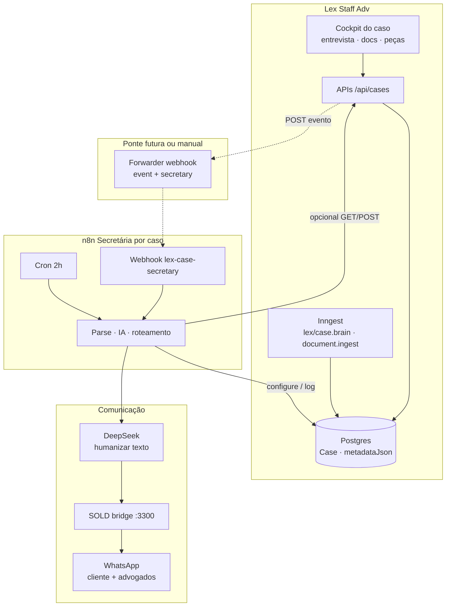
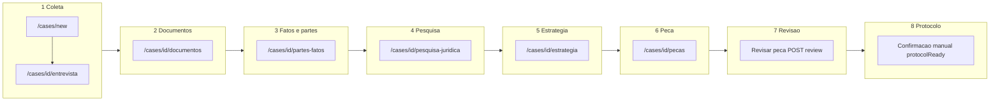
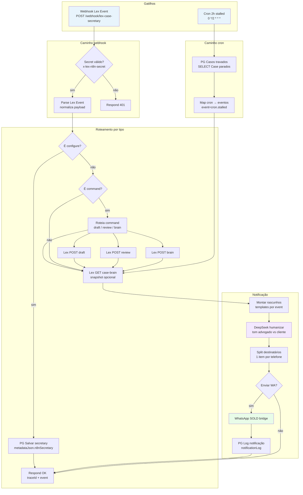
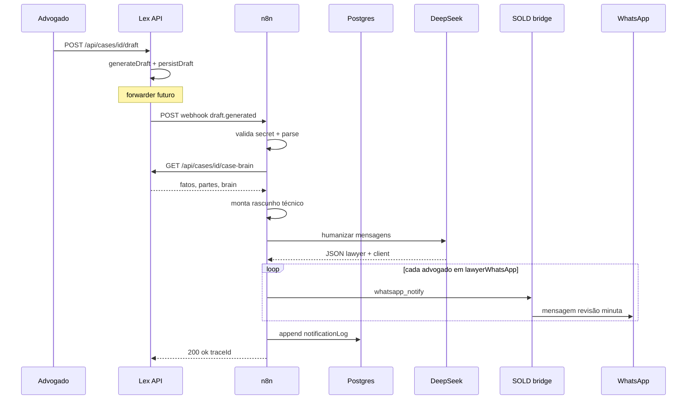

# Lex — Secretária por Caso (n8n)

Workflow **n8n** que espelha o fluxo jurídico do Lex (`src/components/cases` + APIs `/api/cases`) e atua como **secretária dedicada por caso**: busca contexto, persiste configuração de contatos, humaniza mensagens com IA e notifica **cliente** e **advogado(s)** via WhatsApp.

> **Não altera o código do Lex.** Importe `lex-case-secretary.json` no n8n e configure credenciais/variáveis abaixo.

---

## Wireframe e fluxo visual

Esta seção mostra **três camadas**: o que o advogado vê no Lex, o que a secretária n8n faz em segundo plano e como as mensagens saem no WhatsApp.

### Visão geral do sistema



**Leitura rápida:** o Lex continua sendo a fonte da verdade jurídica. O n8n **não substitui** intake, brain ou minuta — só **reage** a eventos, **persiste telefones** em `metadataJson.n8nSecretary` e **notifica** pessoas certas com texto humanizado.

---

### Wireframe — jornada no Lex (produto)

Fluxo que o workflow espelha nas 8 fases do `case-legal-workflow.ts`:



**Wireframe textual do cockpit** (uma tela, múltiplas abas):

```
┌─────────────────────────────────────────────────────────────────────────┐
│  [←]  Título do caso          Fase: ● Pesquisa jurídica    [Mais ações] │
│       Chips: Prontidão 72% · Docs 0 travados · Riscos 1                 │
├─────────────────────────────────────────────────────────────────────────┤
│ Visão │ Entrevista │ Fatos │ Docs │ Pesquisa │ Estratégia │ Peças │ Proc│
├──────────────────────────────┬──────────────────────────────────────────┤
│  Conteúdo da aba ativa       │  Copiloto                                │
│  (form, tabelas, editor)     │  Agora: Pinar fundamento                 │
│                              │  Atenção: entrevista incompleta          │
│                              │  Atalhos: Entrevista · Docs · Pesquisa   │
└──────────────────────────────┴──────────────────────────────────────────┘
```

Quando algo importante acontece no Lex (ex.: minuta gerada), um **forwarder** deve avisar o n8n — hoje isso é manual ou via Postgres/cron até existir a ponte no código.

---

### Fluxograma — automação n8n (25 nós)

Dois **gatilhos** convergem no mesmo pipeline de notificação:



---

### Sequência — exemplo `draft.generated`

Cenário: advogado clicou **Gerar peça** no Lex; o forwarder dispara o webhook.



---

### Passo a passo — cada nó do workflow

| # | Nó n8n | O que faz | Entrada → Saída |
|---|--------|-----------|-----------------|
| 1 | **Webhook Lex Event** | Recebe POST do Lex (ou teste curl). Path: `lex-case-secretary`. | HTTP body → item com `headers` + `body` |
| 2 | **Secret válido?** | Compara `x-lex-n8n-secret` com `LEX_N8N_WEBHOOK_SECRET`. Evita chamadas anônimas. | Inválido → 401; válido → parse |
| 3 | **Respond 401** | Encerra com erro de autenticação. | — |
| 4 | **Parse Lex Event** | Extrai `event`, `caseId`, `workspaceId`, `title`, `secretary`, flags `notifyClient` / `notifyLawyer`, `needsConfigure`, `needsCommand`, `traceId`, `lexBase`. | Payload bruto → objeto canônico |
| 5 | **É configure?** | Ramo `secretary.configure`: só grava telefones, sem notificar. | `true` → PG Salvar; `false` → próximo IF |
| 6 | **PG Salvar secretary** | `UPDATE Case` em `metadataJson.n8nSecretary` (cliente + lista de advogados + preferences). Requer credencial Postgres. | `caseId` + secretary → linha atualizada |
| 7 | **É command?** | Ramo `secretary.command`: dispara ação no Lex sem passar pela UI. | `true` → switch; `false` → buscar snapshot |
| 8 | **Roteia command** | Lê `extras.command`: `trigger_draft`, `trigger_review` ou `trigger_brain`. | Comando → nó HTTP correspondente |
| 9 | **Lex POST draft** | Chama `POST {lexBase}/api/cases/{id}/draft` com `LEX_N8N_SERVICE_TOKEN`. Gera minuta no Lex. | caseId → resposta draft |
| 10 | **Lex POST review** | Chama `POST …/review`. Roda revisão determinística + IA no Lex. | caseId → review + verdict |
| 11 | **Lex POST brain** | Chama `POST …/brain`. Reconsolida Case Brain. | caseId → brain atualizado |
| 12 | **Cron 2h stalled** | A cada 2 horas, sem depender do Lex enviar evento. | tick → query SQL |
| 13 | **PG Casos travados** | Lista até 15 casos sem update há 6h, com advogado cadastrado ou prontidão insuficiente. | — → N linhas Case |
| 14 | **Map cron → eventos** | Transforma cada linha em evento `cron.stalled` com `lawyerWa` do metadata. | Linhas SQL → itens parseados |
| 15 | **Lex GET case-brain** | Busca snapshot (`partes`, `fatos`, `brain`, pins). Falha silenciosa se token ausente. | caseId → JSON snapshot ou `{}` |
| 16 | **Montar rascunhos** | Escolhe template por `event` (criação, intake, doc, minuta, revisão…). Advogado: texto técnico + hint de fatos/partes. Cliente: só eventos “seguros” (criação, doc indexado, revisão quase pronta). | contexto + snapshot → `draftLawyer` / `draftClient` |
| 17 | **DeepSeek humanizar** | Prompt separa tom: advogado objetivo; cliente acolhedor sem detalhe sensível. Saída JSON `{ lawyer, client }`. | rascunhos → mensagens finais |
| 18 | **Split destinatários** | Expande `lawyerWhatsApp[]` em um item por número; adiciona cliente se houver mensagem e opt-in. | 1 item → N itens `{ to, message, channel }` |
| 19 | **Enviar WA?** | Pula envio se `skipped` (sem destino ou opt-out). | — |
| 20 | **WhatsApp SOLD bridge** | POST em `SOLD_WHATSAPP_BRIDGE_URL` com `action: whatsapp_notify`, `to`, `message`, meta `lex_case_id`. | item → resposta SOLD |
| 21 | **PG Log notificação** | Acrescenta entrada em `n8nSecretary.notificationLog` (mantém últimas 50). Auditoria LGPD. | envio → Case atualizado |
| 22 | **Respond OK** | Responde ao webhook com `{ ok: true, traceId, event }`. | — |

**Nós de apoio (sticky notes):** documentação visual dentro do canvas n8n — não executam lógica.

---

### Matriz evento → comportamento

| `event` | Lex (origem) | Ramo n8n | Cliente WA | Advogado WA | Lex API extra |
|---------|--------------|----------|------------|-------------|---------------|
| `case.created` | `POST /api/cases` | notify | Boas-vindas genéricas | Novo caso + link entrevista | — |
| `intake.saved` | fundamental-intake `save` | notify | — | Entrevista salva | — |
| `intake.structured` | fundamental-intake `structure` | notify | — | Relato estruturado | — |
| `document.indexed` | Inngest ingest | notify | “Documento recebido” | Doc processado | — |
| `brain.consolidated` | `lex/case.brain` | notify | — | Score prontidão | — |
| `draft.generated` | `POST …/draft` | notify | — | Minuta para revisar | opcional GET brain |
| `review.completed` | `POST …/review` | notify | Só se verdict “Quase…” | Veredito + detalhe | — |
| `strategy.updated` | `POST …/strategy` | notify | — | Estratégia registrada | — |
| `cron.stalled` | cron 2h | notify | — | Lembrete inatividade | GET brain |
| `secretary.configure` | curl / Lex futuro | configure | — | — | PG save only |
| `secretary.command` | automação | command | — | após ação | POST draft/review/brain |

---

### Onde cada dado mora (wireframe de dados)

```
Case (Postgres)
├── title, status, rawInput
├── parties[], facts[], requests[], drafts[], reviews[]
└── metadataJson
    ├── brain                 ← consolidação Lex (Inngest)
    ├── caseBrain             ← pins, fingerprint
    └── n8nSecretary          ← só a secretária n8n
        ├── clientWhatsApp    ← E.164, updates humanizados
        ├── lawyerWhatsApp[]  ← 1..N responsáveis
        ├── preferences       ← tom, opt-out, horário
        └── notificationLog[] ← auditoria envios WA
```

**Fonte inicial de telefones (Lex UI):** entrevista fundamental → `clientPerson.phone` / `clientCompany.phone` → podem ser copiados no primeiro `secretary.configure`.

---

## 1. Mapa do fluxo Lex (espelhado)

| Fase UI (`case-legal-workflow.ts`) | Rota / componente | API principal |
|-----------------------------------|-------------------|---------------|
| Coleta | `/cases/new`, `/entrevista` | `POST /api/cases/fundamental-intake` |
| Documentos | `/documentos` | `POST …/documents`, Inngest `lex/document.ingest` |
| Fatos e partes | `/partes-fatos` | `…/facts`, `…/parties`, `…/requests`, `…/risks` |
| Pesquisa | `/pesquisa-juridica` | `…/pinned-foundations`, pesquisa assistida |
| Estratégia | `/estrategia` | `POST …/strategy`, `…/strategy/generate` |
| Peça | `/pecas` | `POST …/draft`, `…/drafts/[id]/generate` |
| Revisão | revisão na peça | `POST …/review`, `…/drafts/[id]/review` |
| Protocolo | confirmação manual | `metadataJson.brain.workflow.protocolReadyConfirmed` |

**Orquestração interna:** `src/lib/cases/orchestrator.ts` (`intakeWorkflow`, `draftWorkflow`, `reviewWorkflow`).

**Consolidação assíncrona:** Inngest `lex/case.brain` → `consolidate-case-brain.ts`.

---

## 2. O que a secretária n8n faz a mais

| Recurso | Onde fica |
|---------|-----------|
| Telefone do **cliente** para updates humanizados | `Case.metadataJson.n8nSecretary.clientWhatsApp` |
| 1+ telefones de **advogados** responsáveis | `metadataJson.n8nSecretary.lawyerWhatsApp[]` |
| Preferências (tom, horário, opt-out) | `metadataJson.n8nSecretary.preferences` |
| Log de notificações enviadas | `metadataJson.n8nSecretary.notificationLog[]` (últimos 50) |

Telefones na **entrevista fundamental** (`clientPerson.phone`, `attend.responsibleLawyer`) são **fonte inicial**; o workflow pode copiá-los para `n8nSecretary` no primeiro evento.

---

## 3. Arquivo do workflow

- **JSON:** [`lex-case-secretary.json`](./lex-case-secretary.json)
- **ID arsenal (opcional):** `lex_case_secretary` — registrar em `local-ai-control/tools/n8n/workflow-arsenal/registry.json` se usar o arsenal SOLD.

### Triggers

1. **Webhook** `POST /webhook/lex-case-secretary` — eventos do Lex (recomendado).
2. **Cron** `0 */2 * * *` — varredura de casos “travados” (docs/revisão pendente).
3. **Evento** `secretary.configure` no mesmo webhook — atualizar telefones sem abrir o Lex.

### Eventos suportados (`body.event`)

| `event` | Ação |
|---------|------|
| `case.created` | Boas-vindas ao advogado; opcional confirmação ao cliente |
| `intake.saved` | Resumo de entrevista salva |
| `intake.structured` | IA estruturou relato → aviso advogado |
| `document.indexed` | Documento pronto → próximo passo |
| `brain.consolidated` | Brain atualizado → pendências |
| `draft.generated` | Minuta pronta → **WhatsApp advogado** com link de revisão |
| `review.completed` | Resultado da revisão → advogado (+ cliente se “quase pronta”) |
| `strategy.updated` | Estratégia registrada |
| `secretary.configure` | Grava `clientWhatsApp` / `lawyerWhatsApp` |
| `secretary.command` | `trigger_draft` \| `trigger_review` \| `trigger_brain` |

---

## 4. Variáveis de ambiente (n8n)

| Variável | Uso |
|----------|-----|
| `LEX_API_BASE_URL` | Base do app (ex. `https://seu-dominio.vercel.app`) |
| `LEX_N8N_SERVICE_TOKEN` | Bearer para chamadas server-to-server (criar rota ou API key no Lex) |
| `LEX_N8N_WEBHOOK_SECRET` | Header `x-lex-n8n-secret` no webhook |
| `DEEPSEEK_API_KEY` | Humanização de mensagens |
| `SOLD_WHATSAPP_BRIDGE_URL` | Default `http://172.17.0.1:3300/webhook/n8n` |
| `SOLD_N8N_WEBHOOK_SECRET` | Header `x-sold-secret` no bridge WhatsApp |
| `DATABASE_URL` | ~~Postgres direto~~ — use APIs Lex abaixo |
| `PATCH /api/cases/[id]/justos-secretary` | n8n `secretary.configure` |
| `GET /api/integrations/justos/stalled-cases` | Cron casos travados |
| `POST /api/cases/[id]/justos-notification-log` | Log de WhatsApp enviado |

---

## 5. Ponte Lex → n8n (recomendada)

Disparar o webhook após eventos críticos (sem bloquear a request):

```ts
// Exemplo — forwarder em API route ou Inngest (não incluído no repo)
await fetch(`${process.env.LEX_N8N_WEBHOOK_URL}/webhook/lex-case-secretary`, {
  method: "POST",
  headers: {
    "Content-Type": "application/json",
    "x-lex-n8n-secret": process.env.LEX_N8N_WEBHOOK_SECRET!,
  },
  body: JSON.stringify({
    event: "draft.generated",
    caseId,
    workspaceId,
    title: caseRow.title,
    secretary: caseRow.metadataJson?.n8nSecretary,
    snapshotUrl: `${base}/api/cases/${caseId}/case-brain`,
  }),
});
```

Payload mínimo:

```json
{
  "event": "draft.generated",
  "caseId": "clx…",
  "workspaceId": "clw…",
  "title": "Ação indenizatória — João",
  "secretary": {
    "clientWhatsApp": "5547999998888",
    "lawyerWhatsApp": ["5547992401645", "5547988776655"],
    "preferences": { "clientTone": "acolhedor", "lawyerTone": "técnico" }
  },
  "extras": {
    "draftVersion": 2,
    "verdict": "Em revisão",
    "reviewUrl": "/cases/clx…/pecas"
  }
}
```

---

## 6. Import no n8n

**Instância local (importado em 2026-05-24):**

- UI: http://127.0.0.1:5678
- Nome: **Lex — Secretária por Caso (Staff Adv)**
- ID: `c4e8f2a1-9b3d-4f6e-a7c2-1d5e8b9f0a3c`
- Estado inicial: **inativo** (ative no toggle do editor)

Reimportar via CLI:

```bash
docker cp "/home/thales/Projetos/staff adv/workflows/n8n/lex-case-secretary.json" \
  n8n-n8n-1:/tmp/lex-case-secretary.json
docker exec n8n-n8n-1 n8n import:workflow \
  --input=/tmp/lex-case-secretary.json \
  --userId=1dc85bdb-a48f-4710-8533-01c5a49af1b6
```

Checklist após abrir no n8n:

1. Ajustar credencial **Postgres** (opcional) nos nós `PG *` ou desativar e usar só HTTP + payload enriquecido.
2. **Ativar** o workflow; copiar URL do webhook de produção.
3. Configurar `LEX_N8N_WEBHOOK_URL` no Vercel/Inngest.

---

## 7. Teste manual

```bash
curl -sS -X POST "$N8N_URL/webhook/lex-case-secretary" \
  -H "Content-Type: application/json" \
  -H "x-lex-n8n-secret: $LEX_N8N_WEBHOOK_SECRET" \
  -d '{
    "event": "secretary.configure",
    "caseId": "SEU_CASE_ID",
    "workspaceId": "SEU_WORKSPACE_ID",
    "secretary": {
      "clientWhatsApp": "5547999998888",
      "lawyerWhatsApp": ["5547992401645"]
    }
  }'
```

---

## 8. LGPD / ética

- Mensagens ao **cliente** devem ser genéricas (sem detalhes sensíveis do processo no WhatsApp).
- Advogado recebe detalhes técnicos (veredito, lacunas, link interno).
- Respeitar `preferences.clientOptOut` / `lawyerOptOut` no objeto `secretary`.

---

## 9. Pendências de produto (fora deste JSON)

- [ ] Rota `POST /api/cases/[id]/n8n-secretary` com service token (evita Postgres direto no n8n).
- [ ] Forwarder Inngest `lex/case.brain` → webhook n8n.
- [ ] Link público assinado de revisão de minuta (hoje só rota autenticada do Lex).
